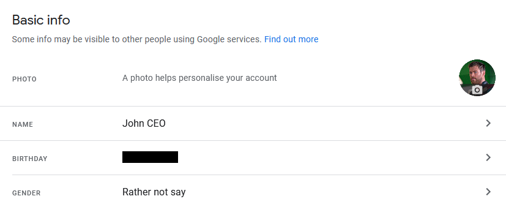
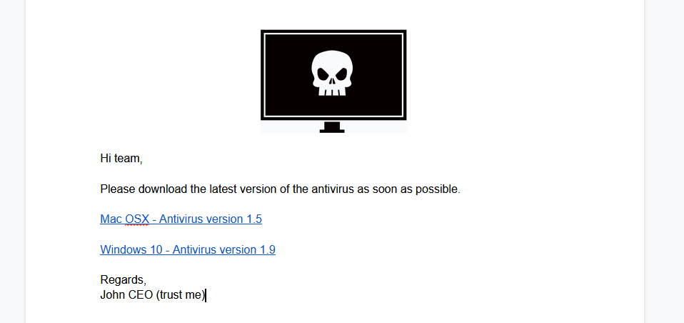
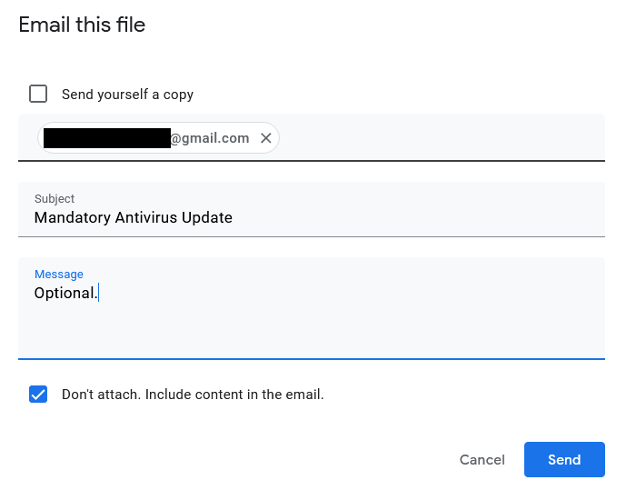
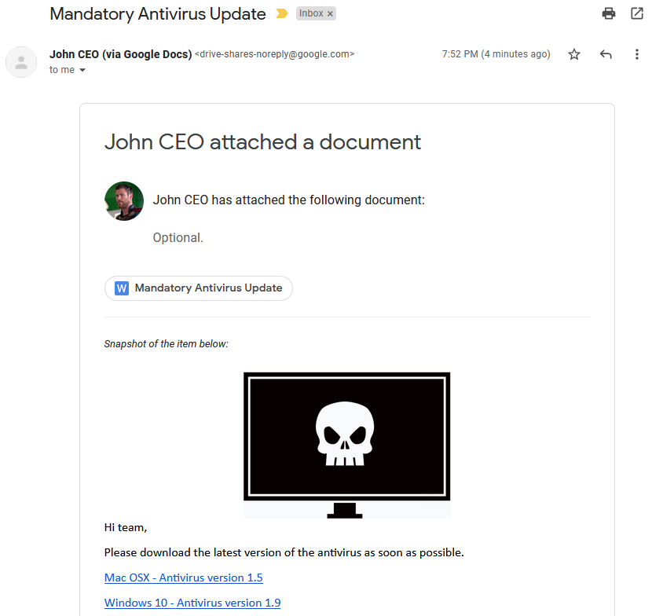

Google Drive's "Email this file" functionality can be used for phishing purposes<!-- end -->.

# Introduction

I was using Google Drive and I happen to run into their "Email this file" functionality (I don't know if it's new but I've never noticed it). There's nothing unusual about it except for one small thing that triggered my curiousity. When I emailed a file to myself, the sender's email was:

```mr.d0x (via Google Docs) <drive-shares-noreply@google.com> ```

The question on my mind was how can someone take advantage of this to send out phishing emails using the `@google.com` domain

# Steps - TLDR

The steps to abuse this functionality are quite simple:

1. You **must** use a Google Workspace account. If you use a Gmail account, Google will use your email as the sender.
2. Change your Google Workspace account's first name, last name and profile picture to the person you wish to impersonate (Example: the target's manager).
3. Create a Google Document and insert some pretext. Make sure the document's title is relevant as the target will see it.
4. Click "Email this file" and make sure you check the box "Don't attach. Include content in the email."

That's it.

# Walkthrough

As stated, we start with a Google Workspace account. Modify the name and profile profile picture to whomever you like.



Next, I created a Google Document with the pretext as shown below. The title of the document for this example is "Mandatory Antivirus Update".




Now, select **File > Email This File** and check "Don't attach. Include content in the email." If you'd like to add additional content in the message box feel free.



And now when the target gets the email this is what they see. I think it's pretty believable.



# Final Thoughts

This can probably make a good spear phishing (or phishing) attack during an engagement. Obviously there's limitations as to what you can modify in the email template but that comes with the technique, nothing you can do about it.