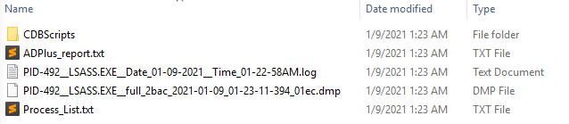

A continuation of my series into abusing Microsoft's debugging tools for red teams. This time I show how to create a LSASS dump with the Adplus debugging tool<!-- end -->. You may want to check my earlier posts that cover <a href="">cdb.exe</a> and <a href="">remote.exe</a>.

# Introduction

Creating <a href="https://attack.mitre.org/techniques/T1003/">memory dumps (T1003)</a> is a widely used technique by attackers to retrieve credentials on a system. Although there have been improvements by Microsoft to reduce the impact of this technique (e.g. disabling WDigest and introducing Credential Guard), it's still used during penetration tests and red team engagements.

The most common way to create a memory dump is with the Windows Sysinternals tool, Procdump. Any half decent AV will now delete your dump file as soon as it's generated. Adplus has the advantage of not being as widely used and therefore it may slip past some AVs. 

# Adplus

The Windows debugging tools come with <b>adplus.exe</b> and <b>adplus_old.vbs</b>. Both of them can be used to create a memory dump of LSASS.

## Required Privileges

I tested this out with administrator privileges and it wasn't creating the dump file. As it turns out you need SYSTEM privileges to create the dump file. If you have administrator privileges it shouldn't be that hard to find a way to SYSTEM so I'll leave that up to you to figure out.

## Creating a memory dump

Its quite simple to create a memory dump, run the following command.

    #Exe
    adplus.exe -hang -pn lsass.exe -o c:\users\mr.d0x\output\folder -quiet
    
    #Vbs script
    cscript.exe adplus_old.vbs -hang -pn lsass.exe -o c:\users\mr.d0x\output\folder -quiet

The output is a folder that contains the .dmp file.



## Evasion Tricks

Instead of using ```-pn lsass.exe``` use ```-p <lsass PID>```.

If that doesn't work then use the ```-r``` flag which creates a dump file every X seconds. For some reason that worked for me and the files didn't get deleted. Obviously this is less stealthy as it's writing multiple files to disk.

    #New command
    #Create 10 dumps, 1 every 2 seconds
    adplus.exe -hang -p <PID> -o c:\users\mr.d0x\output\folder -r 10 2 -quiet

## Issues

One issue I ran into after using Adplus is the lsass process remaining suspended. This causes all sorts of problems and will eventually require a system reboot. If anyone knows how to resume the process after Adplus executes please DM me on Twitter. 
