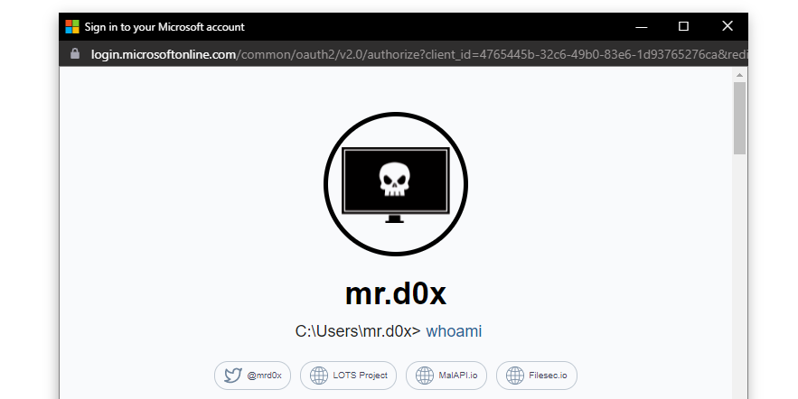
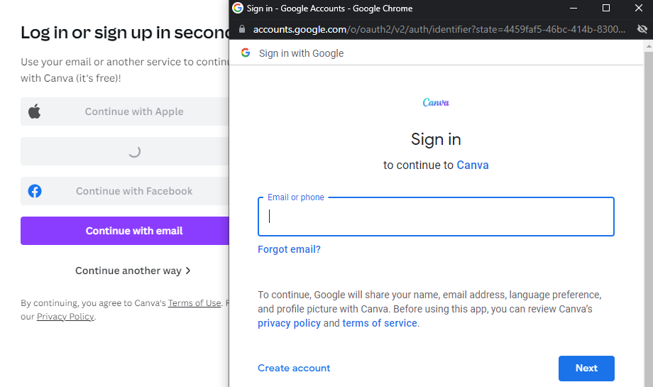
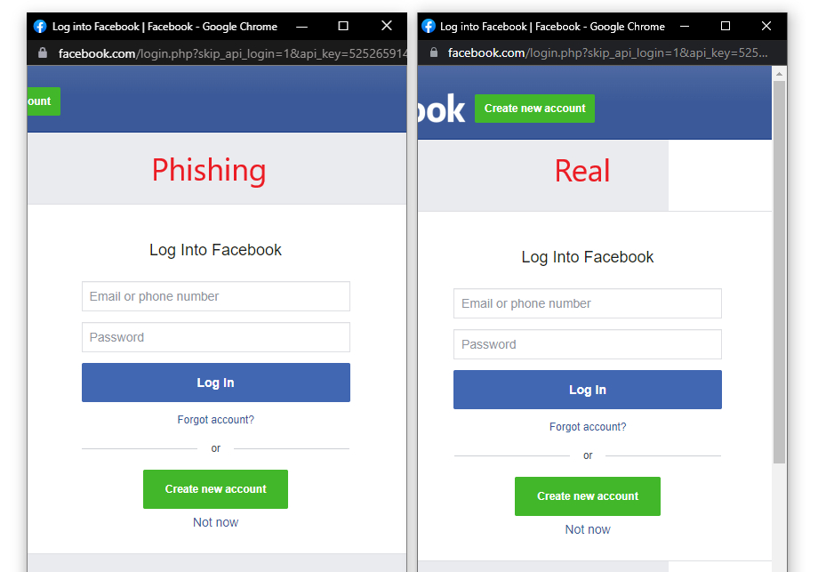

This article explores a phishing technique that simulates a browser window within the browser to spoof a legitimate domain<!-- end -->.

# Introduction

For security professionals, the URL is usually the most trusted aspect of a domain. Yes there's attacks like <a href="https://www.akamai.com/blog/security/watch-your-step-the-prevalence-of-idn-homograph-attacks" target="_blank">IDN Homograph</a> and <a href="https://www.cloudflare.com/en-ca/learning/security/global-dns-hijacking-threat/" target="_blank">DNS Hijacking</a> that may degrade the reliability of URLs but not to an extent that makes URLs unreliable.

All of this eventually lead me to think, is it possible to make the "Check the URL" advice less reliable? After a week of brainstorming I decided that the answer is yes.

# Pop-Up Login Windows

Quite often when we authenticate to a website via Google, Microsoft, Apple etc. we're provided a pop-up window that asks us to authenticate. The image below shows the window that appears when someone attempts to login to Canva using their Google account.

## Replicating The Window

Fortunately for us, replicating the entire window design using basic HTML/CSS is quite simple. Combine the window design with an iframe pointing to the malicious server hosting the phishing page, and its basically indistinguishable. The image below shows the fake window compared with the real window. Very few people would notice the slight differences between the two.

JavaScript can be easily used to make the window appear on a link or button click, on the page loading etc. And of course you can make the window appear in a visually appealing manner through animations available in libraries such as JQuery.

# Demo

# Custom URL on-hover

Hovering over a URL to determine if it's legitimate is not very effective when JavaScript is permitted. HTML for a link generally looks like this:

    <a href="https://gmail.com">Google</a>

If an onclick event that returns false is added, then hovering over the link will continue to show the website in the `href` attribute but when the link is clicked then the `href` attribute is ignored. We can use this knowledge to make the pop-up window appear more realistic.

    <a href="https://gmail.com" onclick="return launchWindow();">Google</a>

    function launchWindow() {
        // Launch the fake authentication window
        return false; // This will make sure the href attribute is ignored
    }

# Fullscreen

If you want to take the obfuscation even further, open the window in fullscreen mode, when the second window is opened. A simply modification will hide the original address bar:

    <a href="https://gmail.com" onclick="return launchWindow();">Google</a>

    function launchWindow() {
        if ( document.body.requestFullscreen && !document.fullscreenElement ) {
            document.body.requestFullscreen();
            
            // Launch the fake authentication window
        }

        return false; // This will make sure the href attribute is ignored
    }

# Available Templates

I've created templates for the following OS and browser:

* Windows - Chrome (Light & Dark Mode)
* Mac OSX - Chrome (Light & Dark Mode)

The templates are available on my Github <a href="https://github.com/mrd0x/BITB" target="_blank">here</a>.

# Conclusion

With this technique we are now able to up our phishing game. The target user would still need to land on your website for the pop-up window to be displayed. But once landed on the attacker-owned website, the user will be at ease as they type their credentials away on what appears to be the legitimate website (because the trustworthy URL says so).
