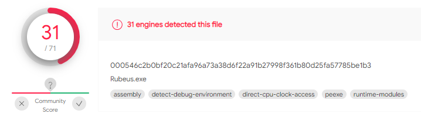
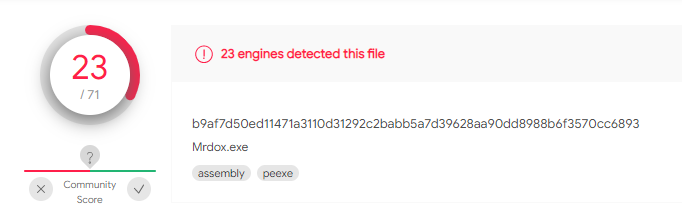
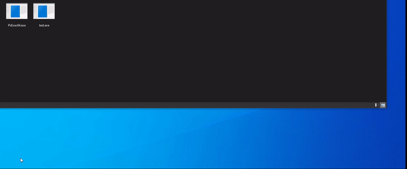
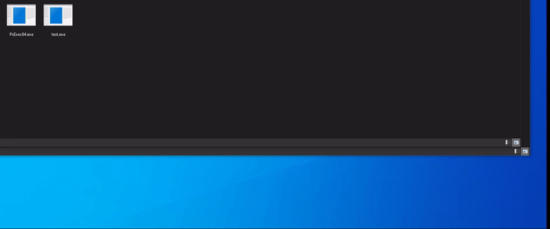
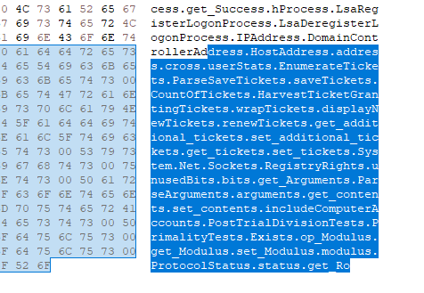
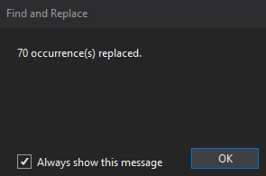
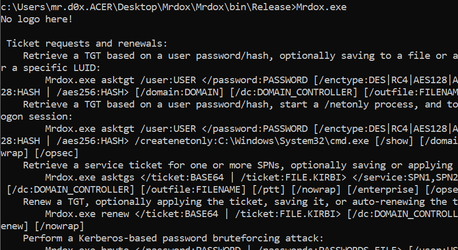

In this post we explore how to bypass Windows Defender's signature based detection of malicious binaries with a practical example. For this example I'm going to use Rubeus as the malicious binary. <!-- end -->

# What is Signature Based Detection?

Before starting we need to understand what signature based detection is and how antivirus agents use this method to catch malicious binaries. An antivirus signature is a continuous sequence of bytes within a malicious binary that uniquely identifies it. Files on your machine are scanned and compared against the a signature database and if there is a match then that file is quarantined and removed off the machine.

If you upload <a href="https://github.com/GhostPack/Rubeus">Rubeus</a> to VirusTotal you can see the hash of the file. This hash can be used as a signature to uniquely identify the file, although most antivirus agents will probably create multiple signatures of the file by taking excerpts of the source code.

Rubeus binary with no modifications has 31 detections

What happens if we remove a single comment from the source code?

Rubeus binary after removing a random comment in the source code has 28 detections

If you look carefully you'd notice 2 differences.

1.  The signature (hash) of the file changed
2.  The detection rate went down which means some AV vendors simply created a signature of the the original binary and blacklisted that.

# Easy Wins

First thing's first, let's find and replace the term 'Rubeus' with a new word. I'm using Visual Studio so to do that use Ctrl+Shift+H:

You also want to do the following:
1.  Open up the .sln file with a text editor and replace all instances of Rubeus with your new word
2.  Modify the 'Rubeus' folder names of the project and 'Rubeus.csproj' to your new word
3.  Right click the project in Visual Studio and select 'Properties' then replace all instances of 'Rubeus' to your new word
4.  Compile and build as a x64 executable

Detection rate dropped to 23

### Modifying Variables, Comments And Functions

We want to change the program as much as possible without changing the functionality. One thing you can do is find and replace all on variable names and function names. Look for malicious keywords like 'Bruteforcer' and replace that. Remove comments and modify text within print methods (e.g. Console.WriteLine()).

The problem with this method is we are arbitrarily replacing words without knowing whether it'll have an effect or not. In the next section we'll try to pinpoint the signature.

# Precise Modifications

So far it's been simple changes and Defender is still detecting our program so now we're going to find what's triggering Defender. 

What you want to do is split your binary by grabbing the first X bytes and see when Defender detects the binary as a malicious file. My main binary file is 254464 bytes, so I'll start off by getting the first 180000 bytes and seeing if Defender triggers on it, make sure you whitelist your working directory first.

    #Get the first 180000 bytes from Mrdox.exe and save it to test.exe
    #Use either Powershell or Bash

    #Powershell
    Get-Content .\Mrdox.exe -Encoding Byte -TotalCount 180000 | Set-Content test.exe -Encoding byte

    #Bash
    head -c 180000 Mrdox.exe > test.exe

Defender doesn't trigger. Let's change that to 181000 bytes instead:

    #Powershell
    Get-Content .\Mrdox.exe -Encoding Byte -TotalCount 181000 | Set-Content test.exe -Encoding byte

    #Bash
    head -c 181000 Mrdox.exe > test.exe

Still nothing... let's try 181500 bytes:

    #Powershell
    Get-Content .\Mrdox.exe -Encoding Byte -TotalCount 181500 | Set-Content test.exe -Encoding byte

    #Bash
    head -c 181500 Mrdox.exe > test.exe

Great! Now we know that Defender is triggering somewhere between 181000 and 181500 bytes. Let's open the last file with <a href="https://mh-nexus.de/en/hxd/">HxD</a> and check out the last 500 bytes.

Defender's signature is somewhere in the highlighted part. The most common word we see is 'tickets' so let's do a find and replace on 'tickets' and replace it with a different word.

Now when we scan the file Defender doesn't trigger! We successfully bypassed Defender and can now run Rubeus.

### References

https://www.youtube.com/watch?v=9pwMCHlNma4