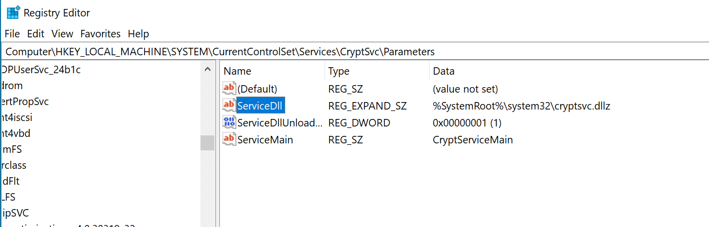
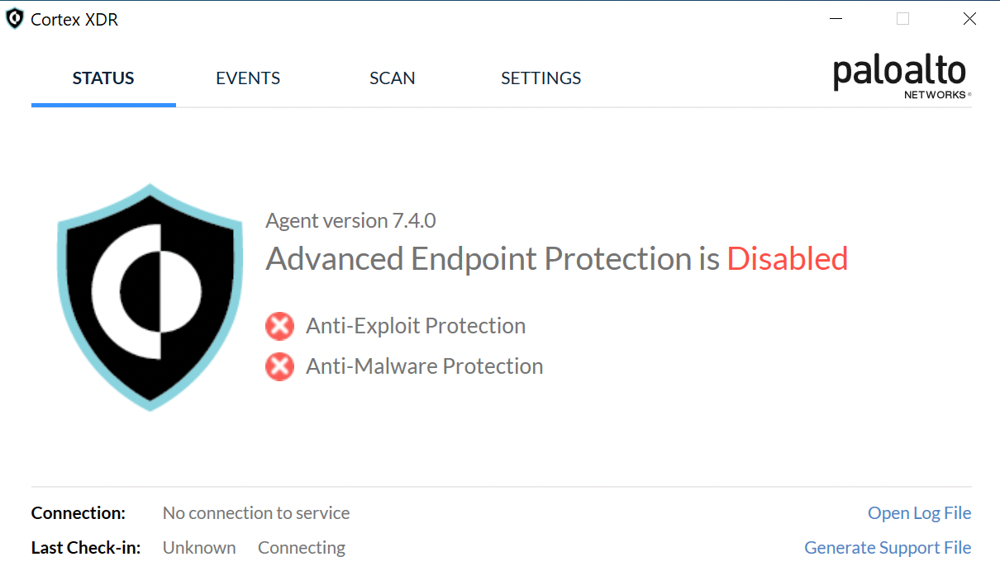
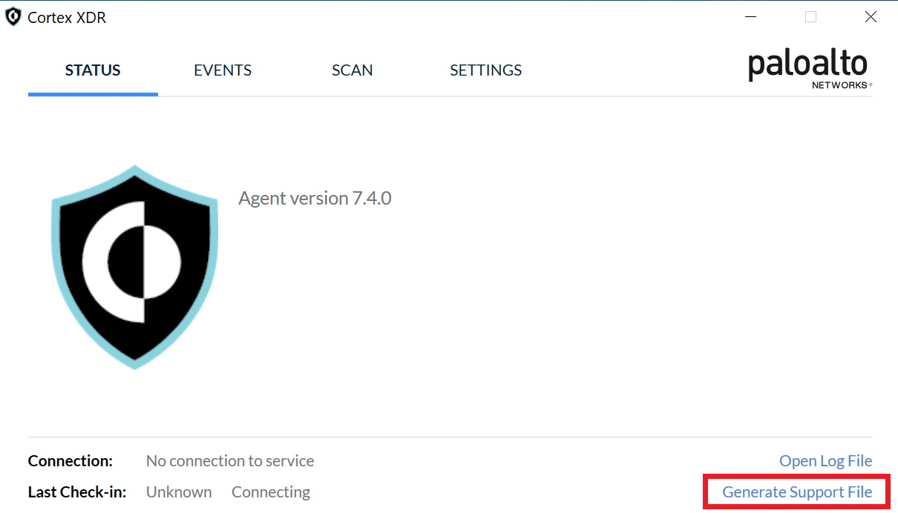

Analyzing Cortex XDR and finding ways to bypass it.<!-- end --> 

# Introduction

This article was written in July 2021 but publishing was delayed to allow the security team an opportunity to fix the findings. Unfortunately, as of today the findings have not been fixed yet. 

All the methods require administrator/root privileges unless mentioned otherwise.

# Disable Cortex Agent

To disable the Cortex XDR agent one registry key needs to be modified. This works despite having tamper protection enabled.

The registry key is located at `HKLM\SYSTEM\CurrentControlSet\Services\CryptSvc\Parameters\ServiceDll`. Modify the DLL to a random value.

To modify the registry key using the command line, use the command shown below.

    reg add HKEY_LOCAL_MACHINE\SYSTEM\CurrentControlSet\Services\CryptSvc\Parameters\ServiceDll /t REG_SZ /v mrd0x.dll /f

After rebooting the machine this should happen:

# Default Uninstall Password (Windows/OSX/Linux)

Cortex XDR has various global settings, one of which is the 'global uninstall password'. By default the password is **Password1** and if the administrators did not change it then it's trivial to disable the XDR agent.

## Windows

Head to `C:\Program Files\Palo Alto Networks\Traps` and find `cytool.exe`. There are various commands you can run if the default password was not changed, some of which are listed below:

    # Disables the agent on startup (requires reboot to work)
    cytool.exe startup disable

    # Disables protection on Cortex XDR files, processes, registry and services
    cytool.exe protect disable

    # Disables Cortex XDR (Even with tamper protection enabled)
    cytool.exe runtime disable

    # Disables event collection
    cytool.exe event_collection disable

## OSX

On Mac you would go to this path instead `/Library/Application Support/PaloAltoNetworks/Traps/bin` and use `cytool.exe`. You can use the same commands as mentioned above.

Interestingly, inside the `/bin` folder there's another executable with the name `traps_uninstaller_tool` which allows you to uninstall the agent if you have the uninstall password.

## Linux

Cortex XDR agents on Linux have no uninstall password. If you're root then go to `/opt/traps/bin` and use `cytool` to uninstall Cortex.

# The Uninstall Password Hash (Windows/OSX/Linux)

In case the default password was changed, we can grab the hash and try to crack it.

## Windows

Head to `C:\ProgramData\Cyvera\LocalSystem\Persistence\agent_settings.db` and in there you'll find a few ldb files. You only need to focus on the largest ldb file.

 Now for this to work you'll need <a href="https://docs.microsoft.com/en-us/sysinternals/downloads/strings">Sysinternals Strings64.exe</a>. A better way would be to copy the ldb file to an offline machine and use strings there.

 Run the following command:

    # Windows strings
    strings64.exe <ldb_file> > out.txt

    # Linux strings
    strings <ldb_file> > out.txt

The output file will have the password in the same algorithm but encoded differently. **PasswordHash** is base64 encoded whereas **password** is hex encoded. Feel free to use whichever one along with it's salt value. Example values are below (The password is Password1):

    "PasswordHash":"LCeLXnrGjjf85UYWhm1dHK4NhPiCMmtcfVBYbT9RuQ5nMNl0EL211UF9xhlU+kERNRo5Ty9XQXgZ0G6XPIM0Bw=="
    "PasswordSalt":"MjEzN3EwcWVuc2hxNmtvdjAya3lq"

    or
    
    "password":"2c278b5e7ac68e37fce54616866d5d1cae0d84f882326b5c7d50586d3f51b90e6730d97410bdb5d5417dc61954fa4111351a394f2f57417819d06e973c833407"
    "salt":"2137q0qenshq6kov02kyj"

I created a simple Python script with the following parameters that successfully cracked the hash.

* Hash Algorithm: **PBKDF2**
* HMAC: **SHA512**
* Iterations: **11,112**

## Dump Hash Without Elevated Privileges (Windows)

There is a way to access the persistence folder on Windows without administrator privileges. If you have GUI access, open the XDR agent's console and click 'Generate Support File'. This creates a dump of the persistence folder which can be accessed without administrator privileges.

## OSX

Head to `/Library/Application Support/PaloAltoNetworks/Traps/persist/agent_settings.db` and use the strings command as shown above. The rest is exactly the same.

## Linux

The uninstall password hash is available in `/opt/traps/persist/agent_settings.db`.

# Conclusion

Patching is not always as quick as we'd like it to be and I feel for the security team. Therefore, I generally provide them more than enough time to patch before disclosing bugs. Unfortunately, having ~300 days passed and the security team still unable to even provide an ETA, I felt it's appropriate to move along with disclosure.