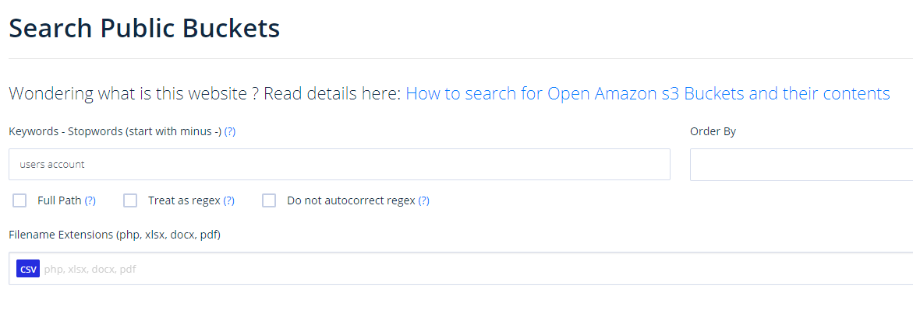
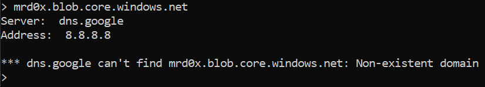
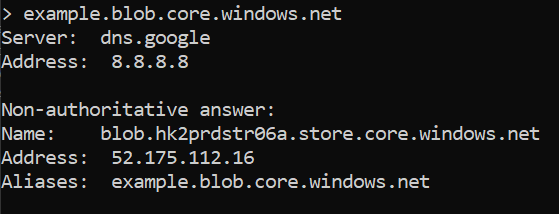
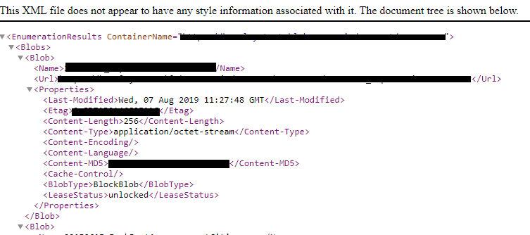
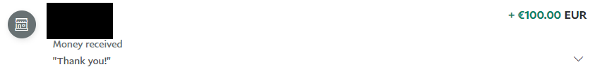
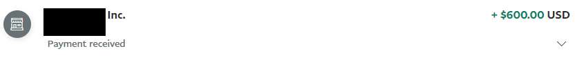
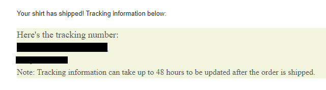

A simple guide on finding exposed AWS S3 buckets and Azure Blobs<!-- end -->. 

# Introduction

Finding exposed buckets is my favorite way of getting a payout because it doesn't really require technical sophistication (relatively speaking) and it's almost guaranteed to be a high severity submission. Exposed buckets are something that even established companies still face a problem with. So let's take advantage of that and get some high severity submissions.

# Grayhat Warfare

<a href="https://buckets.grayhatwarfare.com/" target="_blank">Grayhat Warfare</a> is my go-to site when I want to find exposed buckets & blobs. The UI is simple enough that anyone can use it. The hard part comes down to being patient and persistent in your search. You also need to be creative in your search query so 'password' and .csv files usually won't yield great results.



# Dorks

Another well-known and documented way is using search engine dorks (Google/Bing/DuckDuckGo etc). I'm not going to dive deep into it since there's various dorks you can find online but again be creative and patient.

    Sample dorks:
    site:s3.amazonaws.com AND intext:"password"
    inurl:s3.amazonaws.com AND accounts

# Github

Sensitive data posted onto Github repos has been a hot topic for a while now. Many scanning tools were created for developers to prevent them from pushing API tokens, keys, passwords and other sensitive data. But that won't stop developers from posting links to buckets and blobs.

Use Github to search for S3 buckets and/or Blobs. When using this method I suggest you don't narrow your scope and focus purely on finding exposed buckets. If there's leaked tokens and keys while you're searching that's even better!

    Sample Github queries:
    s3.amazonaws.com AND "private"
    s3.amazonaws.com AND "password"
    blob.core.windows.net AND "sql"
    blob.core.windows.net AND "key"


# Azure Blobs

Azure Blobs are sometimes overlooked due to the slight added complexity in discovering exposed blobs. Here's how the link structure looks like:

    http://<storage-name>.blob.core.windows.net/<container>/<file>

To find exposed blobs you need to brute force the **storage name** and **container(s)** then we use the <a href="https://docs.microsoft.com/en-us/rest/api/storageservices/" target="_blank">Azure Storage REST API</a> to list the files out for us.

## Storage Names - Naming Convention

To find valid storage names you simply do a DNS lookup and check the response.






There are some common keywords used for the storage account names that should be tested for:

```
#Try appending & prepending
<company-name>.blob.core.windows.net
<company-name>cloud.blob.core.windows.net
<company-name>images.blob.core.windows.net
<company-name>backup.blob.core.windows.net
<company-name>backups.blob.core.windows.net
<company-name>storage.blob.core.windows.net
<company-name>cdn.blob.core.windows.net
<company-name>assets.blob.core.windows.net
<company-name>files.blob.core.windows.net
<company-name>resources.blob.core.windows.net
<company-name>documents.blob.core.windows.net
<company-name>development.blob.core.windows.net
<company-name>production.blob.core.windows.net
<company-name>qa.blob.core.windows.net
<company-name>prod.blob.core.windows.net
<company-name>dev.blob.core.windows.net
<company-name>stage.blob.core.windows.net
<company-name>staging.blob.core.windows.net
<company-name>web.blob.core.windows.net
<company-name>website.blob.core.windows.net
<company-name>test.blob.core.windows.net
...
```

Check out <a href="https://github.com/NetSPI/MicroBurst/blob/master/Misc/permutations.txt" target="_blank">this file</a> for additional keywords.

## Containers

Once you have a valid storage account you need to find the container name. Again, this requires brute force and it should be done like this:

```
https://example.blob.core.windows.net/<container>?restype=container&comp=list
```

Once you hit a valid container it should return the URLs for the blobs.



You should use a large list to brute force containers. Find common container names using Grayhat Warfare or Google Dorks and generate your own wordlist.

# Additional Resources

If you want additional details about Azure Blobs then I suggest you check out Cyberark's excellent <a href="https://www.cyberark.com/resources/threat-research-blog/hunting-azure-blobs-exposes-millions-of-sensitive-files" target="_blank">article</a> that goes more in-depth.

I also found <a href="https://www.netspi.com/blog/technical/cloud-penetration-testing/anonymously-enumerating-azure-file-resources/" target="_blank">this article</a> by NetSPI to be useful.


# Results

In less a week I made several submissions and the companies that did provide bounties were mostly generous.







And of course let's not forget the swag.



