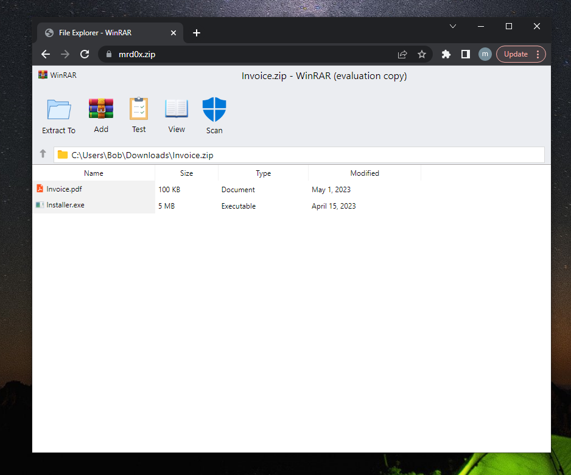
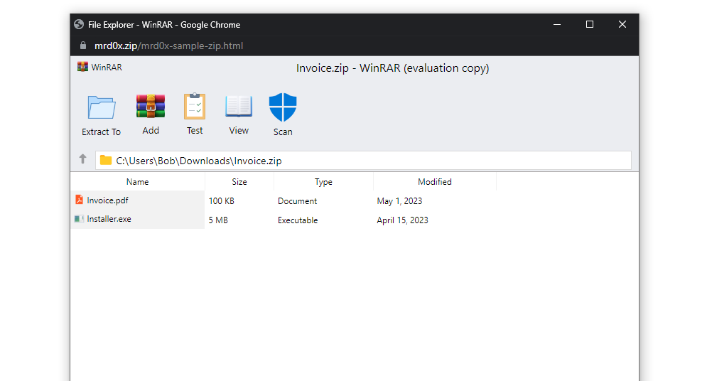
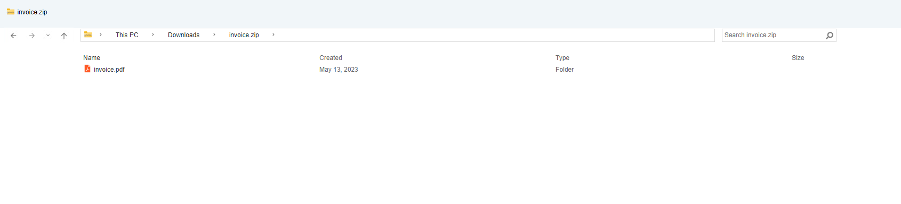
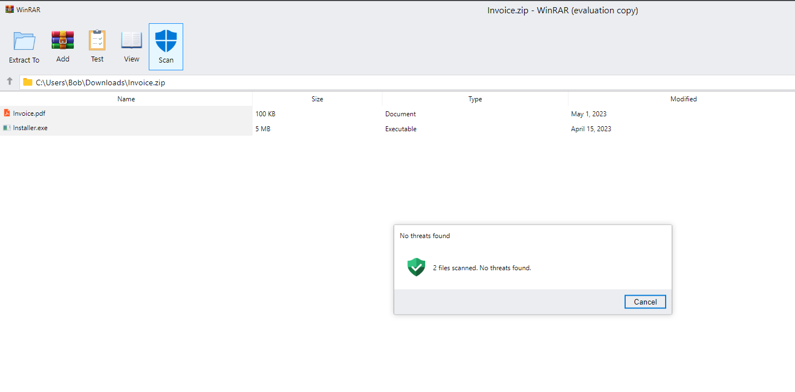
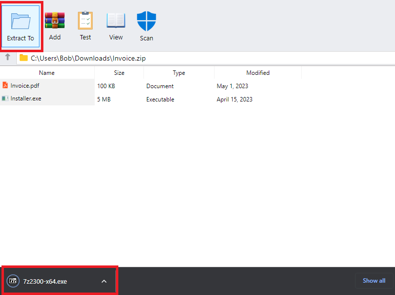
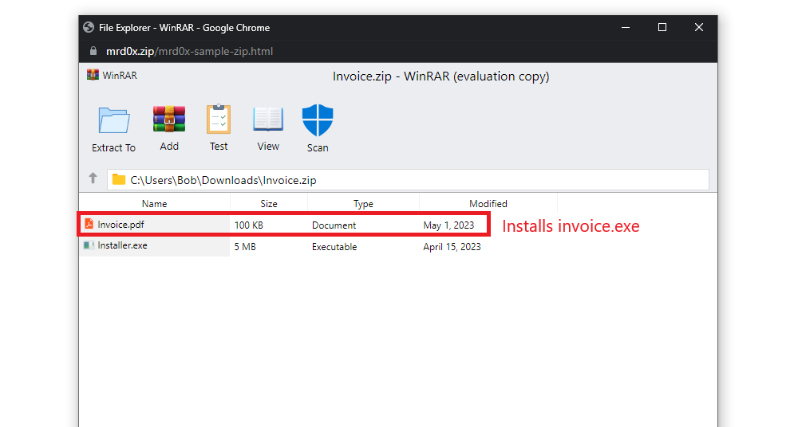
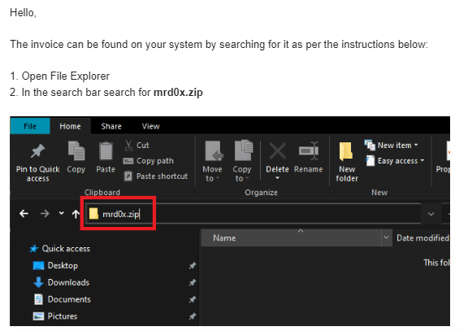

This article explores a phishing technique that emulates a file archiver software in the browser while using a .zip domain<!-- end -->.

# Introduction

Last week Google released several new top-level domains (TLDs) including `.dad`, `.phd`, `.mov` and `.zip`. Many members of the security community began posting about concerns they had with TLDs that can be mistaken for file extensions, specifically, `.mov` and `.zip`. The intention of this article isn't to discuss my opinion on the topic, instead, I'll be showcasing how it can be used to enhance phishing engagements.

With this phishing attack, you simulate a file archiver software (e.g. WinRAR) in the browser and use a `.zip` domain to make it appear more legitimate.

# Emulating File Archive Software

Performing this attack first requires you to emulate a file archive software using HTML/CSS. I've uploaded 2 samples to my <a href="https://github.com/mrd0x/file-archiver-in-the-browser" target="_blank">GitHub</a> for anyone to use. The first one emulates the WinRAR file archive utility, as shown below.

The other one emulates the Windows 11 File Explorer window. Shout out to <a href="https://twitter.com/_ghast1y" target="_blank">@_ghast1y</a> for building this.

## Cosmetic Features

The WinRAR sample has a few cosmetic features that can increase the legitimacy of the phishing page. For example, the 'Scan' icon creates a message box stating that the files are safe.

The 'Extract To' button can be used to drop a file as well.

# Use Cases

Once the content is set up on your `.zip` domain, you have several possibilities to trick the user. Below I provide two sample use cases.

## Credential Harvesting

The first use case is to harvest credentials by having a new web page open when a file is clicked.

## File Extension Switcheroo

Another interesting use case is listing a non-executable file and when the user clicks to initiate a download, it downloads an executable file. Let's say you have an "invoice.pdf" file. When a user clicks on this file, it will initiate the download of a `.exe` or any other file.

# Delivery

Several people pointed out on Twitter that the Windows File Explorer search bar is a good delivery vector. If the user searches for `mrd0x.zip` and it doesn't exist on the machine, it will automatically open it up in the browser. This is perfect for this scenario since the user would be expecting to see a ZIP file.

An example of a phishing email that could be sent to an unsuspecting target.

Once the user performs this, it will auto-launch the `.zip` domain which has the file archive template, appearing pretty legitimate.

# Conclusion

The newly launched TLDs provide attackers with more opportunities for phishing. It's highly recommended for organizations to block `.zip` and `.mov` domains as they are already being used for phishing and will likely only continue to be increasingly used.
