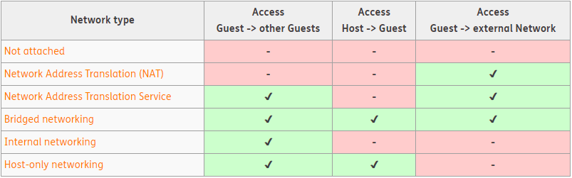
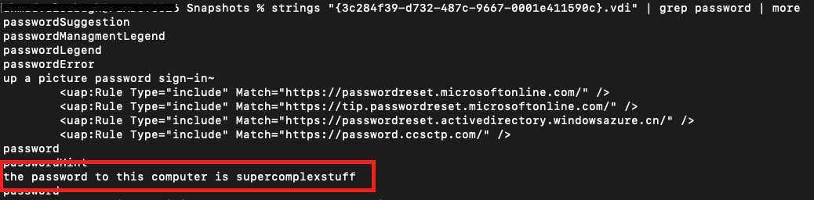
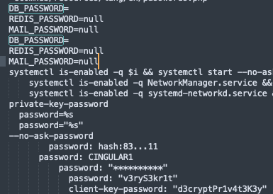
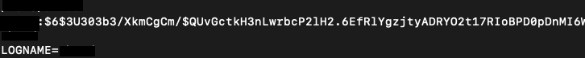
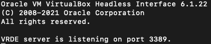
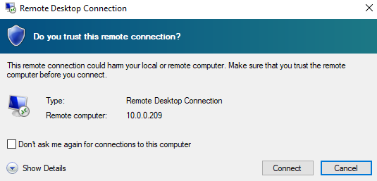

If you run into VirtualBox on a machine during an engagement try some of these methods<!-- end -->.

# Methods

Use this to quickly find the section of your interest.

1. Gathering Information
2. Stealing VDI files
3. Brute Force VM Login
4. Network Scanning VMs
5. Finding Secrets in VDI Files
6. Creating a VM for Evasion

# Gathering Information

Before doing anything you should check what the current set up is. For that we'll need to utilize the ```VBoxManage.exe``` binary. It can be found in **C:\Program Files\Oracle\VirtualBox**. You should run the following commands:

    #List the existing VMs
    VBoxManage.exe list vms

    #Get the guest machine's NIC IDs, MAC & network mode (NAT/Bridged Adapter etc.)
    VBoxManage.exe showvminfo --details <vm-name or ID> | findstr MAC

    #Get the guest machine's IP
    VBoxManage.exe guestproperty enumerate <vm-name or ID> | findstr IP


You can also find this information in the VBOX configuration file located at **C:\users\\<user\>\VirtualBox VMs\\<vm-name\>\\<vm-name\>.vbox**

## Network Modes

The network mode must be set to either **Bridged Adapter** or **Host-only Networking**, otherwise you'll need to modify it to be so. I found a great image from <a href="https://www.thomas-krenn.com/en/wiki/Network_Configuration_in_VirtualBox" target="_blank">this article</a> which explains the different network modes.



If you need to change the network mode on the VM use the following command:

    #Changes the network setting on the NIC to bridged adapter
    VBoxManage.exe modifyvm <vm-name or ID> --nic<ID> bridged

# Stealing VDI Files

This is one of the obvious methods that comes to mind when encountering VirtualBox images. Head to the VM directory located at **C:\users\\<user\>\VirtualBox VMs** and simply copy all the directories and files in there to the attacking machine and from there you can easily boot up the image via VirtualBox.

This method is easy, gives you GUI access to the VM and if snapshots exist you can potentially access the machine without knowing the login credentials (assuming there are any).

The downside of this method is that the files are often very large (15GB+).

# Brute Force VM Login

This method involves running the VM in headless mode and then brute forcing the password. We'll need to utilize the ```VBoxHeadless.exe``` and ```VBoxManage.exe``` binaries which can be found at **C:\Program Files\Oracle\VirtualBox**.

## Retrieving The Username

First we'll need to get the username being used on the VM. This requires the Sysinternals <a href="https://docs.microsoft.com/en-us/sysinternals/downloads/strings">Strings tool</a>. Once you've downloaded Strings, run the following command:

    Strings64.exe C:\users\<user>\VirtualBox VMs\<vm-name>\<vm-name>.vdi | findstr /i user | more

The username will appear several times quite clearly. I used the command on my Kali Linux VDI file and the username was clearly visible.


## Brute Forcing

Now that we have the username let's run the VM in headless mode first.

    #Start the VM in headless mode
    VBoxHeadless.exe -s <vm-name or ID>

Next, use VBoxManage.exe to attempt to login and execute commands on the guest machine. You can easily create a simple script to try a list of passwords.

    #Executing whoami.exe
    VBoxManage.exe guestcontrol <vm-name or ID> --username user --password pass run --exe "C:\windows\system32\whoami.exe"

## Security Events & Account Lockout

Note that failed logins generate security event 4625 (for Windows VMs) and can potentially lockout the user if the lockout policy is configured (it isn't by default).

As for Linux VMs, the logs can be found in /var/log/auth.log. 

# Network Scanning VMs

Another option is to run the VM in headless mode and then scan the VM for any network services you can potentially attack. Users are more likely to run vulnerable services or use weak passwords on VirtualBox machines.

    #Get the guest machine's IP
    VBoxManage.exe guestproperty enumerate <vm-name or ID> | findstr IP

    #Start the VM in headless mode
    VBoxHeadless.exe -s <vm-name or ID>

    #Scan the VM with a tool of your choice
    nmap -sS <ip> -vvvv -oN out.file

# Finding Secrets in VDI Files

This is a last resort method which involves using the Sysinternals ```Strings64.exe``` tool on the VDI files and searching for sensitive data (e.g. passwords, keys, tokens etc.).

The content of all files on the VirtualBox machine can be read using this method, the difficult part is parsing through the Strings dump. You can use the ```-n``` flag with the Strings tool to set a minimum string length to output. But in my opinion, the fastest way is to pipe the output of the dump to ```grep``` (Linux) or ```findstr```  (Windows) to search for certain keywords.

```
#All files with the 'password' in them will be shown
strings64.exe vm.vdi | findstr /i password > out.txt
```

I created a txt file on my Windows VM with a certain string.


And it was immediately discovered using this method (this was tested on both Windows and MacOS)



I also found the contents of an .env file I had placed on the VM.




Another important keyword to look for is the username as this will expose a lot of interesting stuff.

```
#First Get the username on the VM if you haven't already
Strings64.exe vm.vdi | findstr /i user

#Now search for the username
Strings64.exe vm.vdi | findstr /i <username>
```

Running the same command on my Ubuntu VDI file, I was able to find the user's credentials from the shadow file.




# Creating a VM for Evasion

Virtual machines can be deployed to evade detection by security tools as we saw with <a href="https://news.sophos.com/en-us/2020/05/21/ragnar-locker-ransomware-deploys-virtual-machine-to-dodge-security/" target="_blank">Ragnar Locker ransomware</a> deploying Windows XP and hiding the ransomware payload.

Here's how I deployed an Ubuntu VM via command line. Ensure you have the VDI file downloaded first.

    #Create the VM
    vboxmanage.exe createvm --name Ubuntux --ostype "Ubuntu_64" --register

    #Configure the VM settings (e.g. memory, network)
    vboxmanage.exe modifyvm Ubuntux --ioapic on
    vboxmanage.exe modifyvm Ubuntux --memory 1024 --vram 128
    vboxmanage.exe modifyvm Ubuntux --nic1 nat

    #Attach the VDI file
    vboxmanage.exe storagectl Ubuntux --name "IDE Controller" --add ide --controller PIIX4
    vboxmanage.exe storageattach Ubuntux --storagectl "IDE Controller" --port 0 --device 0 --type hdd --medium /path/to/ubuntu.vdi

    #Optional - Enable RDP, allows you to use the host machine's IP to connect via RDP
    vboxmanage.exe modifyvm Ubuntux --vrde on
    vboxmanage.exe modifyvm Ubuntux --vrdemulticon on --vrdeport 3389

    #Run the VM
    VBoxHeadless.exe --startvm Ubuntux



Now use whatever RDP tool you'd like to connect.




You may have a .ISO instead of .VDI or you'd like to see other examples. In that case there are two great resources you can have a look at:

* <a href="https://www.virtualbox.org/manual/ch07.html#idp13344464" target="_blank">Resource 1</a>
* <a href="https://www.andreafortuna.org/2019/10/24/how-to-create-a-virtualbox-vm-from-command-line/" target="_blank">Resource 2</a>


# Conclusion

Next time you run into VirtualBox try to see if you can use one of these methods to assist you. If anyone knows of other methods I may have missed reach out to me on <a href="https://twitter.com/mrd0x" target="_blank">Twitter</a>.