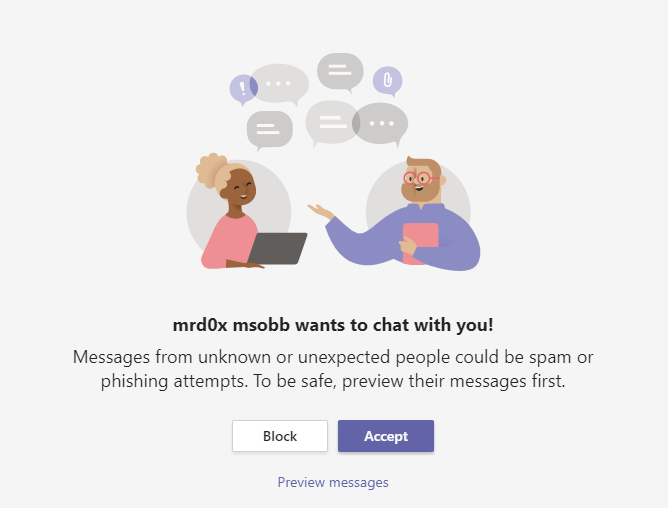
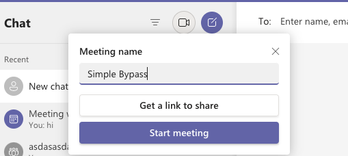
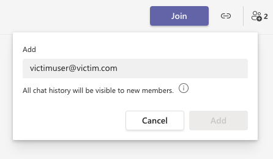
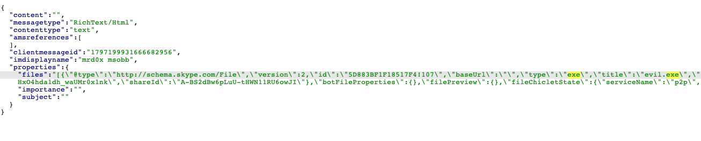
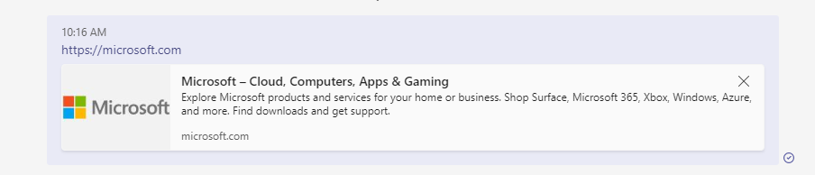
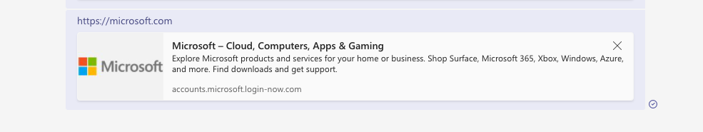

Microsoft Teams does not have any tamper protection to prevent spoofing attacks<!-- end -->.

# Message Request Approval Bypass

Before we begin spoofing, we must contend with a safety feature Teams implements to prevent random phishing attacks. This safety feature prevents random users from messaging someone without their explicit approval.

This can be a hurdle when attempting to phish users with our upcoming spoofing techniques but luckily there's a simple way to bypass this. Create a new meeting, join it then immediately leave. Upon leaving, the name of the meeting will be visible in the recent chats area. Now simply use the add button in the top right corner to add the target user and they will be added to the chat without having the option to approve/deny the request.

Done! Now the user will be immediately added to the chat without any approval necessary.

# Tampering With File Attachments

If you've seen the spoofing horrors in my <a href="https://mrd0x.com/spoofing-and-attacking-with-skype/">Skype article</a> then it'll be of no surprise that Microsoft Teams can be spoofed too and it's very similiar.

## Spoofing File Extension

Upload your malicious file (e.g. .exe, .hta) and intercept the request, modify the extension to an innocent one like .docx. 

## Spoofing Attachment Links

An even better technique is to modify the link of the file rather than the extension. Upload a harmless file such as a .docx, intercept the request and modify the href link to an external link hosting a malicious file. Upon clicking the file, the user downloads the malicious file.

# Spoofing Website Links

If you send a link such as https://microsoft.com, Teams will automatically show a preview of the link.

You can spoof this link by intercepting the request and modifying microsoft.com to your malicious domain. Microsoft's preview will appear for your malicious domain.

# Conclusion

Similiar to my previous Skype article, unsurprisingly Teams is built in a similiar manner and therefore has the same spoofing bugs. There's probably more bugs in there since I didn't analyze everything thoroughly.