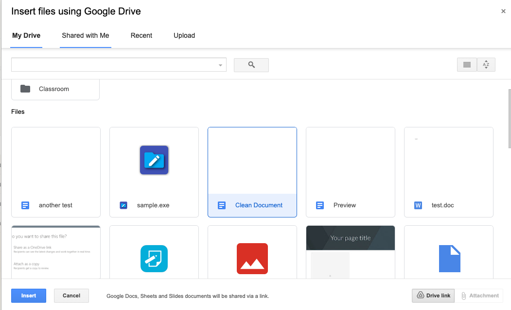
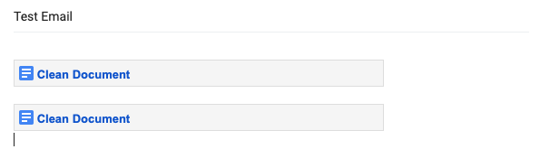
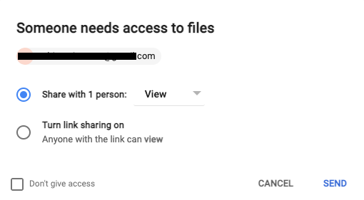
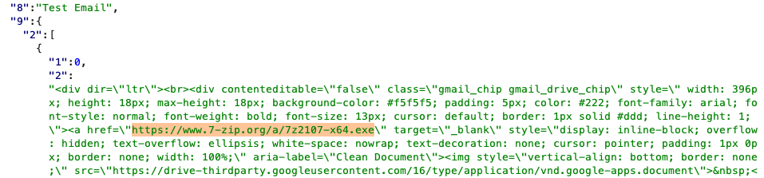
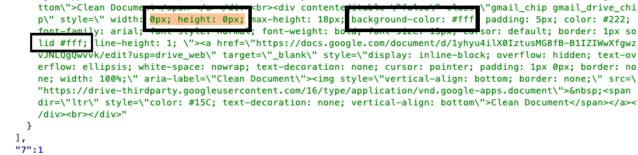
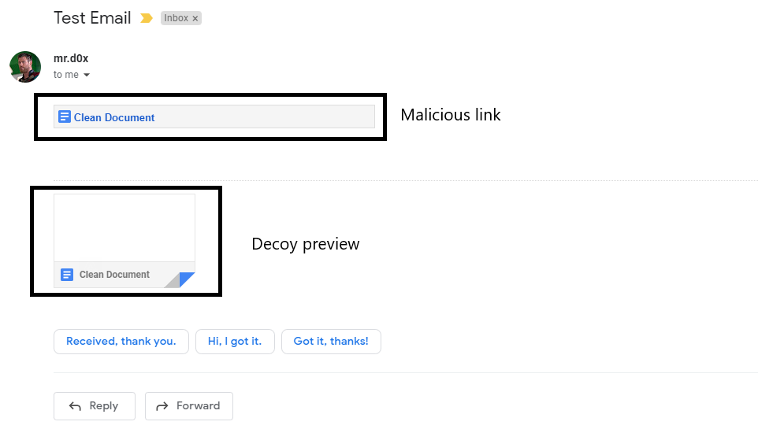
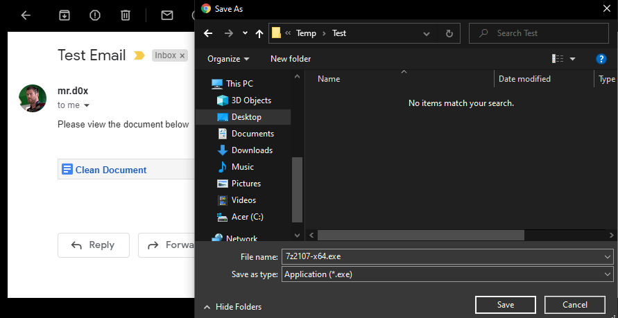

A phishing technique that allows attackers to create fake previews for their malicious attachment.<!-- end --> 

# Introduction

When Google Drive attachments are added to an email, additional HTML/CSS is added to the email to show the file type, file name and a file preview. Fortunately (depending which side of the fence you're on), the content can be modified which opens up a path for us to tamper with it and create better phishing attacks. 

# Spoofing The Attachment & Preview

Before beginning the attack, create a file on your Google Drive (Doc, Sheet etc.). This file will be the decoy preview that the target user will see. Next, head to your inbox and compose an email, select the 'Insert files using Drive' option and insert the previously created file **twice**.

After inserting the file twice, the composed email should look similar to the image below. Of course at this point you should also add the necessary context to your email.

Send the email and when Google prompts you to provide access to the file simply allow viewer access.

Immediately, intercept the request with your favorite HTTP proxy and forward the requests until you reach the email content (look for **mail.google.com**). Now the task is very simple:

1. You want to insert your malicious link in the first file's **href** attribute.
2. You want to make the second file invisible by modifying the css. Set the **width: 0px**, the **height:0px**, change **background-color** and **border-color** to **#fff**. Of course you can do it any other way you'd like, I chose to do it this way.

In the image below, I set my 'malicious' link in the first href attribute.

Next, I made the second file invisible by modifying the CSS as mentioned earlier.

## Target User's Perspective

When the target opens the email, nothing will look out of the ordinary and if they click the preview to see the file they'll land onto your creative decoy preview.

And in case the target user clicks on my creative preview that I definitely did not create in 2 minutes, this is what they'll see:

# Alternative Approach: No Preview

I would like to note that you also have the option of phishing the user with no preview at all. Use the 'Insert files using Drive' option to insert any GDrive file (only once), send the email, intercept the request and set the **href** attribute to the malicious file's link.

# Conclusion

Users are generally not trained for these spoofed phishing attacks which is why they can yield better results. This technique opens up a variety of ways for you to phish users. For example, another phishing scenario can be inserting a link which asks the user to re-authenticate with their credentials to view the document.