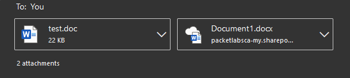
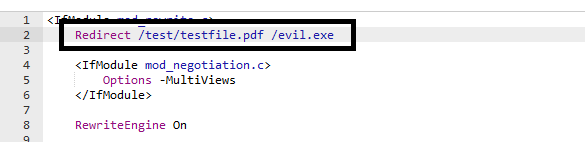
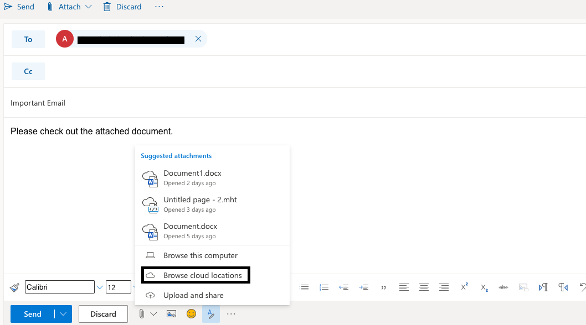
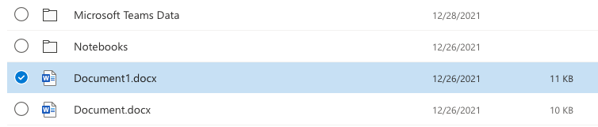
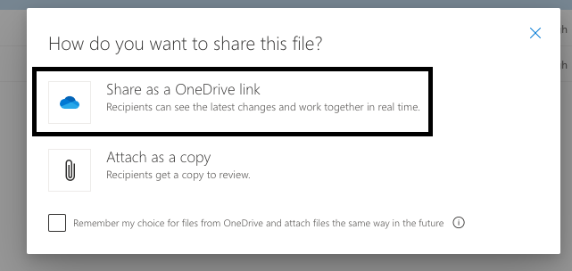
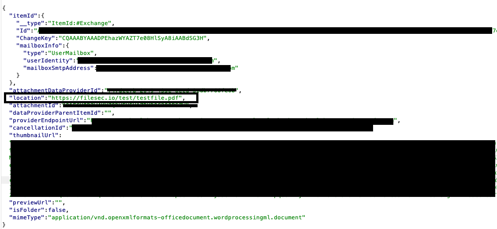
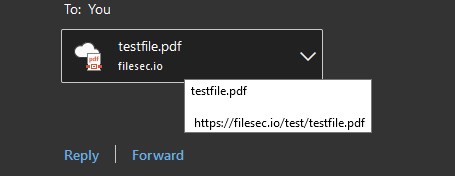
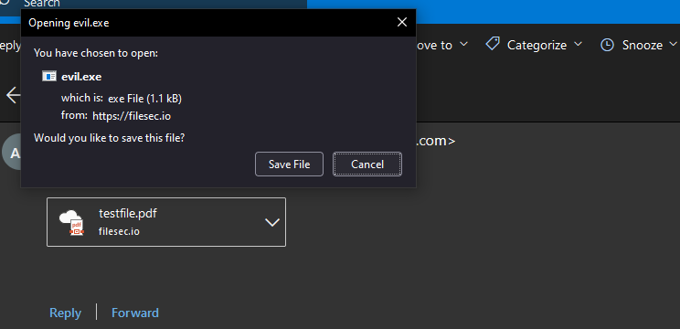

Abuse the way O365 Outlook renders cloud attachments to make malicious executable cloud attachments look like harmless files<!-- end -->.

# Introduction

In this article we'll explore how we can abuse the cloud attachment feature on O365 to make executables (or any other file types) appear as harmless attachments.

# File Attachment Methods

O365 allows you to upload attachments in one of two ways:

* Direct Attachment - The traditional way of uploading files. Severely restricts permitted file types.
* Cloud Attachment - Attach a file available on the cloud (OneDrive/SharePoint). File types are not restricted.

The image below shows how the attachments appear to the target user. The only real visual difference is the icon and the cloud attachment partially shows the link.

Now that the difference is understood, let's abuse the cloud attachment technique to attach a malicious executable. 

## Prerequisites

There are a few things you should do before moving on:

1. Setup an HTTP server and domain. Because cloud attachments partially show the link, it is advised to create a subdomain such as onedrive.microsoft.* to make the attachment look less suspicious. For this demo I will not be doing this but it is highly recommended.

2. Host the malicious executable on your server.

3. Set up an HTTP redirect that redirects a path which ends with a harmless extension (.txt, .pdf, .docx etc.) to your malicious executable. This is extremely important because as we'll see O365 chooses the icon of the attachment based off the file extension of the link. In my case I setup a redirect from `/test/testfile.pdf` to `/evil.exe`.

## Attach Spoofed Malicious Executable 
 
Compose an email to the target user, click the attachment icon > Browse Cloud Locations.

Next, select any random file to attach. The file can be anything it does not matter.

Make sure you check the 'Share as a OneDrive link' option. This is the option which attaches the file as a cloud attachment.

Immediately intercept the request and modify the `location` URL. Set it to be the URL that ends with the harmless extension that redirects to the malicious file which in this case is the `/test/testfile.pdf` path.

When the email is sent to the target user all they see is a PDF attachment and they would have no reason to assume it's anything other than that. But when the attachment is clicked the malicious executable is downloaded instead.

# Conclusion

This is a really great technique which can be helpful when trying to gain initial access. An additional perk of using this technique is the link does not get scanned and therefore increases the chances of the email landing in the inbox.