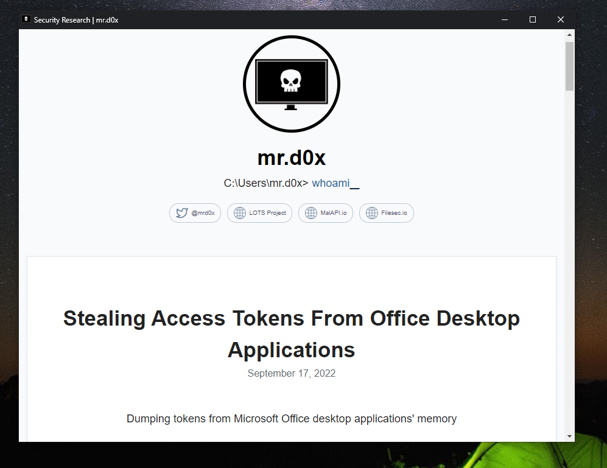
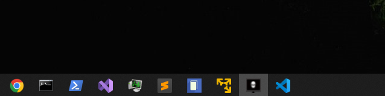
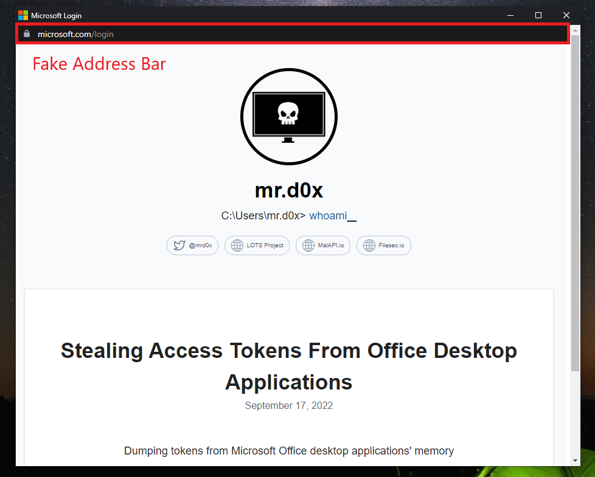
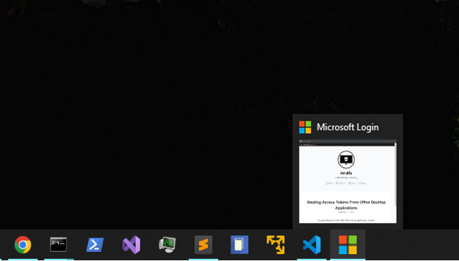
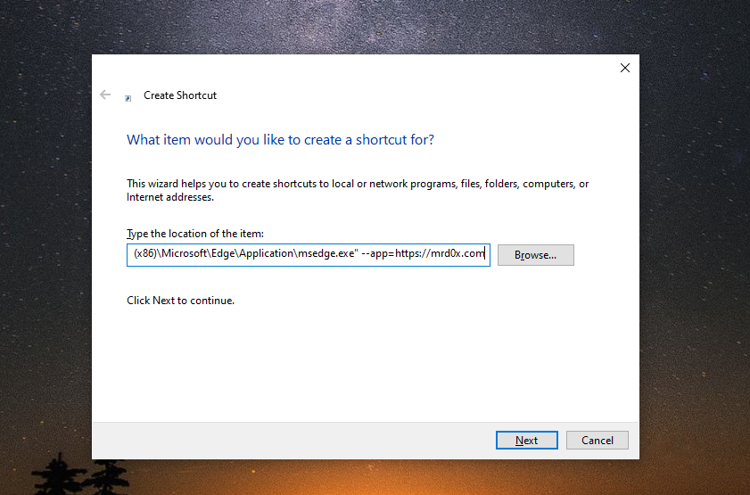
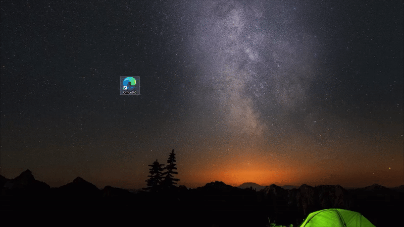
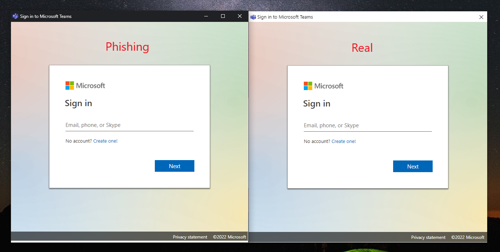
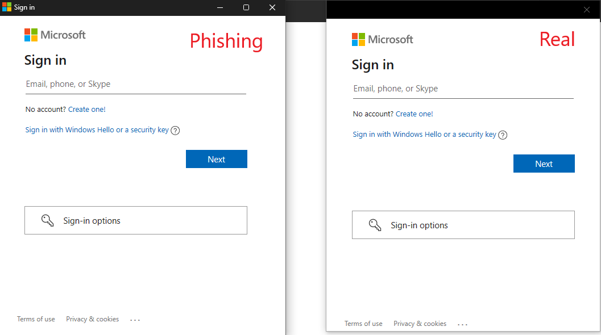
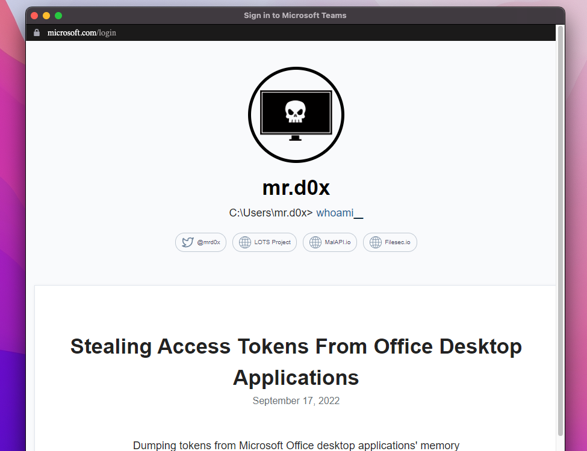

In this blog post I show how Chromium's application mode allows us to easily create realistic desktop phishing applications<!-- end -->. 

# Chromium Application Mode

Chromium-based browsers such as Google Chrome and Microsoft Edge support the ```--app``` command line flag. This flag will launch a website in application mode which does several things:

* Causes the site to be launched in a separate browser window
* The launched window is given a desktop application appearance rather than a browser appearance
* The Windows Taskbar displays the website's favicon rather than the browser's icon
* Launches the website while hiding the address bar 

The commands below show how to launch Chrome or Microsoft Edge in application mode with the site being ```mrd0x.com```

```
# Chrome
C:\Program Files\Google\Chrome\Application>chrome.exe --app=https://mrd0x.com

# Microsoft Edge
c:\Program Files (x86)\Microsoft\Edge\Application>msedge.exe --app=https://mrd0x.com
```

The commands creates the window shown below.



We can see the Windows Taskbar is displaying the site's favicon as the icon.



# Inserting a Fake Address Bar

Since application mode hides the address bar, it's up to us now to create the fake address bar. I used the address bar HTML/CSS from my <a href="https://github.com/mrd0x/BITB" target="_blank">BITB repo</a> (it's signatured so avoid using it in a real engagement) and included it at the top of my site.

```
# You can use a live website or a local HTML file (C:\path\to\file.html)
# This example uses a local HTML file "index.html"
C:\Program Files\Google\Chrome\Application>chrome.exe --app=C:\Users\testUser\index.html
```



The Windows Taskbar will display the website's icon and since I changed mine to Microsoft's logo, the taskbar will now reflect that.



# External/Internal Phishing

Although this technique is meant more towards internal phishing, you can technically still use it in an external phishing scenario. You can deliver these fake applications independently as files.

Assuming that you've setup your phishing page with a fake address bar at the top, simply set the ```--app``` parameter to point to your phishing site.



Below is a demo of how it would look like when launched.



# Impersonate Endpoint Software

Imagine a scenario where the user has some software that runs on the machine, think VPN software for example. With this method you can create a website that impersonates that software's appearance.

Here is an example of an impersonation of the Microsoft Teams software.



Another example is shown below of a Microsoft sign-in prompt. The difference is very subtle and not likely to cause the user to be alarmed.



You can impersonate Windows login prompts, VPN software, backup software and pretty much anything if you have basic HTML/CSS skills.

# MacOS & Linux

Chromium application mode works on other operating systems as well. The command below was used on MacOS.

```
"/Applications/Google Chrome.app/Contents/MacOS/Google Chrome" --app=https://mrd0x.com
```

The result is as expected. I was too lazy to match address bar's font with the OS's font but you should probably take that into account.




# JavaScript - Controlling The Window

The phishing site you specify with the ```--app``` can control certain aspects of the window when its launched.

```window.close()``` - Closes the window. Use it to terminate the window after the user performs an action.

```window.resizeTo(x,y)``` - Resizes the window. Use it to resize the window or to emulate the window size of the software you're impersonating.

```window.moveTo(x,y)``` - Positions the window. Use it to place the window in a certain location on the screen.