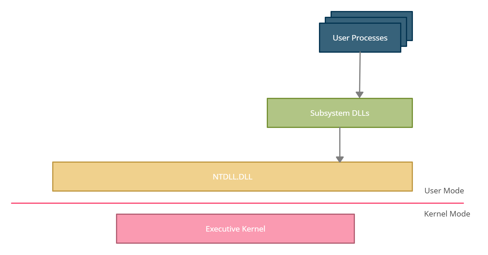
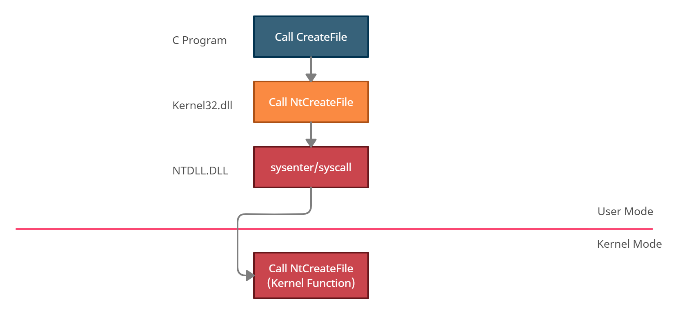
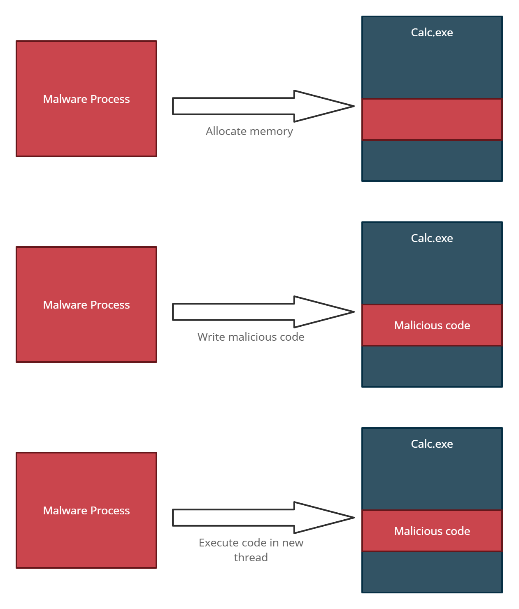
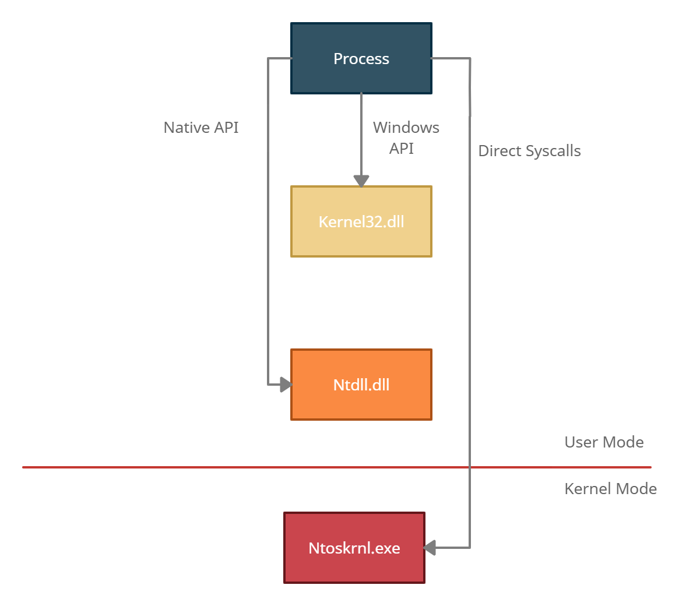

In this blog post I go over the Windows architecture, what happens under the hood of user processes and applications and how to make your application more stealthy.<!-- end -->

Windows is a complex piece of software that has many running parts and can be quite intimidating if you're just starting off. Although there are several resources online that explain everything in this post, I tried to break it down in a simplified yet effective manner. 

# Windows Architecture

A processor in a computer running Windows has two different modes: <i>User Mode</i> and <i>Kernel Mode</i>. Applications run in user mode, and operating system components run in kernel mode. When an application wants to accomplish a task, such as creating a file, it cannot do so on its own. The only entity that can complete the task is the kernel, so instead applications must follow a specific function call flow which is shown in the image below on a high level.

1. <b>User Processes</b> - A program/application executed by the user such as Notepad, Chrome and Word Doc.
2. <b>Subsystem DLLs</b> - DLLs that contain API functions that user processes call. An example of this would be Notepad calling the CreateFile function implemented in kernel32.dll.
3. <b>NTDL.DLL</b> - A system-wide DLL which is the lowest layer available in user mode. This is a special DLL that creates the transition from user mode to kernel mode.
4. <b>Executive Kernel</b> - This is what we know as the Windows Kernel and it calls other drivers and modules available within kernel mode to compelete tasks.

# Function Call Flow Example

The following image shows an example of a user application that creates a file. Note that the image is simplified by skipping the runtime library call.

### Breakdown
It starts with the user application calling a Windows API function <a href="https://docs.microsoft.com/en-us/windows/win32/api/fileapi/nf-fileapi-createfilea">CreateFile</a> which is available in the kernel32 DLL. Kernel32.dll is a critical DLL that exposes applications to the Windows API and is therefore loaded by most applications.

Next, kernel32.dll calls the equivelant function to that of CreateFile in the Native API, <a href="https://docs.microsoft.com/en-us/windows/win32/api/winternl/nf-winternl-ntcreatefile">NtCreateFile</a>, which is provided by ntdll.dll.

Ntdl.dll does an assembly sysenter (x86) or syscall (x64) whichs allows execution to jump to kernel mode. From there the kernel NtCreateFile function is made which calls kernel drivers and modules to complete the requested task.

# What is Process Injection?

Process injection is a way of executing code inside a different process often times for either stealth & defense evasion or privilege escalation. Having an unknown process running on a machine might raise suspicion and can be easily detected by a vigilant user or security team. On the other hand injecting into a legitimate process makes it more difficult to detect by users and security products due to execution being masked under a legitimate process.

There are many ways of process injection, some stealthier than others. A classic example of process injection is shown in the image below.

I won't be getting into the specific injection techniques in this article since there are many resources that explain them in depth. I've included references to write ups on most injection techniques at the end of this post.

# Windows API, Native API and Syscalls

I do want to mention the programmatical ways that can be used to accomplish process injection. The following image shows how a process can use the Windows API, Native API or direct syscalls to inject.

### Windows API

The Windows API is the easiest way and the least stealthy way of injecting into processes. Most AVs/EDRs will easily detect malicious programs that use Windows API function calls. Commonly used functions by malware such as VirtualAllocEx, CreateRemoteThread, WriteProcessMemory are highly monitored and are almost always hooked by EDRs.

### Native API

The Native API is more difficult to use because it is undocumented and functions can change at anytime without any warning from Microsoft. The Windows API acts as a wrapper to the Native API and technically should not be used directly. Therefore when we skip the Windows API and use the Native API directly it can slip past some AVs/EDRs but not always. EDRs still hook certain Native API calls that have been misused in the past by malware. A few example of commonly monitored functions are NtCreateThreadEx, NtCreateProcess and NtWriteVirtualMemory.

### Syscalls

Direct syscalls are the most difficult to use because they will vary from OS version and therefore require additional work and customization for different versions. On the plus side they are undetectable since you make the call directly to the kernel without any intermediatery APIs. There are several tools that can make life easier when using syscalls such as <a href="https://github.com/jthuraisamy/SysWhispers">SysWhispers</a> and <a href="https://github.com/outflanknl/Dumpert">Dumpert</a>.

# Final Note

Having read this post thoroughly, you should now have a basic understanding of the Windows architecture, process injection and the programmitcal ways to go about process injection. Your next step should be opening up Visual Studio and begin implementing and testing out the various injection techniques, using different functions from the Windows API and Native API, and if you're brave enough try direct syscalls. Don't stress too much if your executable is caught by AV, I'll be following up later with an article covering evasion techniques.

# Additional Resources

* <a href="https://posts.specterops.io/adventures-in-dynamic-evasion-1fe0bac57aa">Adventures in Dynamic Evasion</a>
* <a href="https://github.com/D3VI5H4/Antivirus-Artifacts/blob/main/AntivirusArtifacts2.pdf">Hooked API Functions By AV Vendor</a>
* <a href="https://i.blackhat.com/USA-19/Thursday/us-19-Kotler-Process-Injection-Techniques-Gotta-Catch-Them-All-wp.pdf">Windows Process Injection in 2019</a>
* <a href ="https://www.ired.team/offensive-security/code-injection-process-injection">Injection Techniques</a>
