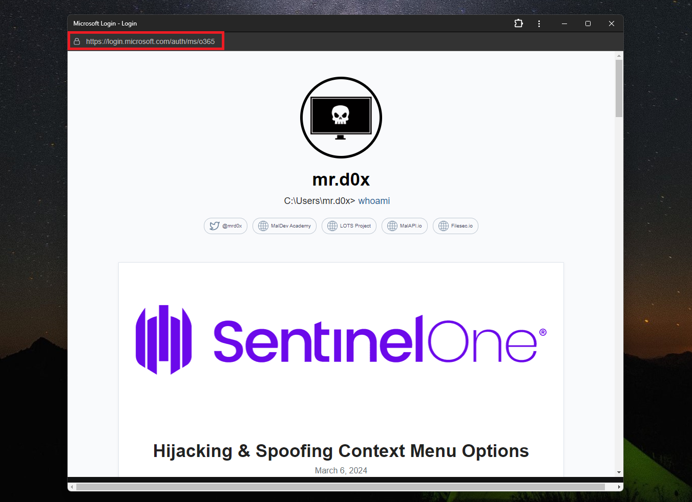
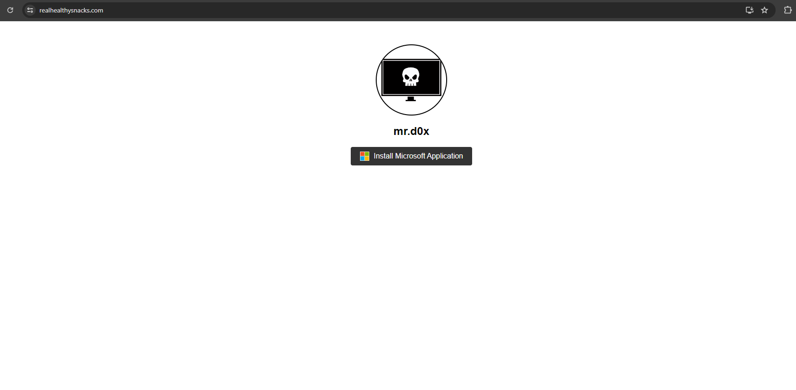
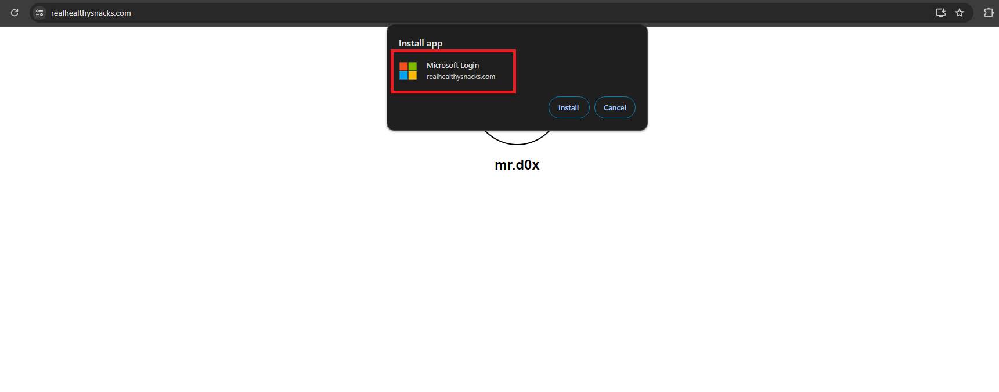
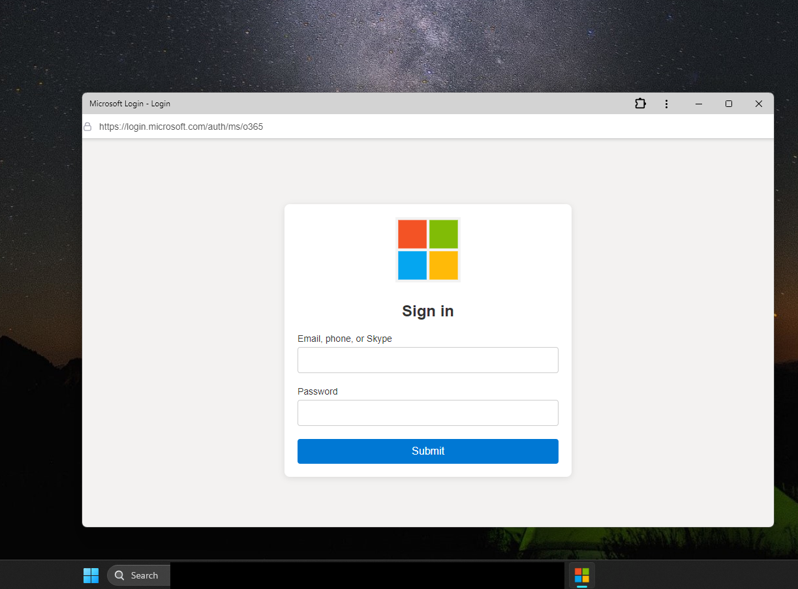

Phishing with Progressive Web Apps and UI manipulation<!-- end -->.

# Introduction

Progressive Web Apps or PWAs are applications that are built using web technologies (i.e. HTML, CSS, JavaScript) that can be installed and behave similarly to native applications. PWAs integrate with the OS better (i.e. they have their own app icon, can push notifications) and therefore they can lead to higher engagement for websites. The issue with PWAs is that manipulating the UI for phishing purposes is possible as we'll explore in this blog.



# PWA Requirements

Before showing an attack scenario using a PWA, we'll need to understand how to create one. Feel free to skip this section as I provide a working template on my GitHub for testing at the end of this post. At a basic level, a PWA requires the following files:

1. Manifest File - The manifest is a JSON file that provides metadata about the web application. It allows the app to be installed on the user's home screen.

```json
{
  "name": "Microsoft Login",
  "short_name": "Microsoft",
  "start_url": "/",
  "display": "standalone",
  "background_color": "#ffffff",
  "theme_color": "#000000",
  "icons": [
    {
      "src": "/images/icons/icon-192x192.png",
      "sizes": "192x192",
      "type": "image/png"
    },
    {
      "src": "/images/icons/icon-512x512.png",
      "sizes": "512x512",
      "type": "image/png"
    }
  ]
}
```

2. Service Worker - A script that the browser runs in the background. This is used for enabling offline capabilities, push notifications, and background sync.

```javascript
self.addEventListener('install', (event) => {
  event.waitUntil(
    caches.open('v1').then((cache) => {
      return cache.addAll([
        '/',
        '/index.html',
        '/styles.css',
        '/app.js',
        '/images/icons/icon-192x192.png',
        '/images/icons/icon-512x512.png'
      ]);
    })
  );
});

self.addEventListener('fetch', (event) => {
  event.respondWith(
    caches.match(event.request).then((response) => {
      return response || fetch(event.request);
    })
  );
});
```

3. HTML File - The main HTML file links the manifest and registers the service worker.

```html
<!DOCTYPE html>
<html lang="en">
<head>
  <meta charset="UTF-8">
  <meta name="viewport" content="width=device-width, initial-scale=1.0">
  <link rel="manifest" href="/manifest.json">
  <title>Example PWA</title>
</head>
<body>
  <script>
    if ('serviceWorker' in navigator) {
      navigator.serviceWorker.register('/service-worker.js')
      .then((registration) => {
        console.log('Service Worker registered with scope:', registration.scope);
      }).catch((error) => {
        console.error('Service Worker registration failed:', error);
      });
    }
  </script>
</body>
</html>
```

4. Styles and Scripts - Any additional CSS and JavaScript files for the PWA to function correctly.

# Attack Scenario

Now that we understand how a PWA file is created, we can start weaponizing it for phishing. We will perform the following attack scenario:

1. Victim accesses an attacker-controlled website.

2. Victim clicks an "Install Microsoft Application" button.

3. A browser pop-up appears asking the user to install the application. We can name our application anything such as "Microsoft Login" or "login.microsoftonline.com". Keep in mind that our real domain name will show in smaller font underneath.

4. Victim installs application.

5. Upon successful installation, redirect the PWA window to a phishing page with a fake URL bar attached to the top of the page.

Needless to say, this scenario can be tailored to any other company besides Microsoft.

## Step 1 - Setting Up Landing Page

We start by creating our landing page with the "Install Microsoft Application" button.



## Step 2 - Installing Application

Clicking the "Install Microsoft Application" button prompts the user to install our PWA application.

* The application's name is "Microsoft Login".

* The Microsoft logo is our application's icon, which is set through the manifest file.



## Step 3 - Redirection

After the application is successfully installed, redirect the user to the phishing page with a fake URL bar.


# Phishing Demo

The demo below performs the previously mentioned steps but instead redirects users to a fake Microsoft phishing page that captures credentials. For higher quality [use this](./demo.mp4).


# Application Icon

Notice how the application's icon is set to the Microsoft Logo, making it more realistic.



# GitHub PoC

I've included the demonstration PoC on my GitHub. You can find the files [here](https://github.com/mrd0x/PWA-Phishing).

# Conclusion

As we saw, PWAs open up the path for UI manipulation that can trick users into believing they're on a different website. This technique clearly has some disadvantages such as the requirement of the target user to install the application. Additionally, the PWA window briefly displays the actual domain name in the top right corner. However, I believe people's habits of checking the URL bar will lead them to disregard that domain name (security awareness is required for this).

It may also be worth mentioning that prior to posting this blog I did find someone raising a [security concern](https://github.com/w3c/manifest/issues/747) regarding the abuse of PWA for phishing back in 2018.