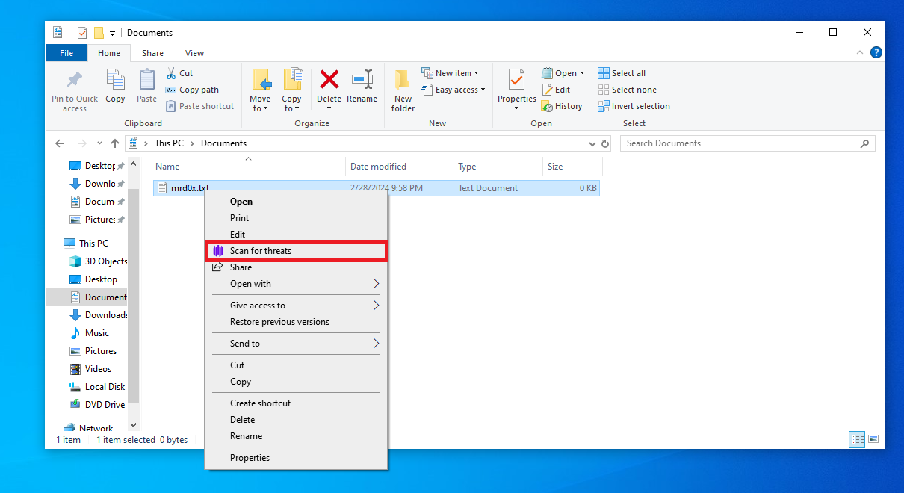
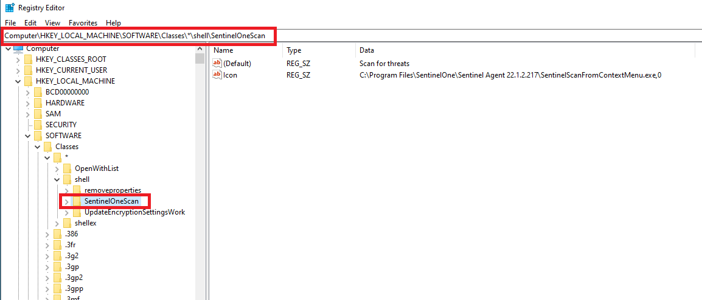
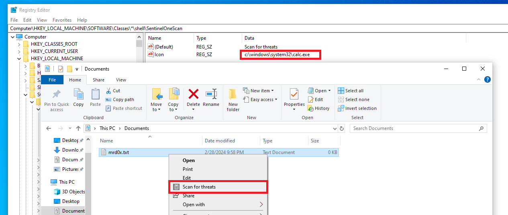
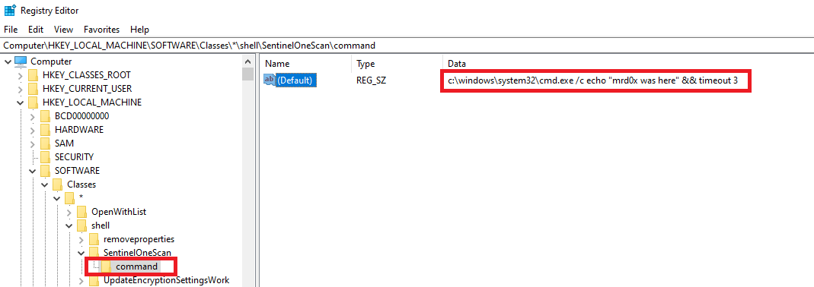
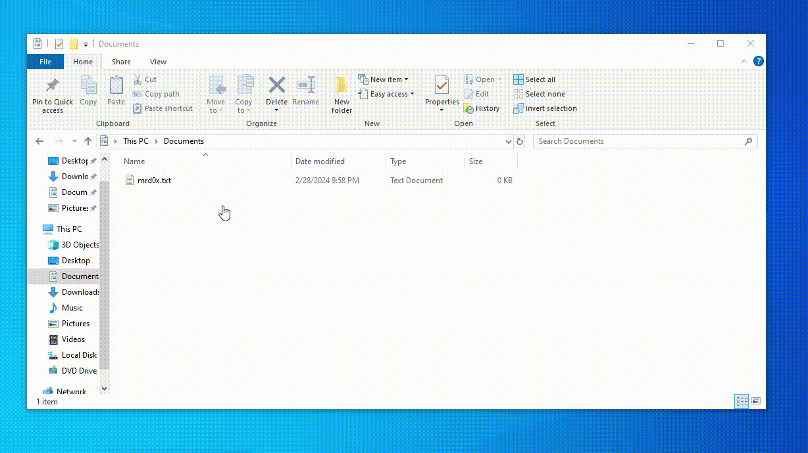
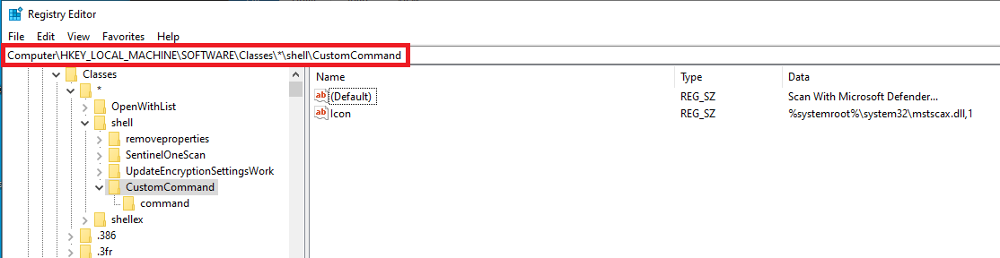
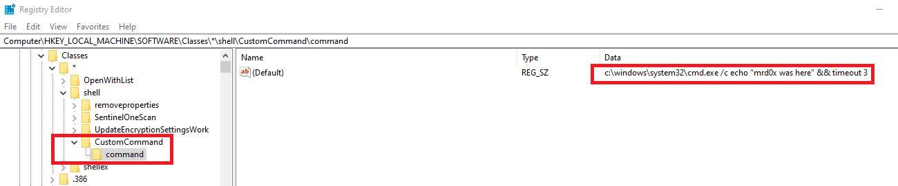
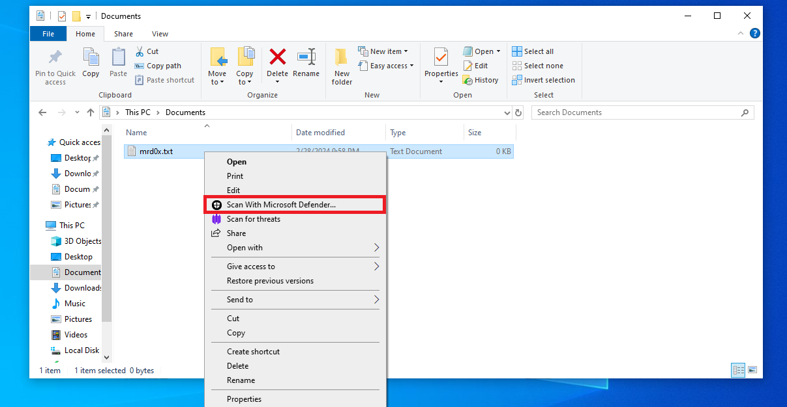

Hijacking SentinelOne's "Scan For Threats" context menu option and creating your own option for persistence<!-- end -->.

# Introduction

Whenever a file is right-clicked it shows a variety of options to allow the user to interact with that item. It's common for installed software to insert their option into that context menu. This is also the case if you have SentinelOne installed.

Obviously, if you click this option SentinelOne will launch a scan on the specified item. This had me thinking, can this option be tampered with?

# Persistence Through Context Menu

Before I move forward it's important to understand that hijacking Explorer's context menu is not new. This has been discussed in-depth in [this article](https://ristbs.github.io/2023/02/15/hijack-explorer-context-menu-for-persistence-and-fun.html). The aforementioned article uses a different (and better) way to execute code by right-clicking a folder.

Now let's head back to SentinelOne's case.

## Searching The Registry

I opened up the Registry and started searching for within the `Computer\HKEY_LOCAL_MACHINE\SOFTWARE\Classes\*\shell\` key. Almost immediately I noticed a SentinelOne key with the name: `SentinelOneScan`.

AVs/EDRs will generally have tamper protection on critical registry keys, therefore I had to check if SentinelOne considers this as part of its important keys. To do so, I simply modified the icon to `calc.exe` and it worked.

## Hijacking The Binary

Since we confirmed that the icon is changeable let's now change the command associated with that option which can be found in `Computer\HKEY_LOCAL_MACHINE\SOFTWARE\Classes\*\shell\SentinelOneScan\command`. This registry key contains the SentinelOne binary that will execute when the "Scan for threats" option is clicked.

Enter the full path to the binary to execute. For this demonstration, I'll simply run `cmd.exe`.

# Demo

It's as simple as that. Now whenever the user right-clicks a file and selects the "Scan for threats" option, it will instead call the command in the registry key.

# Spoofing Context Menu Options

If you're not up against SentinelOne then you can easily create a custom context menu option. Create a registry key under `Computer\HKEY_LOCAL_MACHINE\SOFTWARE\Classes\*\shell\` and add an icon value. Windows has various DLLs that have icons (<a href="https://www.digitalcitizen.life/where-find-most-windows-10s-native-icons/" target="_blank">Examples here</a>).

Add a `command` subkey under `Computer\HKEY_LOCAL_MACHINE\SOFTWARE\Classes\*\shell\CustomCommand` and add your command there.

And now when you right-click a file, you should see the newly inserted option.

# Conclusion

This easy trick can be abused for persistence while masking behind a security solution option. Users will generally trust their security solution and therefore this can be abusing a "trusted" option. You can also easily create an option that appears to be "built-in" to Windows (e.g. Open With, Move File etc.) 