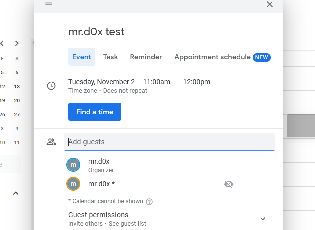
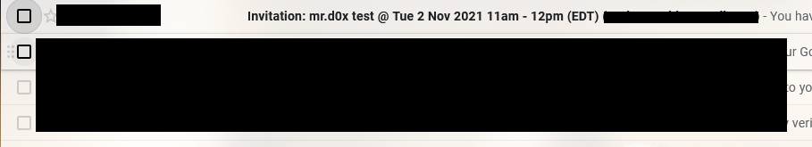
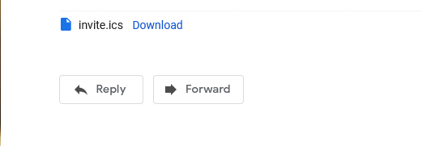
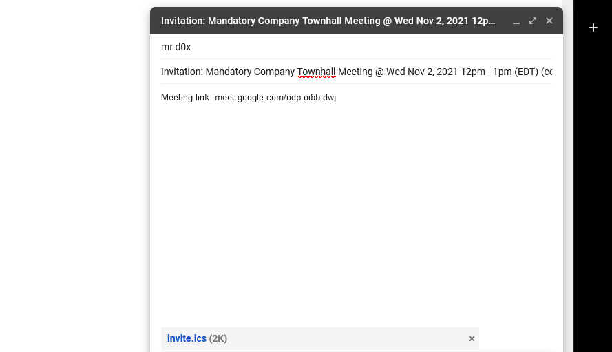
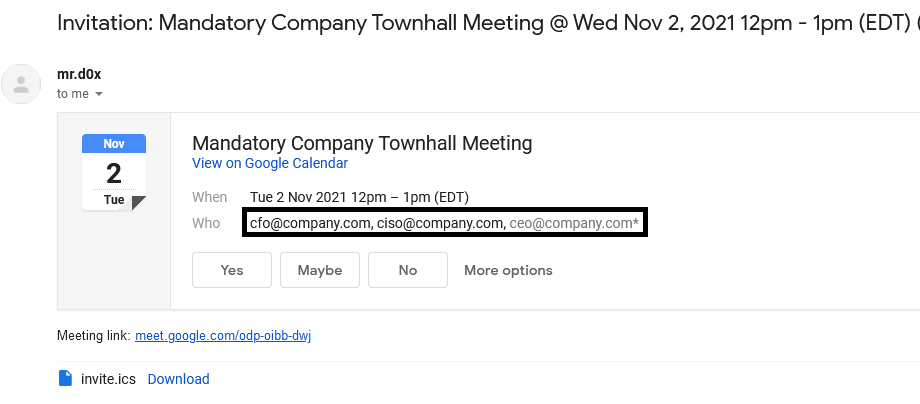
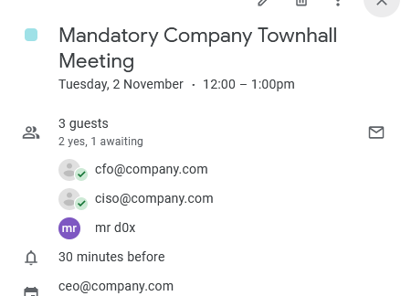
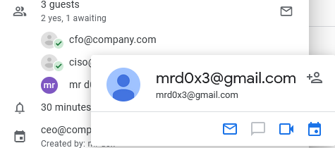

A new technique showing how an attacker can create calendar invites with spoofed attendees<!-- end -->.

# Introduction

It's well known that hackers have previously used .ics files during phishing campaigns. If you're unaware of that then I suggest you check out these resources:

* <a target="_blank" href="https://cofense.com/youre-invited-phishing-links-inside-ics-calendar-attachments/">Cofense</a>
* <a target="_blank" href="https://isc.sans.edu/forums/diary/Spam+Delivered+via+ICS+Files/21611/">SANS ISC</a>

After reading these we can clearly see that .ics files can be pretty dangerous. But recently while testing Google Calendar I found that .ics files can be abused in a way that,as far as I'm aware, hasn't been used before. This technique allows you to create a calendar invite meeting with a spoofed organizer, attendees and attendance responses.

## Compatability

I found out that this technique will work on all the most popular emailing providers (e.g. Google Workspace, O365). But it works better on Google targets because of the way Google renders .ics attachments. Therefore, the demonstration below will only take into account a Google target. Lets start!

# Attack

## Download a .ics Template

The easiest way to get a .ics file is by creating a Google Calendar invite from one Gmail account to another and then downloading the **invite.ics** email attachment.

Sign in to the other email, click on the email invitation and download the invite.ics file.

 Great! Now that we have the .ics file time to tamper with it.

 ## Tampering & Spoofing

 Open up the invite.ics file with a text editor. You'll see each line is in a `key:value` format. Delete the line that starts with `UID.`

    # Delete this line
    UID:59umvk1cmeq4vvr3qbh3qrof8c@google.com

 Now you can begin spoofing the contacts. The organizer can be spoofed by modifying the `CN=` value as shown below.

 `ORGANIZER;CN=spoof@company.com:mailto:mrd0x@hotmail.com`

 As for the Attendees you can add as many as you'd like and again modify the `CN=` value and that's the email the user will see.

 `ATTENDEE;CUTYPE=INDIVIDUAL;ROLE=REQ-PARTICIPANT;PARTSTAT=NEEDS-ACTION;RSVP=TRUE;CN=fakeattendee@company.com;X-NUM-GUESTS=0:mailto:lol@gmail.com`

## Force Attendees To Accept The Invite

Every attendee has the `PARTSTAT=` key. By simply making it `PARTSTAT=ACCEPTED` it will appear as if the attendees accepted the invite.

## Add A Profile Picture

The attendees' `mailto:` address can be another email you own or a random email. The perk of choosing an email you own is you can login to that account and upload a profile picture of who you're pretending to be.

For example, if one of the attendees has `CN=johnathan@company.com` and `mailto:mrd0x@gmail.com`. I can upload a picture of Johnathan to mrd0x@gmail.com and that's what the user will see in the calendar invite.

## Important Caveat - Please read

Make sure the `mailto:` address of the organizer is a **non-Google email** (not Gmail or Google Workspace). For some reason if it's a Google email the 'Yes/Maybe/No' buttons are not included in the email. For my demo I've used a Hotmail account.

## Calendar Title & Time

The calendar title can be changed by modifying the `Summary:` key in the .ics file.

As for the time its by modifying the `DTSTART:` and `DTEND:` keys.

# Recap

I'll recap the steps in case you got lost. I start with the assumption that I've already downloaded the .ics file.

## Step 1

Remove the line that starts with `UID` in the .ics file.

## Step 2

Spoof the organizer and the attendees by modifying the `CN=` and `mailto:` values. Ensure the `mailto:` value of the organizer is a non-Google email. Also ensure you set `PARTSTAT=ACCEPTED` to all the attendees except the victim user.

    ORGANIZER;CN=ceo@company.com:mailto:mrd0x@hotmail.com
    ATTENDEE;CUTYPE=INDIVIDUAL;ROLE=REQ-PARTICIPANT;PARTSTAT=NEEDS-ACTION;RSVP=
    TRUE;CN=mrd0xmsobb@gmail.com;X-NUM-GUESTS=0:mailto:mrd0xmsobb@gmail.com
    ATTENDEE;CUTYPE=INDIVIDUAL;ROLE=REQ-PARTICIPANT;PARTSTAT=ACCEPTED;RSVP=
    TRUE;CN=ciso@company.com;X-NUM-GUESTS=0:mailto:mrd0x3@hotmail.com
    ATTENDEE;CUTYPE=INDIVIDUAL;ROLE=REQ-PARTICIPANT;PARTSTAT=ACCEPTED;RSVP=
    TRUE;CN=cfo@company.com;X-NUM-GUESTS=0:mailto:mrd0x3@gmail.com

## Step 3

Modify the Calendar title to whatever you'd like it to be.

    SUMMARY:Mandatory Company Townhall Meeting

## Step 4

Make sure you set the time of the calendar invite correctly. The time shown below is 2021-11-02 12pm-1pm.

    DTSTART:20211102T160000Z
    DTEND:20211102T170000Z

## Step 4

Compose an email to the victim and attach the .ics file. The format of the email's title should be like this:

    Invitation: CALENDAR-TITLE-HERE @ Wed Nov 2, 2021 12pm - 1pm (EDT) (ORGANIZER@SPOOFED.com)

## Step 5 - Optional

Add a Google Meet link in the email's body because Google strips the Google Meet link in the .ics file.

# Results

As expected the user sees the spoofed names.

And both invited users have accepted the meeting

# Pitfalls

By hovering over the names on Google Calendar, the `mailto:` email will appear so try to set it to one that's close to the spoofed email.

For example: `CN=johnathan@company.com` and `mailto:johnathan@gmail.com`

