Google Drive and OneDrive contain spoofing vulnerabilities that can aid attackers with phishing<!-- end -->.

# Google Drive - Masquerading File Extension

First create your malicious .doc file and upload it to Google Drive.

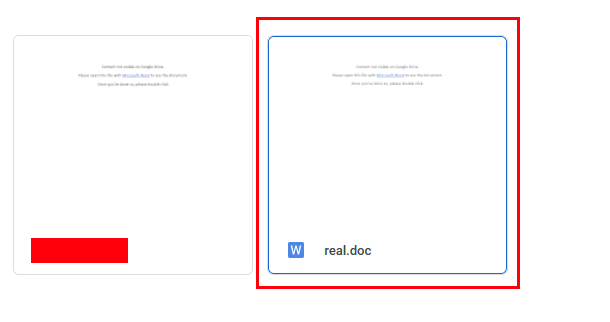

After uploading the file, modify the file extension to .docx.

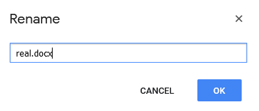

Compose an email to the target and attach the file via Google Drive attachments. When the user opens up the email they see the following:

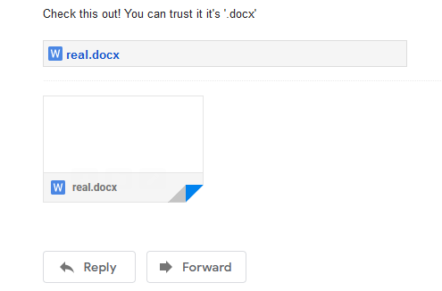

But when they attempt to download the file, it'll be saved as the original extension (in this case .doc).

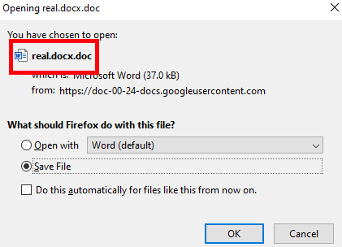

Of course, this can be done to any file extension. In the image below my .exe file looks like a .txt.

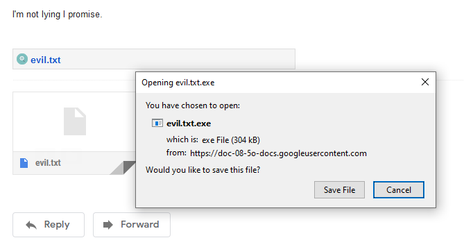

# OneDrive - Masquerading File Extension

Unfortunately, this isn't purely a Google problem as I realized OneDrive faces the same issue. Below I demonstrate two ways to masquerade extensions using OneDrive and Outlook.

## The Quick Way

**This method does not work if the target is using O365/Outlook.**

First upload your malicious .docm file to OneDrive (Avoid using .doc as I noticed OneDrive will automatically change it to .docx).

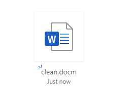

Next, go compose an email to the target and attach that file and immediately intercept the request via Burp (or any other HTTP proxy). In the first request look for your file extension and modify it to any extension you'd like. I changed my .docm to .docx.

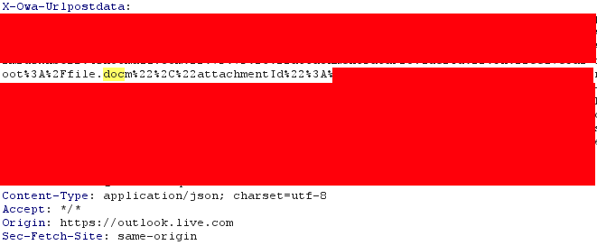

And upon checking the email and the user sees the spoofed extension. But upon download, the original extension is used.

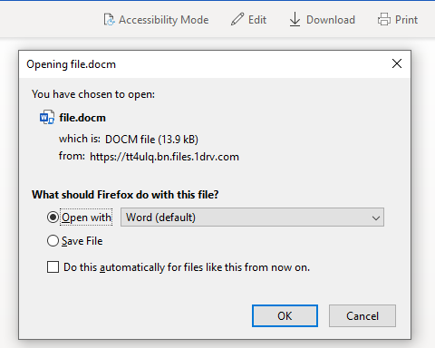

## The Longer Way

First upload your malicious .docm file to OneDrive (Avoid using .doc as I noticed OneDrive will automatically change it to .docx).

Next, you'll want to rename the file extension to docx. This requires a HTTP proxy as OneDrive won't allow you to change the extension via UI.

Afterwards compose an email to the target and attach the .docx file. After sending the file go back and change the file to .docm.

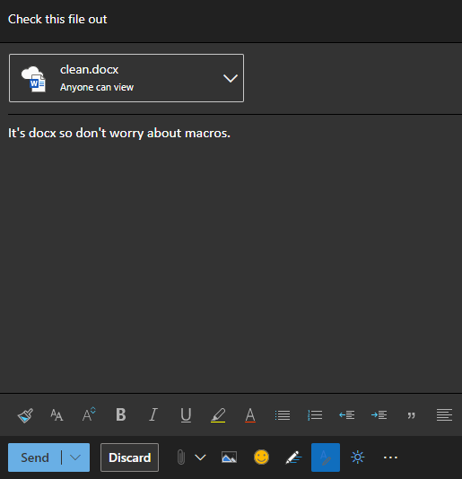

The user sees file.docx but when they try to download it, it'll be file.docm.

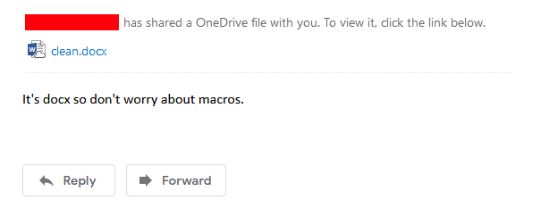

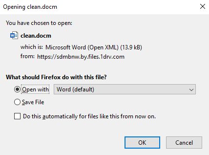

And again to show you another example I use the same technique to hide my an executable as a .txt. And when the user tries to download the file they'll get a surprise.

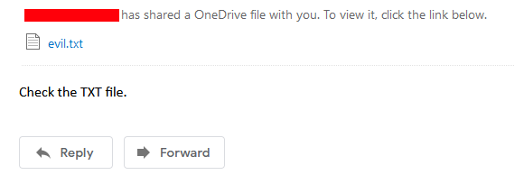

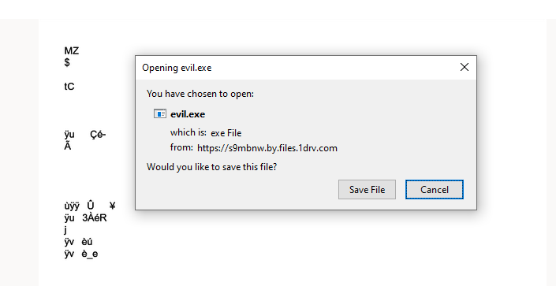

# Google Drive - Masquerade File Icon

Something really great Google and Microsoft do is give us an icon based off the file type. For example, if the file is a Word document Google will place that nice innocent looking 'blue W' beside the file. It helps you distinguish between a Word document and an executable. Wouldn't it be great if we can place that icon on our executable file to entice the user to click on it? Well luckily for us we can and it's **really simple**.

Modify your .exe file to .doc locally on your machine. After you upload it to Google Drive simply rename it to .exe. DONE!

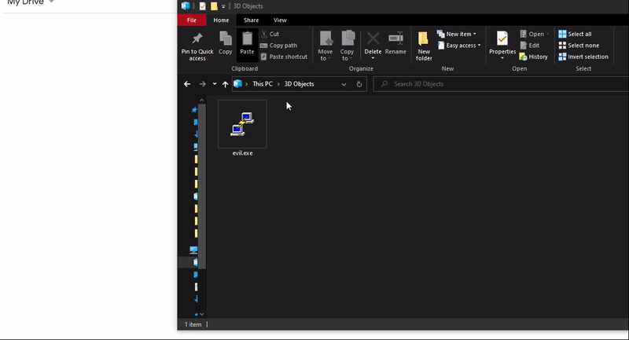

And when you email it this is what recipients see in Gmail and Outlook respectively.

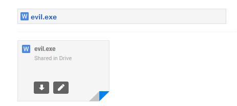

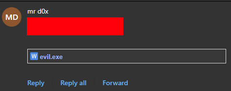

## Additional MIME Types

Check out this list of <a href="https://developer.mozilla.org/en-US/docs/Web/HTTP/Basics_of_HTTP/MIME_types/Common_types" target="_blank">MIME types</a> by file extension and get creative.

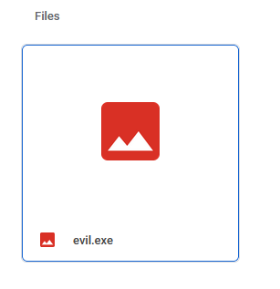

# Google Drive - Modify File's Timestamp

I'm not going through this one in detail but I was also able to play around with the modified timestamp.

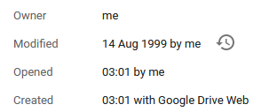

# Non-Existent File Extensions

Another less impressive method of phishing is to use non-existent file extensions. If you create a Word document via MS Word, modify the extension to anything and upload it to Google Drive you'll notice that Google still considers the file a Word document regardless of the extension.

## Scenario 1 (Best Case)

In this scenario, the user receives a download prompt and chooses the 'Open With' option. We try to entice the user to download the file.

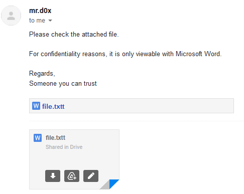

And if they want to verify the file first by viewing it online we include something like this:

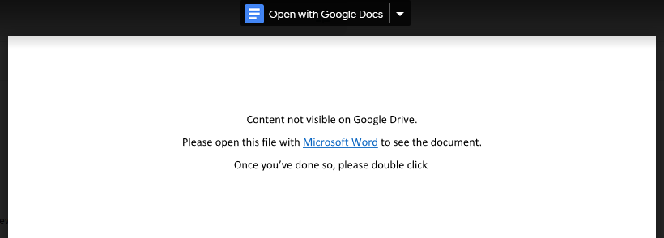

The user now agrees to download the file, but instead of saving it they will open with the default application, MS Word.

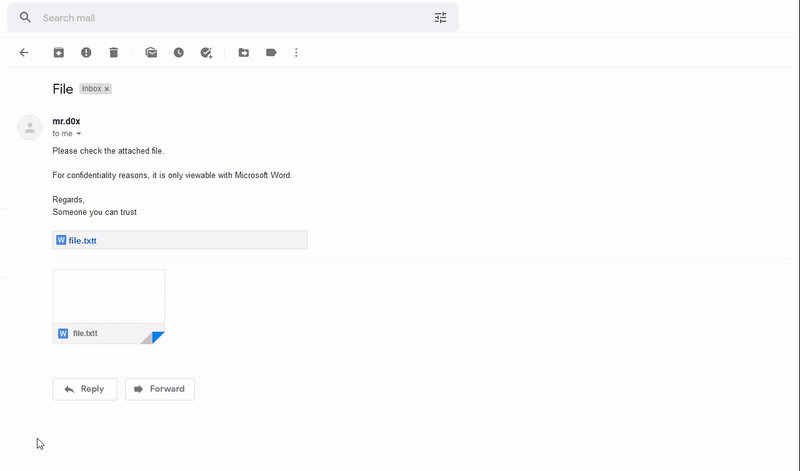

## Scenario 2

In the second scenario, the file is automatically saved and the user will need to open it with Word somehow. Clearly this scenario is not as ideal because double clicking on the file wont't work. Nonetheless, below I demonstrate the scenario. I start with the assumption that the user had already downloaded the file. Although I would agree that this scenario seems less likely to happen we have to remember that the user had Google vouch for them that the file is a Word document.

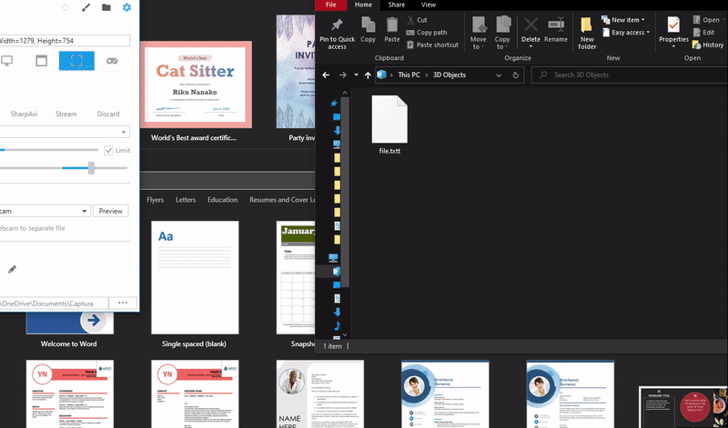

## Scenario 3

The third scenario involves sending the user the Google Drive link and upon downloading, Google will auto append the '.doc' extension.

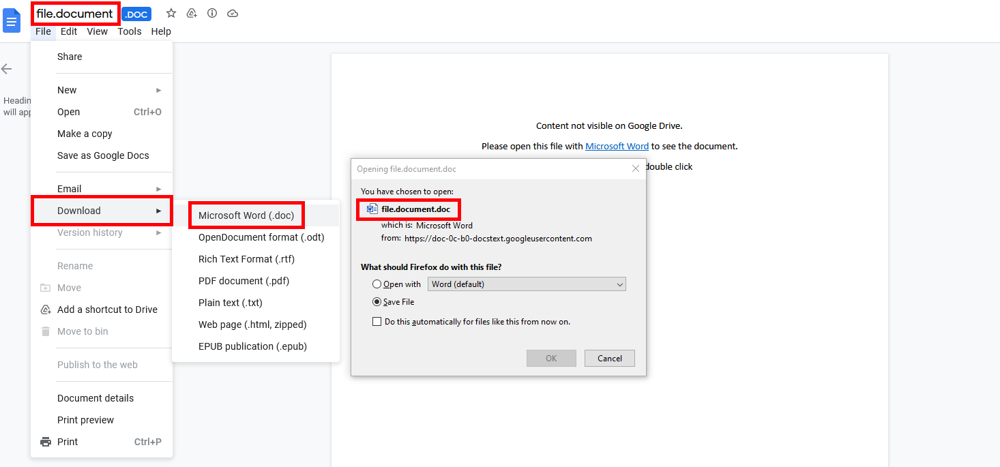

# Things To Consider

* Cloud providers are always scanning your files for malicious content
* If your macros consist of any autorun functions (e.g AutoOpen) then Google will automatically flag it as malware.
* Be smart, don't spoof a .txt file as an .exe because it wiil still need to go through the browser security and smartscreen and other security measures.

