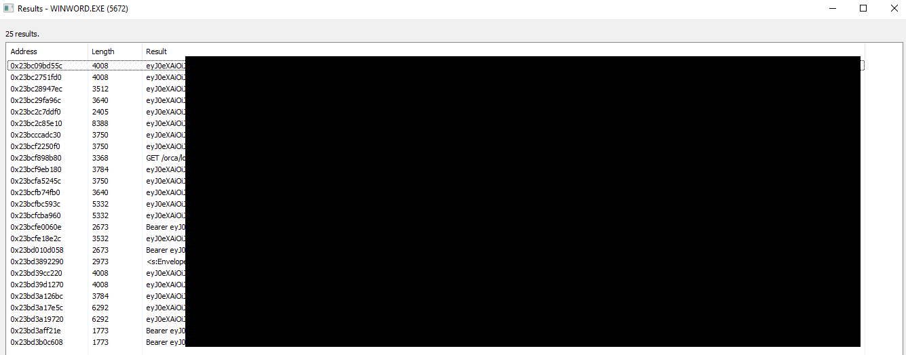
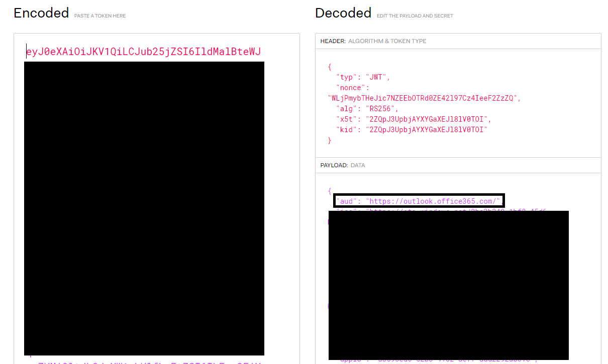
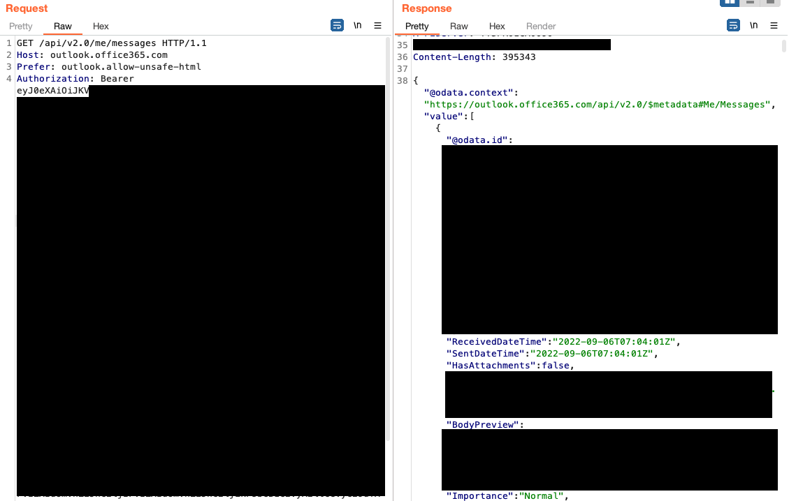
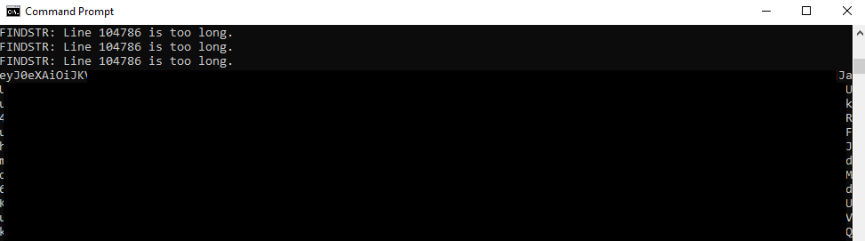

Dumping tokens from Microsoft Office desktop applications' memory<!-- end --> 

# Introduction

While I was reading the recent article about how <a href="https://www.bleepingcomputer.com/news/security/microsoft-teams-stores-auth-tokens-as-cleartext-in-windows-linux-macs/" target="_blank">Microsoft Teams stores access tokens in plaintext</a>, I asked myself if this issue extended to other Office applications. I knew that this should be somehow possible because Office applications are generally connected to a Microsoft account.

# Searching Memory Regions For Access Tokens

I launched Microsoft Word, made sure I was authenticated into my O365 account and began searching the memory regions for specific strings. After understanding what the <a href="https://learn.microsoft.com/en-us/azure/active-directory/develop/access-tokens" target="_blank">token format should look like</a>, I eventually found what I was looking for. 

Searching for strings within memory that contain ```eyJ0eX``` gave me several results.



# Choosing The Correct Access Token

The JWT tokens were not all the same and after decoding several of them I realized that the intended audience (specified by the ```aud``` payload claim) was different. Some of them were:

* api.office.net
* messaging.engagement.office.com
* substrate.office.com
* **outlook.office365.com**

I don't know enough about these APIs but I do know that there is documentation for the <a href="https://learn.microsoft.com/en-us/previous-versions/office/office-365-api/api/version-2.0/use-outlook-rest-api" target="_blank">Outlook REST API</a>.



# Token Scope

Before trying out the token, I had to view the scope to understand what this token can allow me to do. There were several permissions within scope such as:

* All Mail.ReadWrite
* All Files.ReadWrite
* MailboxSettings.ReadWrite


## Using The Token

In the image below, I used the Outlook Mail REST API to extract all the emails successfully. The scope allows you to do much more than just reading emails though.



# Extracting Access Tokens From A Memory Dump

Reading the access token directly from memory is not necessary. You can easily make a memory dump of the Office application, take it offline and extract the token.

    strings64.exe WINWORD.EXE.dmp | findstr /i eyJ0eX

The tokens are successfully extracted from the dump file.



# Conclusion

There are a couple of things to keep in mind. First, the Outlook REST API will be deprecated in November 2022, so if you're testing this after the deprecation date you should search for the <a href="https://learn.microsoft.com/en-us/graph/use-the-api" target="_blank">Microsoft Graph API</a> token. Next, although this article was only dedicated to Microsoft Office applications I'm sure this can be extended to several other desktop applications from other vendors.

## Credits

Thanks to <a href="https://twitter.com/NathanMcNulty" target="_blank">@NathanMcNulty</a> for always helping me with Azure related questions.


