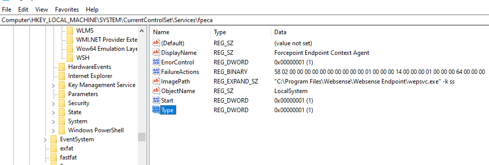
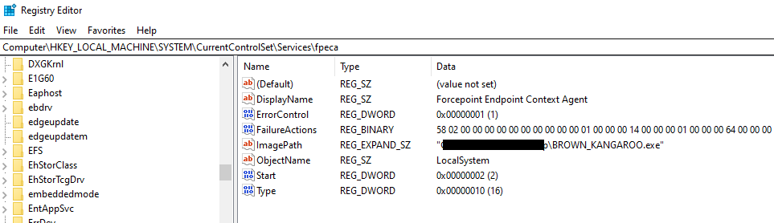
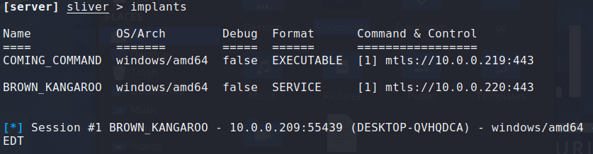
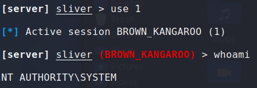

ForcePoint One DLP EndPoint lacks tamper protection allowing attackers to disable the product, raise privileges and establish persistence on the machine<!-- end -->.

# Environment Setup

Everything was tested on Windows 10 with ForcePoint One DLP Endpoint version 19.10.4281 with an uninstall password in place (ironically, meant for tamper protection).

# Disabling the DLP Endpoint Via Registry 

An attacker with administrator privileges can disable the DLP EndPoint, escalate to SYSTEM privileges and establish persistence on the machine by modifying a specific registry key.

    # Vulnerable registry key
    Computer\HKEY_LOCAL_MACHINE\SYSTEM\CurrentControlSet\Services\fpeca

Three values should be modified:

* ```ImagePath``` must be set to the path to your malicious service executable.
* ```Start``` must be set to ```0x02 (2)```. It means the service is always loaded and run.
* ```Type``` must be set to ```0x10 (16)```. It means the Win32 service should be run as a stand-alone process.

By default the values will look like this:



After modification it should look something like this:



Upon restarting the machine, the DLP Endpoint was disabled. A connection was also established to my attacking machine.



Privileges were also raised to SYSTEM as expected.



# Disabling the DLP Endpoint Via Registry (Again)

Similarly to the previous method I demonstrated, by modifying another registry key I was able to replicate the same impact.

    # Vulnerable registry key
    Computer\HKEY_LOCAL_MACHINE\SYSTEM\CurrentControlSet\Services\Fppsvc

Again, three values should be modified:

* ```ImagePath``` must be set to the path to your malicious service executable.
* ```Start``` must be set to ```0x02 (2)```. It means the service is always loaded and run.
* ```Type``` must be set to ```0x10 (16)```. It means the Win32 service should be run as a stand-alone process.

# Disabling the DLP Endpoint By Terminating A Process

The DLP Endpoint is dependent upon two important processes ```wepsvc.exe``` and ```fppsvc.exe```. Wepsvc is protected from termination whereas fppsvc can be terminated by anyone with administrator privileges.

The only problem is as soon as fppsvc is terminated it immediately relaunches. Unfortunately for the process, it's relaunch speed wasn't faster than my one liner. I used the following commmand which kills the process as soon as it launched.

    # Cmd Prompt
    FOR /L %N IN () DO taskkill /F /IM "fppsvc.exe"

We see the green checkmark change to a red X meaning the endpoint is not running.


# Disabling Critical Drivers Via Registry

There were 3 more registry keys that could be modified to disable potentially critical drivers that had no tamper protection whatsoever.

    # Vulnerable registry keys
    Computer\HKEY_LOCAL_MACHINE\SYSTEM\CurrentControlSet\Services\FpFile
    Computer\HKEY_LOCAL_MACHINE\SYSTEM\CurrentControlSet\Services\FpECAWfp
    Computer\HKEY_LOCAL_MACHINE\SYSTEM\CurrentControlSet\Services\FpProcess

By changing the path of the .sys files, the drivers are disabled.

# Additional Information

I found a few additional interesting things that may be of use.

* The file ```C:\Program Files\Websense\Websense Endpoint\repository.xml``` contains a treasure of information such as names, usernames, hostnames and IPs.

* In the same directory, the DLP EndPoint comes with ```Python.exe```. This can be useful to use during an engagement.

* Lastly, ForcePoint has a list of folders and files it recommends to be excluded from AV. If you have write access to any of these excluded items then AV will also be bypassed (assuming the administrators followed the recommendation). The list of recommended exclusions can be found <a href="https://www.websense.com/content/support/library/deployctr/v85/dic_av_exclude.aspx" target="_blank">here</a>.

# ForcePoint's Response

The ForcePoint security team was very professional and great to work with. They issued the following CVEs:

* <a href="https://help.forcepoint.com/security/CVE/CVE-2022-27608.html" target="_blank">CVE-2022-27608</a> - Adds tamper protection to all the registry keys

* <a href="https://help.forcepoint.com/security/CVE/CVE-2022-27609.html" target="_blank">CVE-2022-27609</a> - Adds tamper protection to the ForcePoint process