This is the start of a Twitter recap series which highlights interesting or useful posts that never made it to the blog<!-- end -->.

# Table of Contents

1. MalAPI.io Release
2. LOTS Project Release
3. Dump64.exe Whitelist (LSASS Dump)
4. Devinit.exe - LOLBIN
5. DLL Injection Signed Binaries
6. Outlook/O365 - Attachment Direct Download
7. Microsoft.NodejsTools.PressAnyKey.exe - LOLBIN
8. Mpiexec.exe & Smpd.exe - LOLBINs
9. File Extension Manipulation - Bypass Telemetry Signature Detection
10. OneNote Attachment - Generate Direct Download Link
11. O365 - Bypass Malicious Link Analysis
12. MS Edge - Download Files Via Command Line
13. MS Edge/Chrome - Download Files Via Command Line
14. *.log Whitelist (Bypass Static Detection)

# 1.MalAPI.io Release

Original Tweet: <a target="_blank" href="https://twitter.com/mrd0x/status/1454861280670531589">https://twitter.com/mrd0x/status/1454861280670531589</a> 

On October 31, 2021 I released <a target="_blank" href="https://malapi.io">MalAPI.io</a>, a site that categorizes WinAPIs used by malware and allows people to map attacks at the API level.

# 2.LOTS Project Release

Original Tweet: <a target="_blank" href="https://twitter.com/mrd0x/status/1459210707321380874">https://twitter.com/mrd0x/status/1459210707321380874</a>

On November 12, 2021 I released the Living Off Trusted Sites Project or <a target="_blank" href="https://lots-project.com">LOTS Project</a>, a site that shows how trusted sites can be abused by attackers.

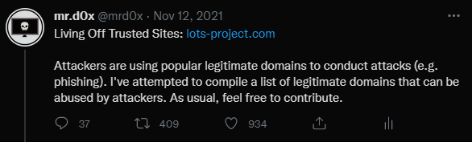

# 3.Dump64.exe Whitelist (LSASS Dump)

Original Tweet: <a target="_blank" href="https://twitter.com/mrd0x/status/1460597833917251595">https://twitter.com/mrd0x/status/1460597833917251595</a>

Discovered a hidden exclusion in Defender AV that allows an attacker to dump LSASS without being detected. It also affected Sophos Intercept X (Thanks @BlaineOh for validating this).

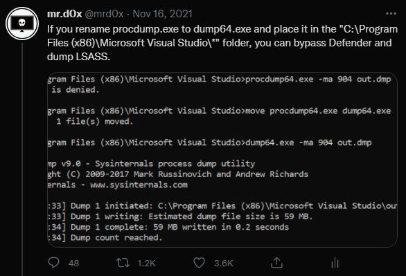

# 4.Devinit.exe - LOLBIN

Original Tweet: <a target="_blank" href="https://twitter.com/mrd0x/status/1460815932402679809">https://twitter.com/mrd0x/status/1460815932402679809</a>

LOLBIN with many uses such as downloading and installing MSI files.

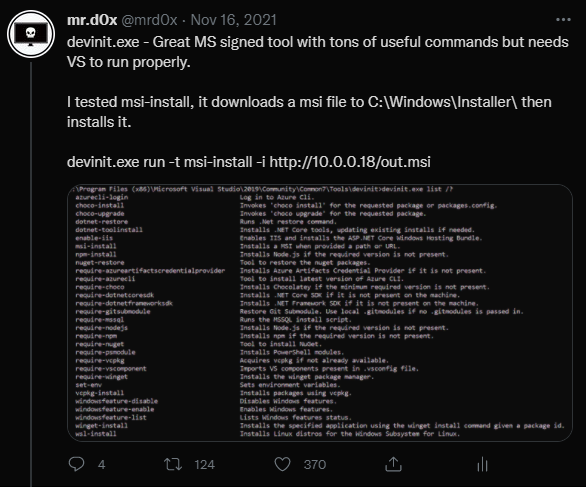

# 5.DLL Injection Signed Binaries

Original Tweet: <a target="_blank" href="https://twitter.com/mrd0x/status/1462546911269847040">https://twitter.com/mrd0x/status/1462546911269847040</a>

Two binaries that perform DLL injection (x64 and x86). Although these are MS Signed binaries, they are under the "Microsoft 3rd Party Application Component" signature. Still useful. I've also uploaded them to a GitHub repo, feel free to check <a target="_blank" href="https://github.com/mrd0x/dll_inject_vs_binaries">them out</a>.

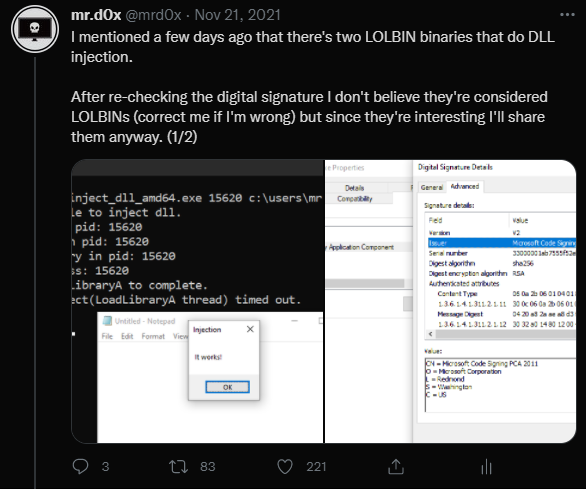

# 6.Outlook/O365 - Attachment Direct Download

Original Tweet: <a target="_blank" href="https://twitter.com/mrd0x/status/1462852381830524931">https://twitter.com/mrd0x/status/1462852381830524931</a>

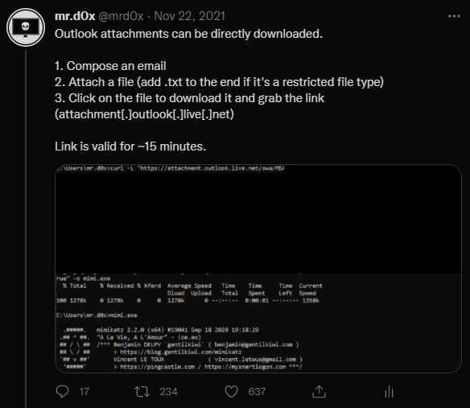

# 7.Microsoft.NodejsTools.PressAnyKey.exe - LOLBIN

Original Tweet: <a target="_blank" href="https://twitter.com/mrd0x/status/1463526834918854661">https://twitter.com/mrd0x/status/1463526834918854661</a>

LOLBIN that executes a binary.

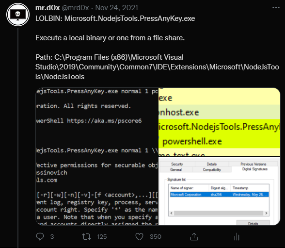

# 8.Mpiexec.exe & Smpd.exe - LOLBINs

Original Tweet: <a target="_blank" href="https://twitter.com/mrd0x/status/1465058133303246867">https://twitter.com/mrd0x/status/1465058133303246867</a>

LOLBINs that can execute multiple instances of a binary.

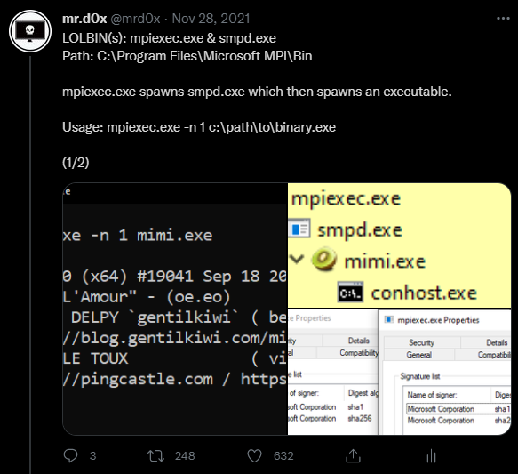

# 9.File Extension Manipulation - Bypass Telemetry Signature Detection

Original Tweet: <a target="_blank" href="https://twitter.com/mrd0x/status/1461041276514623491">https://twitter.com/mrd0x/status/1461041276514623491</a>

Bypassing signature detection by playing with file name & file extension. By default cmd will execute the binary even if the extension is not correct (Thanks @chvancooten for pointing this out). Also thanks to @misconfig for doing <a target="_blank" href ="https://twitter.com/misconfig/status/1474324709940637696">further testing</a>.

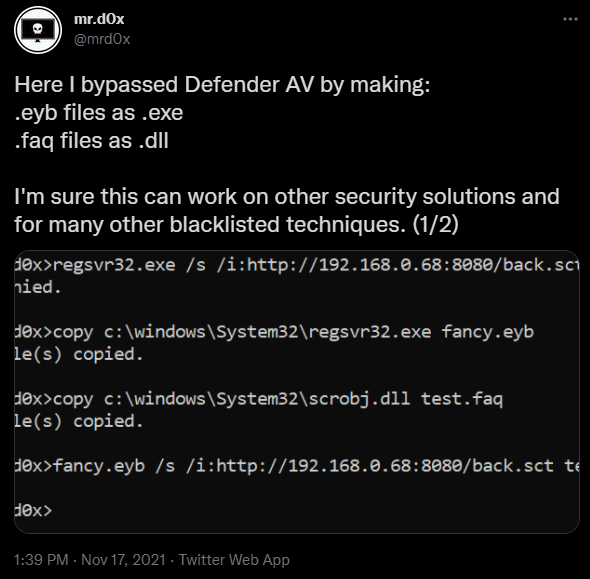

# 10.OneNote Attachment - Generate Direct Download Link

Original Tweet: <a target="_blank" href="https://twitter.com/mrd0x/status/1475085452784844803">https://twitter.com/mrd0x/status/1475085452784844803</a>

OneNote attachments are not scanned on upload and can be directly downloaded. Useful for phishing, exfiltration and dropping files on a host.

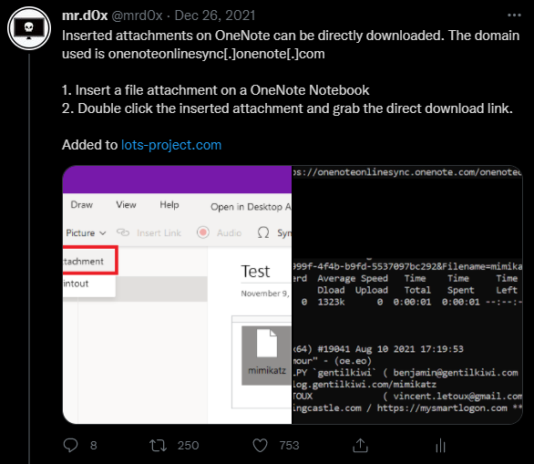

# 11.O365 - Bypass Malicious Link Analysis

Original Tweet: <a target="_blank" href="https://twitter.com/mrd0x/status/1475177065204834311">https://twitter.com/mrd0x/status/1475177065204834311</a>

Add an empty href attribute to a link in an email composed via the 'Reply' or 'Reply All' functionality and it doesn't get scanned.

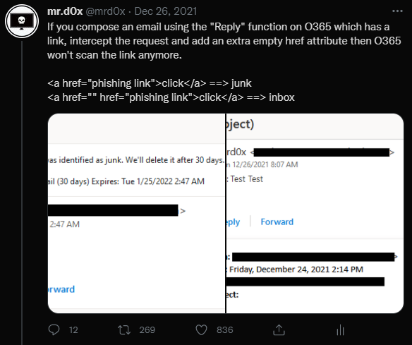

# 12.MS Edge - Download Files Via Command Line

Original Tweet: <a target="_blank" href="https://twitter.com/mrd0x/status/1478116126005641220">https://twitter.com/mrd0x/status/1478116126005641220</a>

A simple way to launch MS Edge in a minimized window and download a file. Works with other browsers as well.

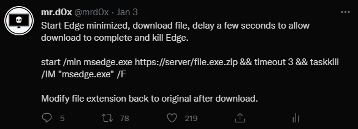

# 13.MS Edge/Chrome - Download Files Via Command Line

Original Tweet: <a target="_blank" href="https://twitter.com/mrd0x/status/1478234484881436672">https://twitter.com/mrd0x/status/1478234484881436672</a>

Download files completely through command line.

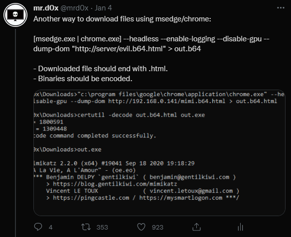

# 14. *.log Whitelist (Bypass Static Detection)

Original Tweet: <a target="_blank" href="https://twitter.com/mrd0x/status/1479094189048713219">https://twitter.com/mrd0x/status/1479094189048713219</a>

Any file named "DumpStack.log" isn't scanned by Defender AV. Thanks to @NathanMcNulty for pointing out that all *.log files aren't scanned by Defender.

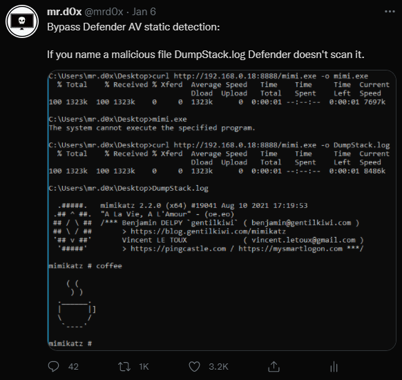

# Conclusion

I plan to post a Twitter recap every few months that way I keep this website as the authoritative source of information. Also in case someone doesn't have or use Twitter this would be beneficial.